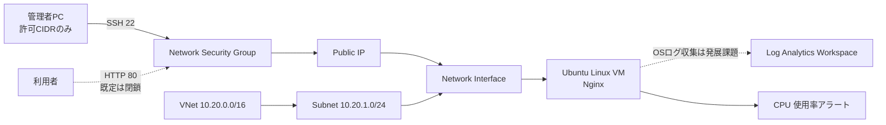

# Azure 構築案件パック

未経験からサーバー構築エンジニアを目指す人が、**設計・構築・試験・運用・説明**までを1つの模擬案件で学ぶポートフォリオです。

> [!IMPORTANT]
> このリポジトリの Azure リソースは既定では作成されません。`deploy.ps1` は What-If（変更予測）で止まります。実環境へのデプロイは課金、権限、リージョンの利用可否を確認してから `-Apply` を明示してください。

## 30秒で分かる案件

| 項目 | 内容 |
|---|---|
| 顧客 | 従業員50名の架空企業 Sample Works |
| 依頼 | 小規模な社内向け Linux Web サーバーを Azure に構築したい |
| 成果物 | 要件定義、基本・詳細設計、Bicep、試験、運用、障害対応、証跡 |
| 構成 | Resource Group / VNet / Subnet / NSG / Public IP / NIC / Linux VM / Log Analytics / CPU Alert |
| セキュリティ | SSH鍵認証、接続元CIDR制限、最小許可、HTTPS化前はHTTPを既定で閉鎖 |
| コスト配慮 | 小さいVM、手動削除手順、概算前提の明記、What-If優先 |
| 検証状態 | 静的検証とCIを用意。実Azure環境での構築は利用者が実施するまで `NOT RUN` |

## 覚え方：5つの「決」

1. **要件を決める** — 何を守り、いつまで動かすか
2. **構成を決める** — どの Azure サービスを組み合わせるか
3. **設定を決める** — IP、名前、サイズ、通信ルール
4. **確認を決める** — 正常・異常をどう試験するか
5. **運用を決める** — 監視、変更、障害、削除をどう行うか

## アーキテクチャ



### 設計判断

- SSHを全世界へ公開せず、`adminCidr` だけ許可します。
- パスワード認証を無効化し、公開鍵だけを使います。
- HTTPは `openHttp=false` が既定です。学習確認時だけ開け、本番想定では HTTPS、Application Gateway/WAF、Private Access 等を別途設計します。
- CPUアラートはAzureプラットフォームメトリックを使います。Log Analyticsは学習用の受け皿だけを作り、OSログ収集に必要なAzure Monitor AgentとData Collection Ruleは発展課題として明示します。
- 単一VMは学習費用を抑える判断です。高可用性要件があれば Availability Zones、Load Balancer、複数VMへ変更します。
- リソース名とタグを統一し、誰の・何の・どの環境かを追跡します。

## 学習ルート

| 順番 | 教材 | 到達目標 |
|---:|---|---|
| 1 | [案件概要](docs/01-project-brief.md) | 顧客要望を技術要件へ変換できる |
| 2 | [用語と全体像](docs/02-fundamentals.md) | Azureの部品を一言で説明できる |
| 3 | [基本設計](docs/03-basic-design.md) | 構成と設計理由を説明できる |
| 4 | [詳細設計](docs/04-detailed-design.md) | 実装に必要な値を読める |
| 5 | [構築手順](docs/05-build-guide.md) | What-Ifから安全に構築できる |
| 6 | [試験仕様](docs/06-test-plan.md) | 合否と証跡を残せる |
| 7 | [運用・障害対応](docs/07-operations-runbook.md) | 初動、切り分け、復旧を行える |
| 8 | [ポートフォリオ説明](docs/08-portfolio-guide.md) | 面接で設計判断を説明できる |

## 最短の使い方

前提: Azure CLI、Bicep CLI、PowerShell 7、Azureサブスクリプション、SSH公開鍵。

```powershell
az login
az account show --output table
Copy-Item infra/parameters/dev.example.bicepparam infra/parameters/dev.bicepparam
# dev.bicepparam の sshPublicKey と adminCidr を自分の値へ変更
./scripts/deploy.ps1 -ParameterFile infra/parameters/dev.bicepparam
```

最後のコマンドは **What-Ifのみ** です。内容を確認して実際に作る場合:

```powershell
./scripts/deploy.ps1 -ParameterFile infra/parameters/dev.bicepparam -Apply
./scripts/verify.ps1 -ResourceGroupName rg-portfolio-dev-jpe-001
```

学習終了後は、対象名を二重指定して削除します。

```powershell
./scripts/remove.ps1 `
  -ResourceGroupName rg-portfolio-dev-jpe-001 `
  -ConfirmResourceGroupName rg-portfolio-dev-jpe-001
```

## リポジトリ構成

```text
.
├─ docs/                 設計・試験・運用・面接用ドキュメント
├─ evidence/             証跡テンプレート（秘密情報を保存しない）
├─ infra/                Bicep とパラメーター例
├─ scripts/              What-If、デプロイ、確認、削除
└─ .github/workflows/    静的検証CI
```

## 安全ルール

- 実在顧客名、メール、IP、テナントID、サブスクリプションID、秘密鍵をコミットしない。
- 料金はリージョン、契約、時期で変わるため、実施直前に Azure Pricing Calculator と Cost Management で確認する。
- `az account show` で対象を確認し、個人の学習用サブスクリプション以外では管理者承認を得る。
- スクリーンショットは機密値をマスクし、テスト結果は成功だけでなく失敗と対処も記録する。
- 本教材の単一VM構成を、そのまま本番環境へ転用しない。

## 参考にした公式設計指針

- [Azure Well-Architected Framework](https://learn.microsoft.com/azure/well-architected/)
- [Azure リソースの名前付け規則](https://learn.microsoft.com/azure/cloud-adoption-framework/ready/azure-best-practices/resource-naming)
- [Bicep ドキュメント](https://learn.microsoft.com/azure/azure-resource-manager/bicep/)
- [Azure CLI ドキュメント](https://learn.microsoft.com/cli/azure/)

## ライセンス

[MIT License](LICENSE)
