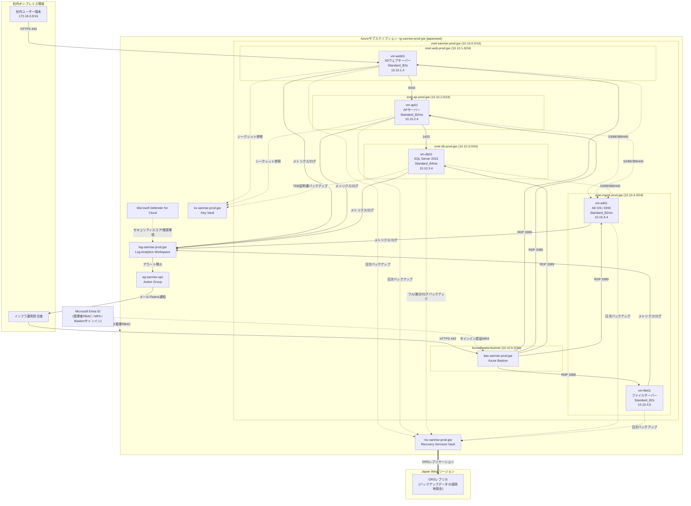

# 全体アーキテクチャ設計書

## この章のポイント

- 株式会社サンライズ物産の受発注・在庫管理システムを、老朽化した自社データセンターの物理サーバーからMicrosoft Azure(以下Azure)へ「リフト&シフト」(既存システムの構成をほぼそのままクラウドへ移行する方式)する全体構成を解説します。
- Web層・AP層・DB層の3階層構成に加えて、AD DS/DNS基盤、ファイルサーバー、Azure Bastion(踏み台サーバーのマネージドサービス)、監視基盤、バックアップ基盤を含めたシステム全体像を、1枚の構成図(Mermaid図)で示します。
- 仮想マシン(VM)へのパブリックIPアドレス付与を廃止し、Azure Bastion経由の統制されたアクセスと、Microsoft Entra ID(旧Azure AD、Microsoftのクラウド上のID管理サービス)による最小権限モデルを採用した理由を説明します。
- オンプレミス環境の継続利用や、PaaS(Platform as a Service、OSやミドルウェアの管理をクラウド事業者に任せるサービス形態)中心の再設計など、他の選択肢と比較しながら「なぜこの設計に至ったか」という設計思想を明らかにします。
- Microsoft Cloud Adoption Framework(CAF、Microsoftが提唱するクラウド導入の標準的な指針)の命名規則を採用する意図を解説します。

---

## 1. 本章の位置づけと前提

本章「全体アーキテクチャ設計書」は、本設計書パック全体の起点となる章です。個々のネットワーク設計・セキュリティ設計・監視設計・バックアップ設計の詳細は、それぞれ専門の章に譲り、本章では**システム全体を俯瞰する構成図と、そこに至った設計判断の理由**を中心にまとめます。初めてこの設計書を読む方は、まず本章を通読することで、以降の各章の詳細設計がどのような全体像の中に位置づけられているかを理解できます。

### 1.1 対象企業とプロジェクトの背景

| 項目 | 内容 |
|---|---|
| 企業名 | 株式会社サンライズ物産 |
| 業種 | 卸売業(加工食品・日用雑貨卸売) |
| 従業員規模 | 約182名(本社:大阪府大阪市、支店:東京・福岡) |
| 対象システム | 受発注・在庫管理システム(2009年構築、Web/AP/DBの3層構成) |

株式会社サンライズ物産は1978年創業、加工食品・日用雑貨を中心に全国のスーパーマーケット・ドラッグストアへ卸売を行う中堅商社です。受発注・在庫管理システムは2009年に自社データセンター内の物理サーバー(Windows Server 2012 R2)上に構築され、10年以上にわたり稼働してきました。しかし対象サーバーはハードウェア保守契約が2026年9月末で終了予定であり、OSもメーカーサポートが終了済みでセキュリティパッチの適用ができない状態が続いています。

### 1.2 現状の課題と本設計での対応

現状の課題を放置したまま単純にハードウェアだけを更新するのではなく、Azureへの移行を機に、可用性・セキュリティ・運用性の観点から抜本的な改善を図ることが本プロジェクトの目的です。現状の課題と、本設計における対応の対応関係を以下に整理します(「なぜこの設計にしたのか」という設計思想の全体像でもあります)。

| # | 現状の課題 | 本設計での対応 |
|---|---|---|
| 1 | 基幹サーバーのハードウェア保守契約が2026年9月に終了予定で、更新時期を迎えている | Azure VM(IaaS、Infrastructure as a Service。OS以上をユーザーが管理し、物理基盤はクラウド事業者が管理するサービス形態)への「リフト&シフト」により、物理ハードウェアの保守・更新という制約そのものを解消する |
| 2 | OSがWindows Server 2012 R2でメーカーサポートが終了しており、脆弱性対応ができない | 全VMをWindows Server 2022 Datacenterへ刷新し、セキュリティパッチ適用が可能な状態を回復する |
| 3 | 自社データセンターの単一拠点運用で、地震・水害等の災害時の事業継続(BCP、Business Continuity Plan=事業継続計画)対策が不十分 | Recovery Services Vault(Azureのバックアップ管理サービス)のGRS(Geo冗長ストレージ、遠隔地への自動複製)により、バックアップデータをJapan Westリージョンへ地理的に保全する |
| 4 | サーバー管理者が固定グローバルIP経由でVMへ直接RDP(リモートデスクトップ)接続しており、共有の管理者アカウントも常態化していてアクセス統制・監査ログが不十分 | VMへのパブリックIP付与を全廃し、Azure Bastion経由の踏み台接続に一本化。管理者にはMicrosoft Entra IDの個人アカウント・MFA(多要素認証)・条件付きアクセスを必須化する |
| 5 | サーバー監視が担当者の目視確認中心で、CPU/ディスク逼迫や障害の予兆を早期に検知できない | Log Analytics(Azureのログ集約・分析サービス)とアラートルールにより、CPU使用率・ディスク空き容量・VM死活状態を自動監視し、異常時に運用担当者へ自動通知する |
| 6 | バックアップが磁気テープによる手動運用で、リストア検証やDR訓練が未実施 | Recovery Services Vaultによる自動バックアップに切り替え、明確なRPO/RTO目標を設定し、定期的なリストア検証を運用手順に組み込む |

### 1.3 プロジェクトゴール

老朽化した基幹サーバーの更新時期に合わせ、受発注・在庫管理システムをAzure(IaaS中心)へリフト&シフトし、可用性・セキュリティ・運用性を向上させることが本プロジェクトのゴールです。あわせて、VMへのパブリックIP付与を廃止しAzure Bastion経由の統制された管理アクセスへ切り替え、Key Vault(秘密情報を安全に管理するAzureサービス)とMicrosoft Entra IDを活用したゼロトラスト(「社内ネットワークだから安全」という暗黙の信頼を置かず、すべてのアクセスを都度検証する考え方。※詳しくは用語集(11-glossary.md)を参照)に近い最小権限のセキュリティモデルを確立します。さらにLog Analyticsによる予兆監視とRecovery Services Vaultによる自動バックアップ体制を整備し、将来的なPaaS化・DX(デジタルトランスフォーメーション)推進の足がかりとする方針です。

なお、本プロジェクトはポートフォリオとしての検証用途を兼ねるため、月額運用コストを抑制する目的でVMサイズはBシリーズ(バースト可能インスタンス。普段は低いCPU性能で稼働し、必要な時だけ性能を一時的に引き上げられる、コスト効率の良いVMシリーズ)を基本とし、リージョンはJapan East(japaneast)単一リージョンに限定しています。月額運用コストの見積り(約168,000円)や内訳の詳細はコスト設計の章にまとめており、本章ではその前提となるアーキテクチャ全体を扱います。

---

## 2. システム全体構成図

以下は、ネットワーク(VNet・サブネット)、サーバー(VM)、Azure Bastion、監視基盤、バックアップ基盤を含めたシステム全体構成図です。実線は業務トラフィックおよび管理アクセス、破線は認証・監視・バックアップ・シークレット参照などの制御系トラフィックを表します。

### 図の読み方(初心者向け補足)

- **箱の入れ子構造**は「どこに何が所属しているか」を表します。一番外側が「Azureサブスクリプション(契約単位)の中のリソースグループ(関連リソースをまとめる入れ物)」、その中に「VNet(Virtual Network、Azure上の仮想ネットワーク)」、さらにその中に「サブネット(VNetを細かく区切ったネットワーク区画)」という順に入れ子になっています。
- **実線の矢印**は業務データや管理接続が実際に流れる経路、**破線の矢印**は認証・監視・バックアップ・シークレット参照といった裏側の制御通信を表します。
- 図中の名称(`vm-web01`や`10.10.1.4`など)はすべて後述の設計台帳の値そのものであり、実装時にもこの名称・アドレスをそのまま使用します。

---

## 3. 全体構成の解説

### 3.1 ネットワーク基盤(VNetとサブネット)

システム全体は、1つのVNet `vnet-sanrise-prod-jpe`(アドレス空間 `10.10.0.0/16`)の中に、役割ごとに分割された5つのサブネットを配置する構成です。サブネットとは、大きな1つのネットワークを機能や用途ごとに細かく区切った区画のことで、区切ることで「どの区画からどの区画への通信を許可するか」をきめ細かく制御できるようになります(この考え方は3.9節で詳しく説明します)。

| サブネット名 | CIDR(アドレス範囲) | 用途 |
|---|---|---|
| snet-web-prod-jpe | 10.10.1.0/24 | Web層(IISによる受発注・在庫管理システムのフロントエンド) |
| snet-ap-prod-jpe | 10.10.2.0/24 | AP層(業務アプリケーションサーバー、受発注・在庫管理ロジック実行) |
| snet-db-prod-jpe | 10.10.3.0/24 | DB層(SQL Serverによるデータベースサーバー) |
| snet-mgmt-prod-jpe | 10.10.4.0/24 | 管理用サブネット(AD DS/DNS、ファイルサーバー等の基盤系サーバー) |
| AzureBastionSubnet | 10.10.5.0/26 | Azure Bastion専用サブネット(Azureの固定仕様により名称固定、/26以上が必須) |

業務システムの3階層(Web/AP/DB)をそれぞれ独立したサブネットに配置し、AD DS/DNSとファイルサーバーという「基盤系」のサーバーをさらに別の管理用サブネットにまとめています。こうすることで、後述するNSG(Network Security Group、サブネットやNIC単位で通信を許可・拒否するAzureの仮想ファイアウォール機能)によって層ごとに異なる通信ルールを適用でき、万が一Web層が侵害されてもDB層へ直接到達できない構造(多層防御)を実現しています。

### 3.2 Web層・AP層・DB層(業務アプリケーションの3階層構成)

既存の受発注・在庫管理業務アプリケーションは、Web(画面表示)・AP(業務ロジック)・DB(データ保管)の3層構成で稼働しています。本設計ではこの構成をほぼそのまま踏襲し(リフト&シフト)、OS・ミドルウェアのみをWindows Server 2022へ載せ替えます。

| VM名 | 役割 | OS | VMサイズ | 配置サブネット | プライベートIP | OSディスク種別 |
|---|---|---|---|---|---|---|
| vm-web01 | Webサーバー(IIS、受発注・在庫管理システムのフロントエンド) | Windows Server 2022 Datacenter | Standard_B2s | snet-web-prod-jpe | 10.10.1.4 | Standard SSD(E6) |
| vm-ap01 | APサーバー(業務アプリケーション、受発注・在庫管理ロジック) | Windows Server 2022 Datacenter | Standard_B2ms | snet-ap-prod-jpe | 10.10.2.4 | Standard SSD(E10) |
| vm-db01 | DBサーバー(SQL Server 2022 Standard Edition搭載、受発注・在庫データ管理) | Windows Server 2022 Datacenter(SQL Server 2022 Standard Edition搭載) | Standard_B4ms | snet-db-prod-jpe | 10.10.3.4 | OS:Standard SSD、データ/ログ/tempdb(SQL Serverが一時的な作業領域として使う専用データベース)用にPremium SSDを別ディスクとして分離 |

- **vm-web01**は、IIS 10.0 + ASP.NETで稼働する既存フロントエンドをそのまま移設します。パブリックIPは付与せず、社内イントラネット(172.16.0.0/16)からのHTTPS(443番ポート)アクセスのみを受け付けます。
- **vm-ap01**は、.NET Framework製の業務アプリケーションを稼働させ、Web層からのAPI呼び出し(8443番ポート)を受け付けて、DB層へSQL接続を行います。
- **vm-db01**は、SQL Server 2022 Standard Editionを搭載し、TDE(透過的データ暗号化。データベースファイル自体をディスク上で暗号化する機能)を有効化します。暗号化に使う証明書はKey Vaultにバックアップし、紛失によるデータ復旧不能を防ぎます。APサーバーからの1433番ポート(SQL Serverの既定の通信ポート)接続のみを許可し、他の層からの直接接続は一切許可しません。
- DBサーバーのみ Standard_B4ms というより大きめのVMサイズを採用しているのは、SQL Serverのメモリ・CPU要求がWeb/APサーバーより高いためです。またデータ/ログ/tempdb用ディスクにPremium SSD(低遅延・高IOPSの高性能ディスク)を採用しているのは、SQL ServerのI/O性能がシステム全体の応答速度に直結するためです。

### 3.3 AD DS/DNS基盤(ディレクトリサービス)

| VM名 | 役割 | OS | VMサイズ | 配置サブネット | プライベートIP |
|---|---|---|---|---|---|
| vm-ad01 | AD DS(ドメインコントローラ)+ DNSサーバー | Windows Server 2022 Datacenter | Standard_B2ms | snet-mgmt-prod-jpe | 10.10.4.4 |

AD DS(Active Directory Domain Services、Windows環境でユーザーやコンピューターを一元管理するディレクトリサービス)とDNS(ドメイン名をIPアドレスに変換する名前解決の仕組み)の役割を1台のVMに集約しています。既存のオンプレミスADドメイン(`sanrise.local`)のレプリカドメインコントローラとしてAzure上に構築し、DNS役割を兼務させます。本フェーズではAzure内で完結するAD DS環境として構築しますが、将来的にはこのVMにEntra Connect(オンプレミスADとMicrosoft Entra IDを同期させるツール)を同居させ、ハイブリッドID基盤へ段階的に移行する構想です。Web/AP/DB各層のVMは、このvm-ad01に対してDNS(53番)、Kerberos認証(88番)、LDAP(389番)、SMB(445番)といったポートで通信し、名前解決とドメイン認証を行います。

### 3.4 ファイルサーバー

| VM名 | 役割 | OS | VMサイズ | 配置サブネット | プライベートIP | ディスク |
|---|---|---|---|---|---|---|
| vm-file01 | ファイルサーバー(部門共有・帳票保管) | Windows Server 2022 Datacenter | Standard_B2s | snet-mgmt-prod-jpe | 10.10.4.5 | Standard SSD(E6、データディスク含む) |

見積書・納品書等の帳票データや部門共有データを、SMB共有(Windows標準のファイル共有プロトコル)により保管します。単一拠点運用のためDFS(Distributed File System、複数拠点のファイルサーバーを1つの名前空間にまとめる機能)は本フェーズでは使用せず、構成をシンプルに保っています。他のVMと同様にRecovery Services Vaultによる自動バックアップの対象です。

### 3.5 Azure Bastion(管理アクセスの一元化)

| 項目 | 値 |
|---|---|
| Bastion名 | bas-sanrise-prod-jpe |
| 専用サブネット | AzureBastionSubnet(10.10.5.0/26) |

Azure Bastionは、インターネットに公開されたポータル画面(HTTPS)を経由して、パブリックIPを持たない社内VMへRDP/SSH接続できるようにするマネージド型の踏み台サービスです。運用担当者はAzureポータルにサインインし、ブラウザ上からBastion経由で各VMへRDP接続します。これにより、**VM自体には一切パブリックIPアドレスを付与しない**という非機能要件を満たしつつ、従来のような「固定グローバルIPを個々のVMに割り当てて直接RDPで接続する」運用や、VPN経由で内部ネットワークにフラットにアクセスする運用と比べて、外部からの攻撃対象領域(アタックサーフェス)を大幅に縮小しています。

Bastion自体が受け付けるべき通信は、Microsoft社の公式仕様として決まったポート・送信元(GatewayManagerやAzureLoadBalancerといったAzure内部サービスタグなど)に限定されており、これらは`nsg-bastion-prod-jpe`という専用のNSGで明示的に許可し、それ以外は既定拒否ルールで遮断しています。詳細なルールは4章および各サブネットのNSG設計に譲りますが、Bastionを使うことで「管理アクセスの通信経路を1か所に集約し、そこだけを厳格に守る」という設計思想を実現しています。

### 3.6 監視基盤(Log Analytics)

| 項目 | 値 |
|---|---|
| Log Analyticsワークスペース名 | log-sanrise-prod-jpe |
| 通知先 | Action Group「ag-sanrise-ops」(メール・Teamsチャネル通知) |

Log Analyticsは、各VMのメトリクス(CPU使用率やディスク空き容量などの数値データ)やログを一元的に収集・分析するAzureのサービスです。従来の「担当者が目視で確認する」運用から、「異常を検知したら自動で通知が飛ぶ」運用へ転換することが最大の狙いです。設定するアラートルールは以下の5種類です。

| アラート名 | 検知条件 | 通知アクション |
|---|---|---|
| alert-vm-high-cpu | 各VM(vm-ad01, vm-web01, vm-ap01, vm-db01, vm-file01)のCPU使用率が5分平均で85%を超過した状態が10分以上継続 | Action Group「ag-sanrise-ops」経由でインフラ運用担当者へメール通知およびTeamsチャネルへ通知 |
| alert-disk-low-freespace | OSディスクまたはデータディスクの空き容量が10%未満 | 運用担当者へメール通知し、ITSM(IT Service Management、社内のIT運用管理)ツールへ自動でチケットを起票 |
| alert-vm-unavailable | Log AnalyticsのHeartbeat(VMの生存確認信号)メトリックが5分間欠落し、VMの応答が確認できない状態を検知 | オンコール担当者へSMS/メールで即時通知し、重大度Sev1としてエスカレーション |
| alert-backup-job-failure | Recovery Services Vault(rsv-sanrise-prod-jpe)のバックアップジョブがFailedステータスで完了 | バックアップ管理者へメール通知し、翌営業日の朝会で原因確認を実施 |
| alert-sql-high-dtu-or-storage | vm-db01のSQL Serverプロセスにおけるディスク書き込みレイテンシまたはtempdb格納ディスクの空き容量が閾値(空き容量15%未満)を下回った状態を検知 | DBA担当者へメール通知し、必要に応じてディスク拡張または不要データのアーカイブを実施 |

さらに、以下の項目をダッシュボードとして可視化し、日常の運用状況を一目で把握できるようにします。各VMのCPU/メモリ使用率、ディスク空き容量、Heartbeatによる全VM稼働状況一覧、Azure Bastionの接続ログ(接続元アカウント・接続先VM・接続時刻)、NSGフローログのサマリ(拒否された通信件数の推移)、Recovery Services Vaultのバックアップ成功率・直近失敗ジョブ、Microsoft Defender for Cloudのセキュリティスコアおよび推奨事項件数、そしてvm-db01のSQL ServerディスクI/Oレイテンシおよびtempdb使用率です。

### 3.7 バックアップ基盤(Recovery Services Vault)

| 項目 | 値 |
|---|---|
| Vault名 | rsv-sanrise-prod-jpe |
| バックアップポリシー名 | bkp-sanrise-standard-daily |

Recovery Services Vaultは、Azure VMやSQL Serverのバックアップを一元管理するサービスです。全VM共通で毎日02:00に日次バックアップを取得し、毎週日曜02:00分は週次バックアップとして長期保持用に取得します。DBサーバー(vm-db01)のみ、Azure Backup SQL Server内ワークロードバックアップという専用の仕組みを使い、フルバックアップを週1回、差分バックアップを日次、さらにトランザクションログバックアップを15分間隔で追加取得します。これは、受発注・在庫データという業務上最も重要なデータの損失を最小化するための工夫です。

保持期間は、日次バックアップが30日間、週次バックアップが12週間、月初分の月次バックアップが12ヶ月間です。DBサーバーのトランザクションログバックアップは15日間保持し、任意の時点にデータを戻せるポイントインタイムリストア(特定の日時の状態にデータベースを復元する機能)を可能にします。

DR(災害復旧)の観点では、コスト重視の構成であるため、リージョン内の可用性ゾーン冗長化やAzure Site Recovery(リージョン間でVMを常時レプリケーションし、災害時に別リージョンへフェイルオーバーさせる仕組み)は本フェーズでは導入していません。その代わり、Recovery Services VaultのGRS(Geo冗長ストレージ)により、バックアップデータをJapan Westリージョンへ自動的に複製することで、最低限の地理的保全を確保しています。大規模障害時には、西日本リージョンへ新規VMを構築し、GRS化されたリカバリーポイントからリストアするという簡易的なDR手順を運用マニュアルに定めます。将来的に事業が拡大した際には、Azure Site Recoveryによる本格的なレプリケーション構成の追加導入を検討する方針です。

### 3.8 ID基盤(Microsoft Entra IDとオンプレAD DSのハイブリッド構成)

Azureリソース(サブスクリプションやリソースグループ)の管理者ロール割り当てと、Azure Bastionへのサインインには、Microsoft Entra IDを使用します。管理者にはEntra IDの条件付きアクセス(接続元や端末の状態などの条件に応じてアクセス可否を制御する機能)とMFA(多要素認証)を必須とし、パスワードのみに依存しない認証を実現します。

一方、社内業務アプリケーションのユーザー認証は、既存のオンプレミスAD DS(`sanrise.local`)を継続利用します。全社員のアカウントを一度にEntra IDへ移行するのはリスクが大きいため、まずはAzureの管理面(インフラ運用者向け)にEntra IDを導入し、業務アプリケーションの利用者認証は使い慣れたオンプレADのまま維持するという、段階的な移行方針を取っています。将来的にはEntra Connect(オンプレADとEntra IDのアカウント情報を同期させるツール)を構成してハイブリッド同期を実現し、社員が1つのアカウントで社内システムとクラウドサービスの両方にサインインできるSSO(シングルサインオン)基盤へ段階的に移行していく計画です。

### 3.9 秘密情報管理(Azure Key Vault)

| 項目 | 値 |
|---|---|
| Key Vault名 | kv-sanrise-prod-jpe |

SQL接続文字列やサービスアカウントのパスワードといった秘密情報を、アプリケーションのコードや構成ファイルに直接書き込むことは、ファイルの流出やソースコード管理システムへの誤コミットによって秘密情報が漏えいするリスクを伴います。本設計ではこれらの秘密情報をすべてAzure Key Vaultのシークレットとして一元管理し、Azure RBAC(Role-Based Access Control、役割に基づくアクセス制御)によって、必要な担当者・サービスにのみ最小権限でアクセス権を払い出します。各VMのローカル管理者パスワードやSQL Serverのsa相当アカウントの認証情報もKey Vaultで管理し、パスワードが平文でどこかのファイルに残ることを防ぎます。またDBサーバーのTDE用証明書のバックアップもKey Vaultに保管し、証明書の紛失による暗号化データの復旧不能という最悪の事態を防いでいます。

---

## 4. 主要Azureサービスの選定理由(他の選択肢との比較)

本設計では複数の実現方式が考えられる場面において、単に「流行っているから」ではなく、要件・制約・コストを踏まえた比較検討の結果として各サービスを選定しています。主要な判断ポイントを以下にまとめます。

### 4.1 システム基盤の移行方式:オンプレ継続 / IaaSリフト&シフト(採用) / フルPaaS化

| 選択肢 | 概要 | メリット | デメリット・採用しなかった理由 |
|---|---|---|---|
| オンプレミス継続(ハードウェアのみ更新) | 物理サーバーを新品に入れ替えて同じ構成を継続 | 移行作業・アプリ改修が最小 | ハードウェア保守やデータセンター運用のコスト・人的負荷が継続し、BCP課題(単一拠点)も未解決のまま。今回の目的である「可用性・セキュリティ・運用性の向上」を達成できない |
| Azure IaaS(VM)へのリフト&シフト(**採用**) | 既存のWeb/AP/DB 3層構成をほぼそのままAzure VMへ移設し、OS・ミドルウェアのみ刷新 | 既存アプリケーションの改修を最小限に抑えつつ、物理ハードウェア管理から解放され、Bastion・Key Vault・Log Analytics・Recovery Services Vaultなどクラウドネイティブな周辺サービスを組み合わせて可用性・セキュリティ・運用性を底上げできる | アプリケーションの構造自体はPaaSほど自動化・自動スケールされない(ただし本フェーズの制約「既存業務アプリケーションの改修は最小限に留める」と合致) |
| フルPaaS化(Azure SQL Database、App Serviceなど) | データベースをAzure SQL Database、Webアプリケーションを App Serviceに全面移行 | OSパッチ適用・冗長化・スケーリングの多くをAzure側が自動で担ってくれる | .NET Framework製の既存業務アプリケーションの大幅な改修が必要になり、「アプリケーション自体の再設計・PaaS化は本フェーズの対象外とする」という制約に反する。移行コスト・期間・リスクも大きい |

本プロジェクトの制約条件には「既存業務アプリケーションの改修は最小限とし、原則としてOS・ミドルウェアをWindows Server 2022へ載せ替えるのみに留める」ことが明記されています。このため、まずはIaaS中心のリフト&シフトで安全にクラウド化を完了させ、Azure移行後の安定稼働を確認したうえで、将来フェーズでAzure SQL DatabaseやApp Serviceへの段階的なPaaS化を検討するという2段階のアプローチを取っています。ゴールに「将来的なPaaS化・DX推進の足がかりとする」と明記されている通り、本設計はあくまで最初のステップという位置づけです。

### 4.2 管理アクセス方式:VPN+直接RDP(現行) / Azure Bastion(採用)

| 選択肢 | 概要 | メリット | デメリット・採用しなかった理由 |
|---|---|---|---|
| 従来方式(VPN経由の直接RDP、固定グローバルIP) | サーバー管理者がVPN経由で各サーバーへ直接RDP接続 | 現状の運用を変えなくてよい | VMにパブリックIPやVPN経由のフラットな到達性が必要になり、アクセス管理・証跡管理が属人化する現状課題をそのまま引き継いでしまう |
| 自前の踏み台VM(Jump Server)を構築 | 踏み台用のVMを1台立て、そこを経由してRDP接続 | Bastionより自由度が高いカスタマイズが可能 | 踏み台VM自体のパッチ適用・冗長化・スケーリングを自前で運用する必要があり、運用負荷が増える。踏み台VMにパブリックIPを付与する場合は攻撃対象になり得る |
| Azure Bastion(**採用**) | Azureのマネージド型踏み台サービス。ポータル経由のHTTPSでVMへRDP/SSH接続 | VMへのパブリックIP付与が一切不要になり、Microsoft社が基盤の保守・パッチ適用を担うため運用負荷が小さい。接続ログが自動的に記録され、証跡管理が容易になる | Basic SKUでは同時接続数などに制約があるが、本システムの利用規模(サーバー5台、管理者は少人数)では十分 |

VMへのパブリックIP付与を全廃するという非機能要件を、運用負荷を増やさずに満たせる点が、Azure Bastionを採用した最大の理由です。

### 4.3 ID基盤:オンプレAD単独 / Entra ID単独 / ハイブリッド構成(採用)

| 選択肢 | メリット | デメリット・採用しなかった理由 |
|---|---|---|
| オンプレAD DS単独のまま | 既存の認証の仕組みを変えずに済む | Azureリソースの管理権限をどう安全に統制するかという課題が残る。クラウド側の操作にMFAや条件付きアクセスを適用できない |
| Microsoft Entra ID単独へ全面移行 | クラウドネイティブなSSO・MFAを全社員に即座に適用できる | 既存の業務アプリケーションはオンプレADのKerberos/LDAP認証に依存しており、認証方式の全面切り替えにはアプリケーション改修が必要になる。改修を最小限に留めるという制約に反する |
| オンプレAD DS + Entra IDのハイブリッド構成(**採用**) | Azure管理者にはEntra IDのMFA・条件付きアクセスを適用しつつ、業務アプリケーションの認証は既存のオンプレADをそのまま使い続けられる。将来のEntra Connect同期によるSSO化への移行パスも確保できる | 認証基盤が一時的に二元化するが、将来フェーズでの段階的統合を計画に織り込んでいる |

### 4.4 秘密情報管理:構成ファイルへの直書き(現行) / Azure Key Vault(採用)

パスワードや接続文字列を構成ファイルやコード内に直接記載する従来の方法は、ファイルの誤共有やソースコード管理システムへのコミットミスによる漏えいリスクが常につきまといます。Azure Key Vaultを採用することで、秘密情報の実体を一元管理された安全な場所に隔離し、アプリケーションやVMは実行時にRBACで許可された範囲でのみ値を取得する形にできます。これはセキュリティ設計における「秘密情報を極力人の目や平文のファイルに触れさせない」という原則に沿った選択です。

### 4.5 バックアップ:磁気テープ(現行) / Recovery Services Vault(採用) / Azure Site Recovery(将来検討)

| 選択肢 | メリット | デメリット・採用しなかった理由 |
|---|---|---|
| 磁気テープによる手動バックアップ(現行) | 物理媒体としてオフラインで保管できる | 手動運用のためミスが起きやすく、リストア検証・DR訓練が実施されていない実態があり、復旧の実効性が担保されていない |
| Recovery Services Vault(**採用**) | バックアップの取得・保持・削除がポリシーベースで自動化され、Azure PortalからリストアやRPO/RTOの管理が容易。GRSにより追加コストを抑えつつ地理的な保全も確保できる | リージョン間の即時フェイルオーバーはできない(後述のAzure Site Recoveryほどの即応性はない) |
| Azure Site Recovery(将来検討) | リージョン間でVMを継続的にレプリケーションし、災害時に短時間でフェイルオーバーできる | 常時レプリケーション用の追加リソース(レプリカVM相当)のコストが発生し、「月額運用コストを抑制する」という制約と相反する。RTO 4時間以内という現行の非機能要件は、GRSベースの簡易DR手順でも満たせる見込みのため、本フェーズでは見送り |

RPO 24時間以内(DBサーバーはトランザクションログバックアップにより15分以内)、RTO 4時間以内という非機能要件に対し、Recovery Services Vaultの日次バックアップ+DBサーバーの15分間隔ログバックアップという組み合わせで過不足なく応えられると判断し、より高コストなAzure Site Recoveryは将来検討事項として本フェーズの対象外としています。

### 4.6 VMサイズ:Bシリーズ(採用)と汎用シリーズの比較

| 選択肢 | 特徴 | 採用理由・見送り理由 |
|---|---|---|
| Bシリーズ(バースト可能インスタンス、**採用**) | 普段は低いベースライン性能で動作し、必要な時だけCPUクレジットを消費して性能を一時的に引き上げられる、低コストなVMシリーズ | 本プロジェクトはポートフォリオとしての検証用途であり、月額運用コストの抑制が明示的な制約条件になっている。受発注・在庫管理システムの想定負荷(社内利用、常時高負荷ではない)とも相性がよい |
| D/Eシリーズ等の汎用・メモリ最適化シリーズ | 常時安定した高い性能を発揮できる | 24時間365日の安定高負荷を前提としない今回の用途にはオーバースペックで、月額コストが大幅に増加するため見送り |

ただし、DBサーバー(vm-db01)のみ、SQL Serverのメモリ・CPU要求を踏まえてBシリーズの中でも上位の`Standard_B4ms`を選定し、他のVMより余裕を持たせています。これは「コスト抑制」と「業務システムとして最低限必要な性能の確保」のバランスを取った設計判断です。

---

## 5. 可用性・拡張性・セキュリティの設計上の工夫

### 5.1 可用性

- **自動バックアップとポイントインタイムリストア**:Recovery Services Vaultによる日次バックアップに加え、DBサーバーはトランザクションログバックアップを15分間隔で取得することで、万が一の障害発生時にもデータ損失を最小限(RPO 15分以内)に抑えられる設計としています。
- **自動監視による早期検知**:Log AnalyticsのHeartbeatメトリックにより、VMの死活状態を5分間隔で監視し、応答がなくなった場合は即座にオンコール担当者へエスカレーションします。人手による目視確認に頼らないことで、障害の発見が遅れるリスクを減らしています。
- **ディスク構成の分離によるI/O安定化**:DBサーバーではOSディスクとデータ/ログ/tempdb用ディスクを分離し、データ/ログ/tempdb用にPremium SSDを採用することで、OS側の入出力と業務データの入出力が競合してパフォーマンスが不安定になることを防いでいます。
- **既知の制約と今後の拡張余地**:本フェーズでは、コスト制約により可用性ゾーン(Azureのデータセンターを物理的に分離した冗長化の仕組み)を用いたVMの冗長構成や、Azure Site Recoveryによるリージョン間フェイルオーバーは導入していません。単一VM構成であるため、VM自体の障害時にはRecovery Services Vaultからのリストア(RTO 4時間以内)によって復旧する設計です。将来的に可用性要件がさらに高まった場合は、可用性セットや可用性ゾーンへのVM配置、Azure Site Recoveryの追加導入を拡張オプションとして検討します。

### 5.2 拡張性

- **VMサイズの垂直スケールが容易**:Bシリーズは同一VM内でサイズ変更(スケールアップ/ダウン)が可能なため、業務量の増加に応じてvm-ap01やvm-db01のサイズを段階的に引き上げることができます。
- **サブネット設計に余裕を持たせたIPアドレス設計**:各サブネットは/24(256アドレス)を割り当てており、現時点で使用しているのは各サブネット数台分のみです。将来、AP層やWeb層でサーバー台数を増やす場合も、既存のIPアドレス設計・NSGルールの体系を変えずに拡張できます。
- **監視・バックアップ・秘密情報管理は共通基盤として拡張可能**:Log Analyticsワークスペース、Recovery Services Vault、Key Vaultはいずれも「1つ作れば複数のVMやリソースを収容できる」共有型のサービスです。今後VMを追加する場合も、既存のワークスペース・Vaultに追加登録するだけで監視・バックアップ・秘密情報管理の対象に加えられます。
- **将来のPaaS化への足がかり**:本フェーズはIaaS中心の構成ですが、ネットワーク層(VNet・サブネット)とID基盤(Entra ID)、Key Vaultによる秘密情報管理はPaaSサービスとも親和性が高い設計です。将来Azure SQL DatabaseやApp Serviceへ段階的に移行する際も、VNet統合やプライベートエンドポイントといった機能を使って同じネットワーク設計思想を引き継ぐことができます。

### 5.3 セキュリティ(多層防御とゼロトラストに近い最小権限モデル)

- **パブリックIPの全廃**:全VMにパブリックIPアドレスを付与しない設計とし、インターネットから直接VMへ到達する経路そのものを無くしています。管理アクセスはAzure Bastion、業務アクセスは社内イントラネットからのHTTPSのみに限定しています。
- **サブネット単位のNSGによる多層防御**:Web層・AP層・DB層・管理用サブネット・Bastion用サブネットのそれぞれに専用のNSG(`nsg-web-prod-jpe`、`nsg-ap-prod-jpe`、`nsg-db-prod-jpe`、`nsg-mgmt-prod-jpe`、`nsg-bastion-prod-jpe`)を割り当て、業務上必要な最小限のポート・プロトコルのみを許可しています。例えば、Web層からDB層への通信は業務上不要であるため、`Deny-Web-To-Db-Outbound`(Web側)および`Deny-Web-To-Db-Inbound`(DB側)というルールで明示的に拒否しており、万が一Web層が侵害されても攻撃者がDB層へ直接到達できない構造になっています。同様にDB層からAP層への逆方向の通信開始も`Deny-Db-To-Ap-Inbound`で明示的に禁止しており、通信は必ず「Web→AP→DB」という一方向の業務フローに沿ってのみ許可される設計です。
- **最小権限の原則**:VM間通信はポート単位で最小化する(Web→AP:8443番のみ、AP→DB:1433番のみ)だけでなく、Azure基盤の管理操作もEntra IDのRBAC(ロールベースアクセス制御)により、担当者ごとに必要最小限の権限のみを付与します。これは「ゼロトラストに近い最小権限のセキュリティモデル」というプロジェクトゴールを具体化したものです。
- **秘密情報の一元管理と暗号化**:SQL接続文字列やサービスアカウントのパスワードはコードや構成ファイルに直接記載せず、Azure Key Vaultで一元管理します。各VMのOS/データディスクはAzure Disk Encryption(またはプラットフォーム管理キーによるサーバー側暗号化)を有効化し、DBサーバーはSQL ServerのTDEを有効化して証明書をKey Vaultにバックアップします。バックアップデータ自体もRecovery Services Vault側で保管時暗号化(プラットフォーム管理キー)されます。VM間通信のうちWeb-AP間、AP-DB間の通信の暗号化(TLS化)は、既存アプリケーションの改修を伴うため本フェーズでは見送り、将来的な改善項目として位置づけています。
- **多要素認証と条件付きアクセス**:Azureリソースの管理者ロール割り当てやAzure Bastionへのサインインには、Microsoft Entra IDの条件付きアクセスとMFAを必須とし、パスワード漏えいのみでは不正アクセスが成立しないようにしています。
- **可視化による継続的なセキュリティ改善**:Microsoft Defender for Cloud(Azure環境のセキュリティ状態を評価し推奨事項を提示するサービス)を有効化し、セキュリティスコアや推奨事項の件数を監視ダッシュボードに組み込むことで、構成ミスや未対応の脆弱性を継続的に可視化・改善していく体制を整えています。

---

## 6. CAF命名規則の採用

本設計では、リソース名をMicrosoft Cloud Adoption Framework(CAF)が示す略語規則に準拠して命名しています。CAFとは、Microsoftが企業のクラウド導入を成功させるために体系化したベストプラクティス集で、その中にリソースの命名規則に関する指針が含まれています。

### 6.1 採用している命名パターン

基本パターンは「`<リソース種別の略語>-<ワークロード/会社識別子>-<環境>-<リージョン略語>`」です(サブネットやVM単体名など、一部のリソースは用途識別子を追加した独自のパターンを取っています)。

| リソース種別 | CAFプレフィックス | 命名例(本設計) | 命名の意味 |
|---|---|---|---|
| リソースグループ | rg- | rg-sanrise-prod-jpe | サンライズ物産の本番(prod)環境、Japan East(jpe) |
| 仮想ネットワーク | vnet- | vnet-sanrise-prod-jpe | 同上のVNet |
| サブネット | snet- | snet-web-prod-jpe / snet-ap-prod-jpe / snet-db-prod-jpe / snet-mgmt-prod-jpe | 用途(web/ap/db/mgmt)を示す識別子を追加 |
| ネットワークセキュリティグループ | nsg- | nsg-web-prod-jpe など | 適用対象のサブネットに合わせた命名 |
| 仮想マシン | vm- | vm-web01 / vm-ap01 / vm-db01 / vm-ad01 / vm-file01 | 役割(web/ap/db/ad/file)+連番 |
| Key Vault | kv- | kv-sanrise-prod-jpe | 秘密情報管理用Key Vault |
| Log Analyticsワークスペース | log- | log-sanrise-prod-jpe | 監視ログの集約先 |
| Recovery Services Vault | rsv- | rsv-sanrise-prod-jpe | バックアップ管理用Vault |
| Azure Bastion | bas- | bas-sanrise-prod-jpe | 管理アクセス用踏み台サービス |
| Action Group | ag- | ag-sanrise-ops | 運用(ops)向け通知グループ |
| バックアップポリシー | bkp- | bkp-sanrise-standard-daily | 標準(standard)日次(daily)ポリシー |

なお、Azure Bastion専用サブネットのみ`AzureBastionSubnet`という固定名称を使用しています。これはAzure側の技術的仕様でこの名前でなければBastionが機能しないためであり、CAF規則よりもAzureプラットフォームの制約が優先される数少ない例外です。

### 6.2 CAF命名規則を採用する意図

- **一目で種別・環境・リージョンが分かる**:例えば`rg-sanrise-prod-jpe`という名前を見るだけで、「これはリソースグループで、サンライズ物産の本番環境、Japan Eastリージョンのものだ」と即座に判別できます。リソースが増えてもAzureポータルの一覧やログの中で迷わずに目的のリソースを見つけられます。
- **本番・検証など環境の混同を防ぐ**:今後、検証環境(例:`-dev-`や`-stg-`)を追加する際も、命名規則さえ守れば本番環境のリソースと明確に区別でき、誤って検証用の設定変更を本番リソースに適用してしまうといった事故を防げます。
- **チームでの運用・引き継ぎがしやすい**:命名が担当者ごとにバラバラだと、リソースの用途や管理責任者を推測するのに時間がかかります。CAFという業界標準の規則に統一しておくことで、将来別の担当者が引き継いだ場合や、他のAzure案件の経験者が参画した場合でも、迷わず構成を理解できます。
- **将来のInfrastructure as Code(IaC、構成をコードで管理する手法。BicepやTerraformなど)化を見据えた一貫性**:命名パターンが規則的であることは、将来リソース定義をコード化(自動化)する際にも、命名を機械的に生成しやすくなるというメリットがあります。属人的な命名の揺れは、自動化の妨げになります。
- **監査・棚卸しのしやすさ**:命名規則が統一されていると、コスト管理や棚卸し(すべてのリソースを定期的に洗い出して不要なものがないか確認する作業)の際に、名前だけである程度リソースの用途・所属環境を判別でき、確認作業の負荷を下げられます。

---

## 7. 構成要素サマリ一覧

最後に、本章で解説した全構成要素を一覧表としてまとめます。詳細な通信ルール(NSGルール)、監視のしきい値設計、バックアップの運用手順などは、それぞれの専門章で詳しく解説します。

| カテゴリ | リソース名 | 概要 |
|---|---|---|
| リソースグループ | rg-sanrise-prod-jpe | 全リソースを格納する管理単位(japaneast) |
| VNet | vnet-sanrise-prod-jpe | 10.10.0.0/16 |
| サブネット(Web) | snet-web-prod-jpe | 10.10.1.0/24 |
| サブネット(AP) | snet-ap-prod-jpe | 10.10.2.0/24 |
| サブネット(DB) | snet-db-prod-jpe | 10.10.3.0/24 |
| サブネット(管理) | snet-mgmt-prod-jpe | 10.10.4.0/24 |
| サブネット(Bastion) | AzureBastionSubnet | 10.10.5.0/26 |
| VM(AD/DNS) | vm-ad01 | Standard_B2ms、10.10.4.4 |
| VM(Web) | vm-web01 | Standard_B2s、10.10.1.4 |
| VM(AP) | vm-ap01 | Standard_B2ms、10.10.2.4 |
| VM(DB) | vm-db01 | Standard_B4ms、10.10.3.4 |
| VM(ファイルサーバー) | vm-file01 | Standard_B2s、10.10.4.5 |
| Bastion | bas-sanrise-prod-jpe | 管理アクセス専用の踏み台サービス |
| Key Vault | kv-sanrise-prod-jpe | 秘密情報の一元管理 |
| Log Analytics | log-sanrise-prod-jpe | 監視ログ・メトリクスの集約 |
| Action Group | ag-sanrise-ops | アラート通知グループ |
| Recovery Services Vault | rsv-sanrise-prod-jpe | バックアップ管理 |
| バックアップポリシー | bkp-sanrise-standard-daily | 日次/週次/月次のバックアップポリシー |
| ID基盤 | Microsoft Entra ID + オンプレAD DS(sanrise.local) | ハイブリッドID基盤 |

---

## 理解度チェック

**Q1. 本プロジェクトで採用した移行方式は何と呼ばれますか。また、フルPaaS化ではなくこの方式を選んだ最大の理由は何ですか。**
A1. 「リフト&シフト」と呼ばれる方式です。既存のWeb/AP/DB 3層構成をほぼそのままAzure VMへ移設する方式で、既存業務アプリケーションの改修を最小限に留めるという本プロジェクトの制約条件に合致するために採用しました。

**Q2. サーバー管理者はどのようにVMへ接続しますか。また、なぜVMにパブリックIPアドレスを付与していないのですか。**
A2. Azure Bastion(bas-sanrise-prod-jpe)経由でRDP接続します。VMにパブリックIPを付与すると、インターネットから直接VMへ到達できる経路が生まれ、攻撃対象領域が拡大するためです。Bastionに接続経路を一元化することで、攻撃対象を最小化し、接続ログによる証跡管理も容易にしています。

**Q3. Web層からDB層への直接通信を許可していないのはなぜですか。**
A3. 多層防御の考え方に基づき、万が一Web層が外部から侵害された場合でも、攻撃者がDB層(受発注・在庫データ)へ直接到達できないようにするためです。通信は必ず「Web→AP→DB」という業務上必要な経路のみに限定し、NSGで直接通信を明示的に拒否(Deny)しています。

**Q4. DBサーバーのRPOが他のサーバーより短く設定されているのはなぜですか。具体的な数値も答えてください。**
A4. DBサーバー(vm-db01)は、受発注・在庫データという業務上最も重要なデータを保持しているためです。トランザクションログバックアップを15分間隔で取得することで、RPO(目標復旧時点)を15分以内に抑えています。他のサーバーは日次バックアップに基づきRPO 24時間以内です。

**Q5. リソース名にCAFの命名規則を採用する目的を1つ挙げてください。**
A5. 例えば、リソース名を見るだけで種別・環境・リージョンが一目で分かる、環境の混同を防げる、チームでの引き継ぎがしやすくなる、将来のIaC(Infrastructure as Code)化に対応しやすくなる、などが挙げられます(いずれか1つで正解)。
