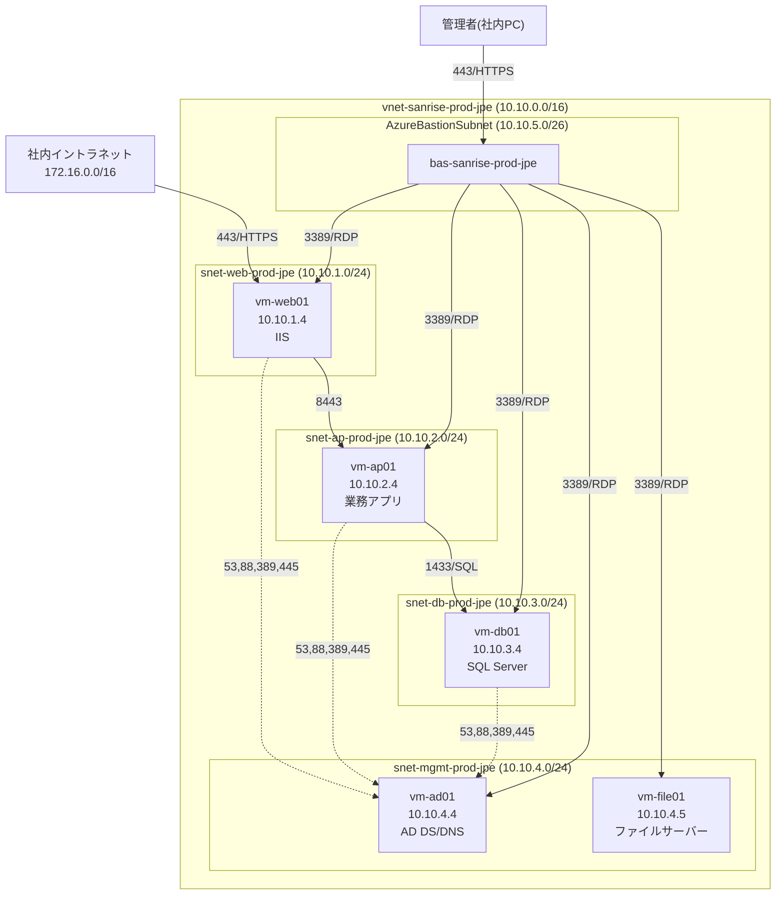

# 02. ネットワーク設計書

**この章のポイント**

- 仮想ネットワーク(VNet)を Web/AP/DB/管理/Bastion の5つのサブネットに分割し、多層防御(Defense in Depth、※詳しくは用語集(11-glossary.md)を参照)の考え方に基づいたネットワーク構成を設計します。
- IPアドレス設計の基本となる CIDR(Classless Inter-Domain Routing)表記の読み方を、はじめて学ぶ人向けに丁寧に解説します。
- 「AzureBastionSubnet」という名前が固定であることなど、Azure特有の制約・初心者がつまずきやすいポイントを整理します。
- NSG(Network Security Group、ネットワークセキュリティグループ。※詳しくは用語集を参照)のルールを、優先度・方向・プロトコル・送信元/宛先・許可/拒否の観点から1件ずつ丁寧に読み解きます。
- ADサーバーへのDNS委任と、Azureが標準で提供するDNSとの関係(名前解決の設計)を説明します。

---

## 1. ネットワーク設計の目的と全体方針

ネットワーク設計とは、「どの範囲のIPアドレスを、どのように区切り、どこからどこへの通信を許可・拒否するか」を決める工程です。00章(要件定義書)で整理したとおり、本プロジェクトの現状課題には以下のようなネットワーク・セキュリティに関するものが含まれていました。

- サーバー管理者が固定グローバルIP経由でVMへ直接RDP接続しており、アクセス統制・監査ログが不十分である(課題④)
- Web/AP/DBの3層が明確に分離されておらず、仮に1台が攻撃を受けた場合に他層への被害拡大を防ぐ仕組みが弱い

これらを解決するため、本設計では以下の3つの方針を採用しています。

1. **VNetは単一(1つ)とし、その中をサブネットで細かく分割する。** 本プロジェクトはJapan East単一リージョン・単一の業務システムが対象であり、複数VNetを連携させるハブ&スポーク構成(※詳しくは用語集を参照)を組むほどの規模ではありません。将来的な拡張余地は、VNet全体に十分広いアドレス空間(`10.10.0.0/16`)を確保することで担保します。
2. **VMには一切パブリックIPアドレスを付与せず、管理アクセスはAzure Bastion経由に一本化する。** これにより、非機能要件NF-01(Azure Bastion経由でのみ各VMに接続でき、VMには一切パブリックIPアドレスを付与しない)を満たします。
3. **層(Web/AP/DB)ごとにサブネットとNSGを分離し、業務上必要な通信のみを許可する多層防御構成とする。** これにより、非機能要件NF-02(Web層/AP層/DB層間の通信を業務上必要な最小限のポート・プロトコルのみに限定する多層防御構成)を満たします。

以降、これらの方針を具体的な設計値(設計台帳の値)とともに解説します。

---

## 2. VNet/サブネット構成

### 2.1 仮想ネットワーク(VNet)の基本情報

| 項目 | 値 |
|---|---|
| リソースグループ | `rg-sanrise-prod-jpe` |
| リージョン | Japan East(`japaneast`) |
| VNet名 | `vnet-sanrise-prod-jpe` |
| アドレス空間(CIDR) | `10.10.0.0/16` |

VNet名・サブネット名・NSG名はいずれもMicrosoft CAF(Cloud Adoption Framework)の略語規則に従い、`<リソース種別のプレフィックス>-<用途/会社名>-<環境>-<リージョン略称>` という命名パターンで統一しています(例:`vnet-` = Virtual Network、`snet-` = Subnet、`nsg-` = Network Security Group)。命名規則の詳細は01章(全体アーキテクチャ設計書)を参照してください。

### 2.2 サブネット構成(全サブネット一覧)

VNet `10.10.0.0/16` の中を、以下の5つのサブネットに分割しています。設計台帳(ledger)の値をそのまま掲載します。

| サブネット名 | CIDR | 用途 | 配置される主なリソース |
|---|---|---|---|
| `snet-web-prod-jpe` | `10.10.1.0/24` | Web層(IISによる受発注・在庫管理システムのフロントエンド) | `vm-web01`(`10.10.1.4`) |
| `snet-ap-prod-jpe` | `10.10.2.0/24` | AP層(業務アプリケーションサーバー、受発注・在庫管理ロジック実行) | `vm-ap01`(`10.10.2.4`) |
| `snet-db-prod-jpe` | `10.10.3.0/24` | DB層(SQL Serverによるデータベースサーバー) | `vm-db01`(`10.10.3.4`) |
| `snet-mgmt-prod-jpe` | `10.10.4.0/24` | 管理用サブネット(AD DS/DNS、ファイルサーバー等の基盤系サーバー) | `vm-ad01`(`10.10.4.4`)、`vm-file01`(`10.10.4.5`) |
| `AzureBastionSubnet` | `10.10.5.0/26` | Azure Bastion専用サブネット(Azureの固定仕様により名称固定、/26以上) | Azure Bastion(`bas-sanrise-prod-jpe`) |

> **補足**:サーバーの詳細スペック(VMサイズ、OS、ディスク構成)は03章(サーバー設計書)で解説します。本章はあくまでネットワーク(通信経路とアドレス設計)に焦点を当てます。

### 2.3 ネットワーク構成図

上図の実線はデータ通信、点線はDNS/AD認証通信、`BAS→各VM`はAzure Bastion経由の管理アクセスを表しています。VMWebからVMDBへの直接矢印が存在しないこと(=直接通信できないこと)が、本設計の多層防御の要点です。

---

## 3. CIDR表記の読み方(はじめて学ぶ人向け)

IPアドレス設計を理解するうえで避けて通れないのが「CIDR表記」です。ここでは `10.10.0.0/16` や `10.10.1.0/24` のような表記の意味を、基礎から解説します。

### 3.1 CIDRとは

CIDR(サイダー、Classless Inter-Domain Routing)とは、「IPアドレス/プレフィックス長」という形式で、あるネットワークに含まれるIPアドレスの範囲をまとめて表現する記法です。`10.10.1.0/24` の場合、次のように読み解きます。

- `10.10.1.0` … このネットワークの先頭アドレス(ネットワークアドレス)
- `/24` … 「プレフィックス長」。32ビットあるIPv4アドレスのうち、先頭24ビットが「ネットワーク部」(固定部分)であることを示す
- 残りの `32 - 24 = 8` ビットが「ホスト部」(このネットワーク内で自由に使える部分)となり、`2^8 = 256` 個のアドレスが割り当てられる

### 3.2 プレフィックス長とアドレス数の対応表

本設計で使用しているプレフィックス長を中心に、対応関係を整理します。

| プレフィックス長 | サブネットマスク | ホスト部のビット数 | 割当アドレス総数 | 本設計での使用箇所 |
|---|---|---|---|---|
| /16 | 255.255.0.0 | 16ビット | 65,536個 | VNet全体(`10.10.0.0/16`) |
| /24 | 255.255.255.0 | 8ビット | 256個 | Web/AP/DB/管理の各サブネット |
| /26 | 255.255.255.192 | 6ビット | 64個 | `AzureBastionSubnet` |

数字が大きくなるほど「ネットワーク部」が広がり、逆に1つのネットワークに含められるアドレス数(ホスト部)は少なくなる、という点がポイントです。`/16`(6万5千個)の中に、複数の`/24`(256個)や`/26`(64個)を切り出して収めている、というのが本設計のVNet/サブネットの関係です。

### 3.3 具体例:`10.10.1.0/24` の範囲を読み解く

| 項目 | 値 |
|---|---|
| ネットワークアドレス | 10.10.1.0 |
| 利用可能アドレス範囲(理論上) | 10.10.1.0 〜 10.10.1.255 |
| ブロードキャストアドレス | 10.10.1.255 |
| 理論上のアドレス総数 | 256個 |

ただし、Azure環境では後述するとおり、このうち5個のアドレスがAzureによって予約されるため、実際に仮想マシンへ割り当てられるのは251個です(詳細は4.2節)。

### 3.4 なぜVNet全体を `10.10.0.0/16` という広い範囲にしたのか(設計思想)

VNetのアドレス空間を必要最小限(例えば各サブネットの合計ぴったり)にせず、あえて `/16`(6万5千個超)という広い範囲を確保しています。理由は以下のとおりです。

1. **将来のサブネット追加に備えるため。** 現時点では5つのサブネットしか使っていませんが、将来的にPaaS化(App Service用サブネットなど)やDR用サブネットを追加する余地を残しています。
2. **オンプレミス側ネットワークとのアドレス重複を避けるため。** NSGルール設計(6章)に登場する社内イントラネットは `172.16.0.0/16` を使用しています。Azure側を `10.10.0.0/16` という異なる範囲にすることで、将来オンプレミスとAzure間でサイト間VPNやExpressRouteを構成する際にIPアドレスが重複せず、そのまま接続できます。これは実務で非常によく問われる設計判断です(重複したアドレス空間同士は直接ルーティングできないため)。

---

## 4. サブネットを分割する設計思想(多層防御)

### 4.1 なぜ1つの大きなサブネットにまとめず、5つに分割したのか

もっとも単純な設計は、VNet内に大きなサブネットを1つだけ作り、そこに全VMを配置することです。しかし本設計ではあえて、Web層・AP層・DB層・管理層・Bastion専用の5つのサブネットに分割しています。理由は次のとおりです。

| 観点 | 1つの大きなサブネットにまとめた場合の問題点 | サブネットを分割した場合の効果 |
|---|---|---|
| 被害の局所化(封じ込め) | 1台のVMが侵害されると、同じサブネット内の他VM全てへ横方向に侵入(ラテラルムーブメント、※詳しくは用語集を参照)されるリスクが高い | サブネットの境界でNSGによる通信制御が働くため、たとえばWeb層が侵害されてもDB層へは直接到達できない |
| 通信ルールの見通し | 全VM共通の緩いルールにせざるを得ず、最小権限の原則を徹底しにくい | 層ごとに「本当に必要な通信」だけを許可するルールを個別に定義でき、最小権限を徹底できる |
| 監査・トラブルシューティング | どの層からどの層への通信か、ログ上で区別しにくい | サブネット単位・NSG単位でログ(NSGフローログ等)を分析でき、異常な通信を発見しやすい |
| 役割ごとの拡張性 | AP層だけスケールアウトしたい場合等に、既存VMと混在していて設計変更が難しい | 層ごとに独立しているため、AP層だけVMを追加する、DB層だけディスクを強化するといった変更が他層に影響しにくい |

これは「多層防御(Defense in Depth)」と呼ばれる考え方で、1つの防御線(例えば境界のファイアウォール)だけに頼るのではなく、複数の防御線を重ねることで、どこか1つが突破されても被害を最小限に抑える設計思想です。本設計では特に、**ゼロトラストに近い最小権限**という要件(NF-02)を満たすため、単に層を分けるだけでなく、「Web→DBの直接通信を明示的に拒否する」ルールをWeb側・DB側の両方のNSGに重ねて定義しています(6章で詳しく解説します)。

### 4.2 管理用サブネット(`snet-mgmt-prod-jpe`)を分離した理由

AD DS/DNSサーバー(`vm-ad01`)とファイルサーバー(`vm-file01`)は、業務アプリケーションの3層(Web/AP/DB)とは性質が異なる「基盤系サーバー」であるため、専用の管理用サブネットにまとめて配置しています。これらのサーバーはVNet内の全サブネット(Web/AP/DB)から名前解決・認証・ファイル共有のために通信を受け付ける必要があり、業務ロジックのサブネットとは異なるアクセスパターンを持つためです。

### 4.3 Bastion専用サブネット(`AzureBastionSubnet`)を分離した理由

Azure Bastionは、VMへの管理アクセス(RDP/SSH)を仲介するマネージドサービスであり、Azureの仕様上、必ず専用のサブネットに配置する必要があります(他のリソースと同居できません)。これを独立させることで、「管理アクセスの入口」を1か所に集約し、管理者の接続ログ・アクセス経路を一元的に把握・統制できるようにしています(NF-01への対応)。

---

## 5. Azure特有の制約:初心者がつまずきやすいポイント

オンプレミスのネットワーク設計にはないAzure特有の制約がいくつかあります。実際に設計・構築する際につまずきやすいポイントを整理します。

| No. | つまずきやすいポイント | 内容 | 本設計での対応 |
|---|---|---|---|
| 1 | Bastion用サブネットの名前は固定 | Azure Bastionを配置するサブネットの名前は、必ず `AzureBastionSubnet` という文字列(大文字・小文字も完全一致)でなければならない。他の名前(例:`snet-bastion-prod-jpe`)を付けるとBastionを配置できない | 設計台帳どおり `AzureBastionSubnet` という名前をそのまま使用 |
| 2 | Bastion用サブネットは `/26` 以上が必要 | Azure Bastionは最低でも `/26`(64アドレス)のサブネットサイズを要求する。`/27` 以下では作成できない | `10.10.5.0/26` を割り当て(将来Standard SKUへ変更しホストのスケールアウトを行う場合にも対応できるサイズ) |
| 3 | 各サブネットで5個のIPアドレスがAzureにより予約される | `/24`(256個)のサブネットでも、実際にVM等へ割り当てられるのは251個。予約分の内訳は、ネットワークアドレス(先頭1個)、デフォルトゲートウェイ(先頭+1)、DNS用に2個(Azure予約)、ブロードキャストアドレス(末尾1個)の合計5個 | サーバー数(1〜2台/サブネット)に対して `/24` は十分な余裕があるため問題なし |
| 4 | サブネットは作成後にCIDR範囲を変更しにくい | 一度サブネットを作成し、その中にリソース(VMのNICなど)を配置すると、後からアドレス範囲を縮小・変更することが難しい(リソースの再作成が必要になる場合が多い) | 事前にVM台数・将来の増設を見込んで `/24` の余裕あるサイズを採用 |
| 5 | 1つのサブネットには1つのNSGしか関連付けできない | サブネット単位で見ると、適用できるNSGは常に1つ(複数のNSGを重ねて適用することはできない) | 層ごとに専用のNSG(`nsg-web-prod-jpe` 等)を1対1で作成 |
| 6 | VNetのアドレス空間は他ネットワークと重複させてはいけない | 同一アドレス範囲を使うVNet同士や、オンプレミスとVNetは、ピアリングやVPN接続時に正しくルーティングできない | オンプレミス社内ネットワーク(`172.16.0.0/16`)とは異なる `10.10.0.0/16` を採用(3.4節参照) |
| 7 | Bastionサブネットには特別なNSGルールが必須 | `AzureBastionSubnet` にNSGを付けること自体は可能だが、Azure Bastionの正常動作のために必須となる決まったルール(GatewayManager・AzureLoadBalancer等からの通信許可)を定義しないとサービスが動作しなくなる | `nsg-bastion-prod-jpe` にAzure公式ドキュメントで必須とされるルールを過不足なく定義(6.2節) |

---

## 6. NSGルール設計

### 6.1 NSGルールの読み方(初心者向け解説)

NSG(ネットワークセキュリティグループ)は、サブネット(またはNIC)を通過する通信を許可・拒否するフィルタです。1件のルールは、次の要素で構成されます。

| 要素 | 意味 | 補足 |
|---|---|---|
| 優先度(Priority) | ルールが評価される順番。数字が小さいほど先に評価される | 100〜4096の範囲。同じ優先度は使えない。最初にマッチしたルールが適用され、以降のルールは評価されない |
| 方向(Direction) | 通信の向き。Inbound(受信)/Outbound(送信) | サブネットに「入ってくる」通信か「出ていく」通信かを区別する |
| プロトコル(Protocol) | TCP/UDP/ICMP/Any(`*`) | 例えばRDPはTCP、DNSの問い合わせはUDP(場合によりTCPも使用) |
| 送信元ポート(Source Port) | 通信の送信元が使うポート番号 | クライアント側が動的に使う一時的なポートのため、通常は `*`(すべて)を指定する |
| 宛先ポート(Destination Port) | 通信先のアプリケーションが待ち受けているポート番号 | 例:RDPは3389、HTTPSは443、SQL Serverは1433 |
| 送信元(Source) | 通信の送り主。IPアドレス範囲(CIDR)、サービスタグ(後述)、または `*` | 例:`10.10.5.0/26`(Bastionサブネット)、`Internet` |
| 宛先(Destination) | 通信の届け先。送信元と同様の指定方法 | |
| アクセス許可(Access) | Allow(許可)/Deny(拒否) | |

**サービスタグ(Service Tag)** とは、`Internet`、`VirtualNetwork`、`AzureLoadBalancer`、`GatewayManager`、`Storage`、`AzureActiveDirectory`、`AzureCloud` のように、Azureがあらかじめ定義してくれているIPアドレス範囲のグループ名です。Azure側のサービスのIPアドレスは変更されることがあるため、個別のIPアドレスを直接指定する代わりにサービスタグを使うことで、Azure側の変更に追従したルール管理が可能になります。

**評価の基本ルール**:
1. 同じ方向(Inbound/Outbound)のルールを、優先度の数字が小さい順に評価します。
2. 通信内容(プロトコル・ポート・送信元・宛先)が最初にマッチしたルールが適用され、それ以降のルールは評価されません。
3. どのルールにもマッチしなかった通信は、既定ルール(`AllowVnetInBound`、`AllowAzureLoadBalancerInBound`、`DenyAllInBound` など、優先度65000番台でAzureが自動的に用意している)によって処理されます。本設計では、既定の全拒否に頼らず、明示的に `Deny` ルールを追加している箇所があります(例:`Deny-Web-To-Db-Outbound`)。これは「意図を明文化し、設計書やポータル上でひと目で分かるようにする」ための工夫です。

以降、設計台帳のNSGルールを1つずつ、サブネット(NSG)単位の表として掲載します。

### 6.2 `nsg-bastion-prod-jpe`(適用先:`AzureBastionSubnet`)

Azure Bastionを正しく動作させるために、Microsoft公式ドキュメントで必須とされているルール一式です。値を変更・追加・削除するとBastionが正常に動作しなくなるため、原則としてそのまま維持します。

**Inbound(受信)ルール**

| 優先度 | ルール名 | プロトコル | 送信元ポート | 宛先ポート | 送信元 | 宛先 | 許可/拒否 | 設計意図(理由) |
|---|---|---|---|---|---|---|---|---|
| 100 | AllowHttpsInbound | TCP | * | 443 | Internet | AzureBastionSubnet(10.10.5.0/26) | Allow | Bastion公式必須ルール:インターネットからのHTTPS(443)受信を許可 |
| 110 | AllowGatewayManagerInbound | TCP | * | 443 | GatewayManager | AzureBastionSubnet(10.10.5.0/26) | Allow | Bastion公式必須ルール:Azure基盤の管理トラフィック(GatewayManager)を許可 |
| 120 | AllowAzureLoadBalancerInbound | TCP | * | 443 | AzureLoadBalancer | AzureBastionSubnet(10.10.5.0/26) | Allow | Bastion公式必須ルール:ヘルスプローブ用にAzureLoadBalancerからの通信を許可 |
| 130 | AllowBastionHostCommunicationInbound | TCP | * | 8080,5701 | AzureBastionSubnet(10.10.5.0/26) | AzureBastionSubnet(10.10.5.0/26) | Allow | Bastion公式必須ルール:Bastionホスト間のデータプレーン内部通信を許可 |
| 4096 | DenyAllInbound | * | * | * | * | * | Deny | 既定の全拒否を明示化し、上記許可ルール以外の受信を遮断 |

**Outbound(送信)ルール**

| 優先度 | ルール名 | プロトコル | 送信元ポート | 宛先ポート | 送信元 | 宛先 | 許可/拒否 | 設計意図(理由) |
|---|---|---|---|---|---|---|---|---|
| 100 | AllowSshRdpOutbound | TCP | * | 22,3389 | AzureBastionSubnet(10.10.5.0/26) | VirtualNetwork(10.10.0.0/16) | Allow | Bastion公式必須ルール:対象VNet内VMへの踏み台RDP/SSH通信を許可 |
| 110 | AllowAzureCloudOutbound | TCP | * | 443 | AzureBastionSubnet(10.10.5.0/26) | AzureCloud | Allow | Bastion公式必須ルール:証明書検証やログ等Azure基盤サービスへのHTTPS送信を許可 |
| 120 | AllowBastionHostCommunicationOutbound | TCP | * | 8080,5701 | AzureBastionSubnet(10.10.5.0/26) | AzureBastionSubnet(10.10.5.0/26) | Allow | Bastion公式必須ルール:Bastionホスト間のデータプレーン内部通信を許可 |
| 130 | AllowGetSessionInformationOutbound | TCP | * | 80 | AzureBastionSubnet(10.10.5.0/26) | Internet | Allow | Bastion公式必須ルール:セッション情報取得のためのHTTP(80)送信を許可 |

> **読み方の例**:Inbound優先度100の `AllowHttpsInbound` は、「インターネット上のどこからでも(送信元:Internet)、Bastionサブネット(宛先:10.10.5.0/26)の443番ポートへのTCP通信を許可する」という意味です。管理者はブラウザからAzureポータルにHTTPS(443)でアクセスし、ポータル上でBastion経由の接続を開始するため、この通信が必要になります。

### 6.3 `nsg-web-prod-jpe`(適用先:`snet-web-prod-jpe`)

**Inbound(受信)ルール**

| 優先度 | ルール名 | プロトコル | 送信元ポート | 宛先ポート | 送信元 | 宛先 | 許可/拒否 | 設計意図(理由) |
|---|---|---|---|---|---|---|---|---|
| 100 | Allow-Bastion-Rdp-Inbound | TCP | * | 3389 | 10.10.5.0/26(AzureBastionSubnet) | 10.10.1.0/24(snet-web-prod-jpe) | Allow | Bastion経由の管理アクセスのみ許可し、直接のRDP接続を禁止(ゼロトラスト) |
| 110 | Allow-CorpIntranet-Https-Inbound | TCP | * | 443 | 172.16.0.0/16(オンプレ社内ネットワーク) | 10.10.1.0/24(snet-web-prod-jpe) | Allow | 社内ユーザー端末からの受発注・在庫管理システムWeb画面アクセスのみ許可 |
| 4000 | Deny-Internet-Inbound | * | * | * | Internet | 10.10.1.0/24(snet-web-prod-jpe) | Deny | インターネットからの直接アクセスを遮断し、社内利用のみに限定する |

**Outbound(送信)ルール**

| 優先度 | ルール名 | プロトコル | 送信元ポート | 宛先ポート | 送信元 | 宛先 | 許可/拒否 | 設計意図(理由) |
|---|---|---|---|---|---|---|---|---|
| 100 | Allow-Web-To-Ap-Outbound | TCP | * | 8443 | 10.10.1.0/24(snet-web-prod-jpe) | 10.10.2.0/24(snet-ap-prod-jpe) | Allow | Web層からAP層へのアプリケーションAPI呼び出しのみ許可 |
| 110 | Allow-Web-To-AdDns-Outbound | TCP,UDP | * | 53,88,389,445 | 10.10.1.0/24(snet-web-prod-jpe) | 10.10.4.0/24(snet-mgmt-prod-jpe) | Allow | 名前解決とドメイン認証のためADサーバーへの通信のみ許可 |
| 200 | Deny-Web-To-Db-Outbound | * | * | * | 10.10.1.0/24(snet-web-prod-jpe) | 10.10.3.0/24(snet-db-prod-jpe) | Deny | 多層防御:Web層からDB層への直接通信を明示的に禁止する |

> **読み方の例**:Outbound優先度200の `Deny-Web-To-Db-Outbound` は、「Web層(10.10.1.0/24)からDB層(10.10.3.0/24)へのあらゆる送信通信を拒否する」というルールです。仮にWeb層のVMがマルウェア感染などで乗っ取られたとしても、このルールによりDB層への通信路が断たれているため、被害が直接DBへ及ぶことを防ぎます。優先度200という数字自体には特別な意味はなく、他の許可ルール(100番台)より後に評価されるように余裕を持たせているだけです。

### 6.4 `nsg-ap-prod-jpe`(適用先:`snet-ap-prod-jpe`)

**Inbound(受信)ルール**

| 優先度 | ルール名 | プロトコル | 送信元ポート | 宛先ポート | 送信元 | 宛先 | 許可/拒否 | 設計意図(理由) |
|---|---|---|---|---|---|---|---|---|
| 100 | Allow-Web-To-Ap-Inbound | TCP | * | 8443 | 10.10.1.0/24(snet-web-prod-jpe) | 10.10.2.0/24(snet-ap-prod-jpe) | Allow | Web層からの業務アプリケーションAPI呼び出しのみ許可 |
| 110 | Allow-Bastion-Rdp-Inbound | TCP | * | 3389 | 10.10.5.0/26(AzureBastionSubnet) | 10.10.2.0/24(snet-ap-prod-jpe) | Allow | Bastion経由の管理アクセスのみ許可 |
| 200 | Deny-Db-To-Ap-Inbound | * | * | * | 10.10.3.0/24(snet-db-prod-jpe) | 10.10.2.0/24(snet-ap-prod-jpe) | Deny | 多層防御:DB層からAP層への逆方向の通信開始を禁止 |

**Outbound(送信)ルール**

| 優先度 | ルール名 | プロトコル | 送信元ポート | 宛先ポート | 送信元 | 宛先 | 許可/拒否 | 設計意図(理由) |
|---|---|---|---|---|---|---|---|---|
| 100 | Allow-Ap-To-Db-Outbound | TCP | * | 1433 | 10.10.2.0/24(snet-ap-prod-jpe) | 10.10.3.0/24(snet-db-prod-jpe) | Allow | APサーバーからDBサーバーへのSQL接続のみ許可 |
| 110 | Allow-Ap-To-AdDns-Outbound | TCP,UDP | * | 53,88,389,445 | 10.10.2.0/24(snet-ap-prod-jpe) | 10.10.4.0/24(snet-mgmt-prod-jpe) | Allow | 名前解決とドメイン認証のためADサーバーへの通信のみ許可 |

> **読み方の例**:Inbound優先度200の `Deny-Db-To-Ap-Inbound` は、「DB層からAP層への通信の“開始”を拒否する」ルールです。通常の業務フロー(AP→DBへSQL接続)では、DBが応答を返す通信(戻りの通信)はステートフル(状態を保持する)なNSGの性質上、この拒否ルールに関係なく許可されます。このルールが防いでいるのは、DB層が乗っ取られた場合などに、DB側からAP層へ新たに接続を開始しようとする不正な通信です。

### 6.5 `nsg-db-prod-jpe`(適用先:`snet-db-prod-jpe`)

**Inbound(受信)ルール**

| 優先度 | ルール名 | プロトコル | 送信元ポート | 宛先ポート | 送信元 | 宛先 | 許可/拒否 | 設計意図(理由) |
|---|---|---|---|---|---|---|---|---|
| 100 | Allow-Ap-To-Db-Inbound | TCP | * | 1433 | 10.10.2.0/24(snet-ap-prod-jpe) | 10.10.3.0/24(snet-db-prod-jpe) | Allow | APサーバーからのSQL接続のみ許可し、他層からの接続を遮断する |
| 110 | Allow-Bastion-Rdp-Inbound | TCP | * | 3389 | 10.10.5.0/26(AzureBastionSubnet) | 10.10.3.0/24(snet-db-prod-jpe) | Allow | Bastion経由の管理アクセスのみ許可 |
| 120 | Deny-Web-To-Db-Inbound | * | * | * | 10.10.1.0/24(snet-web-prod-jpe) | 10.10.3.0/24(snet-db-prod-jpe) | Deny | 多層防御:Web層からDB層への直接アクセスを明示的に遮断する |

**Outbound(送信)ルール**

| 優先度 | ルール名 | プロトコル | 送信元ポート | 宛先ポート | 送信元 | 宛先 | 許可/拒否 | 設計意図(理由) |
|---|---|---|---|---|---|---|---|---|
| 100 | Allow-Db-To-AdDns-Outbound | TCP,UDP | * | 53,88,389,445 | 10.10.3.0/24(snet-db-prod-jpe) | 10.10.4.0/24(snet-mgmt-prod-jpe) | Allow | 名前解決とドメイン認証のためADサーバーへの通信のみ許可 |
| 110 | Allow-Db-To-AzureBackup-Outbound | TCP | * | 443 | 10.10.3.0/24(snet-db-prod-jpe) | Storage(サービスタグ) | Allow | Azure Backup(MARSエージェント/バックアップ拡張機能)によるバックアップデータのAzure Storageへの送信を許可 |

> **読み方の例**:`Deny-Web-To-Db-Inbound`(DB側)と、6.3節の `Deny-Web-To-Db-Outbound`(Web側)は、実は同じ通信(Web→DB)を「送信側」と「受信側」の両方から二重に拒否している、一見冗長なルールです。これは意図的な設計であり、片方のNSG設定に誤りがあった場合でも、もう一方のNSGが防波堤として機能するようにするための多層防御の実践です。実務でも「重要な境界は複数の場所で守る」という考え方は評価されるポイントです。

### 6.6 `nsg-mgmt-prod-jpe`(適用先:`snet-mgmt-prod-jpe`)

**Inbound(受信)ルール**

| 優先度 | ルール名 | プロトコル | 送信元ポート | 宛先ポート | 送信元 | 宛先 | 許可/拒否 | 設計意図(理由) |
|---|---|---|---|---|---|---|---|---|
| 100 | Allow-Bastion-Rdp-Inbound | TCP | * | 3389 | 10.10.5.0/26(AzureBastionSubnet) | 10.10.4.0/24(snet-mgmt-prod-jpe) | Allow | Bastion経由の管理アクセスのみ許可 |
| 110 | Allow-VNet-To-AdDns-Inbound | TCP,UDP | * | 53,88,389,445,3268 | 10.10.0.0/16(VNet全体) | 10.10.4.0/24(snet-mgmt-prod-jpe) | Allow | Web/AP/DB各層からのDNS名前解決・AD認証・SMBファイル共有アクセスを許可 |
| 4000 | Deny-Internet-Inbound | * | * | * | Internet | 10.10.4.0/24(snet-mgmt-prod-jpe) | Deny | インターネットからの直接アクセスを遮断する |

**Outbound(送信)ルール**

| 優先度 | ルール名 | プロトコル | 送信元ポート | 宛先ポート | 送信元 | 宛先 | 許可/拒否 | 設計意図(理由) |
|---|---|---|---|---|---|---|---|---|
| 100 | Allow-Mgmt-To-EntraId-Outbound | TCP | * | 443 | 10.10.4.0/24(snet-mgmt-prod-jpe) | AzureActiveDirectory(サービスタグ) | Allow | Entra Connectによるディレクトリ同期のためのHTTPS通信を許可 |

> **読み方の例**:`Allow-VNet-To-AdDns-Inbound` の送信元が `10.10.0.0/16`(VNet全体)と広く指定されているのは、Web・AP・DBのすべての層がADサーバーへDNS問い合わせ・ドメイン認証・SMB通信を行う必要があるためです。この点だけは「層ごとに個別指定」ではなく「VNet全体からの許可」としており、管理用サブネットが基盤サービス(AD/DNS)を担うという役割の違いを反映した設計です。ポート `3268` はグローバルカタログ(GC:複数ドメイン構成時にAD情報を検索するための仕組み。※詳しくは用語集を参照)用のポートで、将来的なマルチドメイン構成やEntra Connectの動作要件を見越して開放しています。

---

## 7. DNS設計

### 7.1 DNS方式の全体像(設計思想)

Azure VNetには、既定で `168.63.129.16` という特別な仮想IPアドレスによる「Azure提供のDNS」が組み込まれており、何も設定しなければ、VNet内のVMはこのDNSを使ってAzure内部の名前解決(VM名からプライベートIPへの解決など)を行います。

しかし本設計では、業務要件F-02(社内AD DS/DNS基盤をAzure上に拡張し、オンプレミスADとのハイブリッド構成を実現する)を満たすため、VNetのDNS設定を **カスタムDNS(`vm-ad01` = `10.10.4.4`)** に切り替えています。理由は次のとおりです。

- Windowsのドメイン参加コンピュータ(Webサーバー、APサーバー、DBサーバー、ファイルサーバー等)は、ドメイン `sanrise.local` に参加・認証する際に、AD統合DNSゾーンに登録される特殊なレコード(SRVレコード:ドメインコントローラの場所を示すレコードなど)を解決する必要があります。
- Azure提供の既定DNS(`168.63.129.16`)は、Azure内部の名前解決には対応していますが、AD統合DNSゾーンやSRVレコードは解決できません。
- そのため、ドメイン環境で正しく認証・名前解決を行うには、AD DSの役割を兼務する `vm-ad01` をVNetのDNSサーバーとして明示的に指定する必要があります。

| 項目 | 値/方針 |
|---|---|
| VNetのDNS設定 | カスタムDNS:`10.10.4.4`(`vm-ad01`) |
| ADドメイン名 | `sanrise.local` |
| DNS役割の配置 | `vm-ad01` がAD DS(ドメインコントローラ)とDNSサーバーの役割を兼務 |
| Azure提供DNS(既定) | `168.63.129.16`(VNet設定をカスタムDNSにしても、Azure基盤サービスからは常にこのアドレスで到達可能) |

### 7.2 名前解決の流れ

| シナリオ | 問い合わせ先 | 解説 |
|---|---|---|
| ドメイン参加VM(例:`vm-web01`)が `vm-db01.sanrise.local` を名前解決する | `vm-ad01`(10.10.4.4) | VNetのDNS設定がカスタムDNSのため、まず `vm-ad01` へ問い合わせが飛ぶ。AD統合ゾーンに登録済みのため即座に解決される |
| ドメイン参加VMがログオン・Kerberos認証(※詳しくは用語集を参照)を行う | `vm-ad01`(10.10.4.4) | ドメインコントローラの場所を示すSRVレコードをDNSで解決し、そのドメインコントローラ(`vm-ad01`自身)へ認証要求(ポート88など)を送る |
| `vm-ad01` が外部(インターネット上)のホスト名を名前解決する必要がある場合(例:Windows Update、Azure PaaSサービスのFQDN等) | `vm-ad01` → フォワーダー設定 → `168.63.129.16`(Azure提供DNS) | 社内AD DNSサーバーが自ゾーン(`sanrise.local`)以外の問い合わせを受けた際、Azure提供DNS(168.63.129.16)を「フォワーダー(転送先)」として構成しておくことで、インターネット上の名前解決も行える |
| `nsg-db-prod-jpe` の `Allow-Db-To-AzureBackup-Outbound` や `nsg-mgmt-prod-jpe` の `Allow-Mgmt-To-EntraId-Outbound` で許可している通信 | Storage/AzureActiveDirectoryサービスタグの実体(例:`*.blob.core.windows.net`、`login.microsoftonline.com`等) | これらのAzure公開エンドポイントのFQDNを名前解決するためにも、上記のフォワーダー設定(vm-ad01→168.63.129.16)が必要になる |

### 7.3 Azure提供DNS(`168.63.129.16`)の役割

`168.63.129.16` は、Azure内のすべての仮想ネットワークで共通して使える特別な仮想パブリックIPアドレスで、次の役割を持っています。

- VNetのDNS設定をカスタムDNS(本設計では`vm-ad01`)に変更していても、VM自身はこのアドレスに対して常に通信できます(DHCP・ライセンス認証・正常性プローブなどのAzureプラットフォーム内部通信に使われるため)。
- 社内AD DNSサーバー(`vm-ad01`)の「フォワーダー」として設定することで、`sanrise.local` 以外のドメイン名(インターネット上のFQDN)の名前解決を、Azureの高速なDNSインフラに委任できます。
- Azure Bastionのようなマネージドサービス自体も内部的にこのアドレスを利用しますが、これはAzure側が自動的に処理する範囲であり、利用者側で明示的な設定は不要です。

### 7.4 将来のハイブリッド構成に向けて

現段階では `vm-ad01` はAzure内で完結するAD DS環境として構築していますが、要件定義(F-02)にあるとおり、将来的にはオンプレミス側ADドメイン(`sanrise.local`)とのハイブリッド構成(サイト間VPN経由でのレプリケーションや、Microsoft Entra Connectによるディレクトリ同期)への拡張を想定しています。そのための準備として、以下をあらかじめ設計に織り込んでいます。

- VNetのアドレス空間(`10.10.0.0/16`)をオンプレミス(`172.16.0.0/16`)と重複しない範囲にしていること(3.4節)
- `nsg-mgmt-prod-jpe` に、Entra Connectのディレクトリ同期通信(HTTPS/443、宛先:AzureActiveDirectoryサービスタグ)をあらかじめ許可済みにしていること
- 管理用サブネットにEntra Connectサーバーを将来的に同居させる余地を、IPアドレス面(`10.10.4.0/24` の未使用アドレス)で確保していること

ハイブリッドID戦略の詳細(Entra IDとオンプレミスAD DSの役割分担、RBAC設計など)は、05章(ID・アクセス管理設計書)で解説します。

---

## 8. まとめ:本章の設計思想の振り返り

本章で行ったネットワーク設計の要点を、改めて「なぜそうしたのか」という観点で整理します。

1. **VNetを単一にしつつ、内部をサブネットで細かく分割した**のは、複数リージョン・複数VNetを必要としない小〜中規模システムにおいて、シンプルさを保ちながら多層防御を実現するための現実的な選択だからです。
2. **VMへのパブリックIP付与を全廃し、Azure Bastion経由に一本化した**のは、現状課題(固定グローバルIP経由の直接RDP接続によるアクセス統制不足)を根本的に解消し、非機能要件NF-01を満たすためです。
3. **Web/AP/DB層間の通信を最小限のポートに絞り、かつ逆方向・直接迂回の通信も明示的に拒否した**のは、単一の防御線に頼らない多層防御の考え方(ゼロトラストに近い最小権限)を徹底するためです。
4. **VNetのアドレス空間をオンプレミスと重複しない範囲に設計した**のは、目先の要件だけでなく、将来のハイブリッド接続(サイト間VPN、Entra Connect等)を見据えた拡張性を確保するためです。
5. **DNSをAD統合DNS(`vm-ad01`)中心の構成にした**のは、Windowsドメイン環境の名前解決・認証の仕組み上、Azure提供DNSだけでは業務要件(F-02のハイブリッドAD構成)を満たせないためです。

これらの設計判断は、いずれも00章で整理した現状課題・要件へ論理的に紐づいています。次章(03章:サーバー設計書)では、本章で定義したサブネット上に実際にどのようなスペックのVMを配置するかを詳細に解説します。

---

## 理解度チェック

**Q1. Azure Bastion用のサブネットの名前を、自社の命名規則(例:`snet-bastion-prod-jpe`)に合わせて自由に変更してもよいですか?**

A. いいえ、変更できません。Azure Bastionの仕様上、専用サブネットの名前は必ず `AzureBastionSubnet` という固定文字列(大文字・小文字も完全一致)である必要があります。他の名前を付けるとBastionを配置できません。

**Q2. `10.10.1.0/24` のサブネットには理論上256個のIPアドレスが含まれますが、実際にVMへ割り当てられるのは何個で、なぜですか?**

A. 251個です。Azureは各サブネットで、ネットワークアドレス・デフォルトゲートウェイ・DNS用途2個・ブロードキャストアドレスの合計5個を予約するため、理論値の256個から5個を差し引いた数が実際に使える数になります。

**Q3. NSGのルールで、優先度100のルールと優先度200のルールがある場合、どちらが先に評価されますか?**

A. 優先度100のルールが先に評価されます。NSGの優先度は数字が小さいほど優先順位が高く、先に評価される仕組みです。

**Q4. Web層のVM(`vm-web01`)からDB層のVM(`vm-db01`)へ、なぜ直接通信できないのですか? どのルールがそれを実現していますか?**

A. 多層防御の考え方に基づき、Web層とDB層の間の直接通信を意図的に禁止する設計にしているためです。具体的には、`nsg-web-prod-jpe` の `Deny-Web-To-Db-Outbound`(送信側の拒否)と、`nsg-db-prod-jpe` の `Deny-Web-To-Db-Inbound`(受信側の拒否)の両方で、二重に明示的な拒否ルールを設定しています。

**Q5. 社内のドメイン参加コンピュータが `sanrise.local` 内のホスト名を名前解決するとき、どのDNSサーバーに問い合わせますか? また、インターネット上のホスト名を解決したいときはどうなりますか?**

A. まず `vm-ad01`(`10.10.4.4`)に問い合わせます。VNetのDNS設定をこのIPアドレスへのカスタムDNSとしているためです。インターネット上のホスト名(自ゾーン以外)を解決したい場合は、`vm-ad01` 上のフォワーダー設定により、Azure提供DNS(`168.63.129.16`)へ転送されて解決されます。
