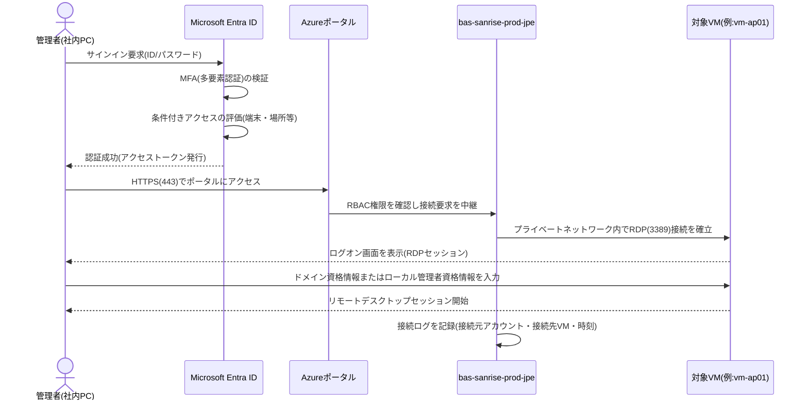
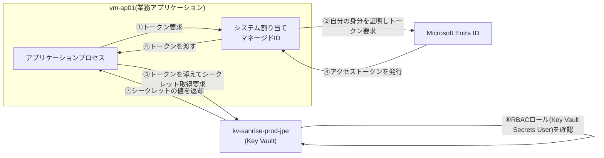

# 04. セキュリティ設計書

**この章のポイント**

- サーバー管理者の接続経路をAzure Bastion(踏み台サーバー機能をマネージドサービスとして提供する仕組み。※詳しくは用語集(11-glossary.md)を参照)に一本化し、VMへのパブリックIPアドレス付与を全廃することで、外部からの攻撃対象領域(アタックサーフェス)をどう縮小しているかを解説します。
- Microsoft Entra ID(旧Azure AD)とオンプレミスAD DS(Active Directory Domain Services)を組み合わせたハイブリッドID基盤、およびRBAC(Role-Based Access Control、役割に基づくアクセス制御)による最小権限の原則を、はじめて学ぶ人向けに丁寧に解説します。
- パスワードや接続文字列を「なぜコードや構成ファイルに直書きしてはいけないのか」という基本から、Azure Key Vaultによる秘密情報の一元管理の仕組みを説明します。
- 保管時暗号化(ディスク暗号化・TDE)と転送時暗号化(TLS)の違いと、本設計での適用状況・残課題を整理します。
- 章末に、実務でそのまま使えるセキュリティチェックリストを用意します。

---

## 1. 本章の目的と全体方針

### 1.1 本章の位置づけ

00章(要件定義書)・01章(全体アーキテクチャ設計書)・02章(ネットワーク設計書)では、VNet・サブネット・NSG(ネットワークセキュリティグループ)による「通信経路」の設計を扱いました。本章では、その通信経路の**内側**、すなわち「誰が」「どのような権限で」「何にアクセスできるか」「情報がどのように守られているか」というアクセス制御・秘密情報管理・暗号化の観点から、セキュリティ設計を深掘りします。ネットワーク層の防御(境界防御)と、本章で扱うID・秘密情報・暗号化の防御(内部防御)を組み合わせることで、はじめて「多層防御(Defense in Depth)」と「ゼロトラスト(社内外を問わずすべての通信を信用せず都度検証するセキュリティの考え方。※詳しくは用語集を参照)に近い最小権限」というプロジェクトゴールが実現できます。

### 1.2 現状課題との対応関係

00章で整理した現状課題のうち、本章が直接的に解決の対象とするのは主に課題④です。

| # | 現状の課題 | 本章での対応 |
|---|---|---|
| 4 | サーバー管理者が固定グローバルIP経由でVMへ直接RDP接続しており、共有の管理者アカウントも常態化していてアクセス統制・監査ログが不十分である | Azure Bastion経由への接続一本化(2章)、Microsoft Entra IDの個人アカウント化・MFA(多要素認証)・条件付きアクセスの必須化(3章)、RBACによる最小権限の権限払い出し(3章) |
| 2 | OSがWindows Server 2012 R2でメーカーサポートが終了しており、脆弱性対応ができない | Windows Server 2022への刷新(01章・03章)に加え、Microsoft Defender for Cloudによる継続的な脆弱性の可視化(6章) |
| 6 | バックアップが磁気テープによる手動運用であり、リストア検証が未実施 | バックアップデータの保管時暗号化・地理的保全(5章)。運用手順自体はバックアップ設計の章で詳述 |

### 1.3 本設計が目指すセキュリティモデル

本設計が目指すのは、「社内ネットワークの中にいるから安全」「一度ログインしたら何でもできる」という暗黙の信頼を置かない、**ゼロトラストに近い最小権限モデル**です。具体的には、以下の4本の柱で構成しています。

| 柱 | 目的 | 本章の該当章 |
|---|---|---|
| ① 管理アクセスの統制 | 「誰が」VMに接続するかを一元的な入口(Bastion)に集約し、証跡を残す | 2章 |
| ② ID・権限の最小化 | 「どこまでの操作が許されるか」を役割ごとに必要最小限に絞る | 3章 |
| ③ 秘密情報の一元管理 | パスワードや接続文字列を人の目・平文ファイルに触れさせない | 4章 |
| ④ データの暗号化 | 保管中・通信中のデータそのものを、経路や権限の防御を突破されても読み取れない状態にする | 5章 |

以降、この4本の柱の順に、設計台帳(ledger)の値に基づいて詳しく解説します。

---

## 2. 管理アクセスのセキュリティ:Azure Bastion

### 2.1 Bastionの基本情報

| 項目 | 値 |
|---|---|
| Bastion名 | `bas-sanrise-prod-jpe` |
| 専用サブネット | `AzureBastionSubnet`(`10.10.5.0/26`) |
| 対象VM(接続先) | `vm-ad01`、`vm-web01`、`vm-ap01`、`vm-db01`、`vm-file01`(全5台) |
| SKU | Basic SKU(コスト重視の構成のため。月額概算はコスト設計の章を参照) |

### 2.2 Azure Bastionとは何か

Azure Bastionは、Microsoftが基盤の保守・可用性確保を担う**マネージド型の踏み台サービス**です。管理者はブラウザ(またはネイティブクライアント)からAzureポータルへHTTPS(443番ポート)でアクセスし、ポータル上でBastionを介したRDP(Remote Desktop Protocol)接続を開始します。Bastionはインターネットから受けたHTTPS接続を、内部のプライベートネットワーク経由でのみ対象VMへ中継するため、**管理者・VMのどちらもインターネットに直接さらされることがありません**。

### 2.3 なぜVMにパブリックIPアドレスを一切付与しないのか(設計思想)

現状課題④のとおり、旧システムではサーバー管理者が固定グローバルIP経由でVMへ直接RDP接続していました。これは一見すると便利な運用に見えますが、セキュリティの観点からは複数のリスクを抱えています。本設計であえてBastion方式を採用した理由を、他の選択肢と比較しながら整理します。

| 観点 | 固定グローバルIP+VPN経由の直接RDP(旧方式) | 自前の踏み台VM(Jump Server)を構築する方式 | Azure Bastion(本設計で採用) |
|---|---|---|---|
| インターネットからの到達性 | VM自体がグローバルIP/VPNの入口を持ち、ポートスキャンや総当たり攻撃(ブルートフォース攻撃、パスワードを機械的に総当たりで試す攻撃)の標的になり得る | 踏み台VMにパブリックIPを付与する構成にすると、同様のリスクがその1台に集約される | VMには一切パブリックIPを付与せず、Bastionという単一のマネージドな入口のみが外部に露出する。その入口自体はMicrosoftが継続的にセキュリティ対策・パッチ適用を行う |
| 認証情報の管理 | 個々の管理者が各VMの資格情報を個別に把握しがちで、共有の管理者アカウントが常態化しやすい(現状課題④そのもの) | 踏み台VM自体のローカルアカウントを別途管理する必要があり、管理対象がむしろ1台増える | Azureポータルへのサインインは個人のMicrosoft Entra IDアカウント+MFAで統制される。VMへのログオン認証(AD DSまたはローカル管理者)とは別レイヤーで多重に保護される(3章で詳述) |
| 監査ログ・証跡 | VPN側のログとVM側のログが分断されており、「誰が・いつ・どのVMに接続したか」を追跡しづらい(属人化) | 踏み台VM自体にログ収集基盤を自前で構築・保守する必要がある | Bastionの接続ログ(接続元アカウント・接続先VM・接続時刻)が自動的に記録され、Log Analyticsのダッシュボードで一元的に可視化できる(監視設計の章を参照) |
| 運用・保守負荷 | VPN機器自体の保守・ファームウェア更新が必要 | 踏み台VMのOSパッチ適用・可用性確保・冗長化を自前で運用する必要があり、運用負荷が増える | Microsoftがマネージドサービスとして基盤の保守・可用性を担うため、利用者側の運用負荷が小さい |
| 本設計での採否 | 不採用(現行方式であり、課題④の直接の原因) | 不採用(パブリックIP付与時のリスクと運用負荷を理由に見送り) | **採用** |

**設計思想のポイント**は、「攻撃対象領域(アタックサーフェス、攻撃者が狙うことのできる入口の数や範囲)を、できる限り1か所に集約し、そこだけを厳格に守る」という考え方です。5台のVMそれぞれに個別の入口(パブリックIP)を持たせるのではなく、Bastionという単一のマネージドな入口に統制することで、守るべき対象を減らし、かつその1か所への防御をMicrosoft側の継続的な保守に委ねることができます。

### 2.4 Bastion経由の接続フロー

このフローのポイントは、**認証が二段階に分かれている**ことです。①Azureポータルへのサインイン(Entra ID・MFA・条件付きアクセス)と、②VM自体へのログオン(AD DSのドメイン資格情報、またはKey Vaultで管理されたローカル管理者資格情報)は、まったく別のレイヤーで独立して行われます。どちらか一方の認証情報だけが漏えいしても、もう一方の認証を突破しない限り不正アクセスは成立しません。

### 2.5 Bastion利用時のAzure RBAC要件

Bastion経由で接続を開始するには、Azure基盤の管理操作としてのRBAC権限(3章で詳述)も必要です。具体的には、対象VMおよびBastionリソース(`bas-sanrise-prod-jpe`)に対して、少なくとも**Reader**ロール(閲覧のみの権限)が付与されている必要があります。この権限がなければ、たとえEntra IDでサインインできてもポータル上でBastion接続のボタン自体が操作できません。RBACの払い出しを絞ることで、「サインインはできるが、特定のVMへは接続できない」という粒度の制御が可能になります。

### 2.6 Basic SKUの制約と将来の拡張

本設計ではコスト制約(月額運用コストの抑制)を踏まえ、Azure BastionはBasic SKUを採用しています。Basic SKUは同時接続セッション数などに制約がありますが、本システムの利用規模(サーバー5台、管理者は少人数)であれば十分に運用可能と判断しています。将来、管理者が増員される、あるいは同時接続数の制約が運用上のボトルネックになった場合は、Standard SKU(スケールユニットによる同時接続数の拡張やIPベースの接続制御等の追加機能を持つ上位プラン)への切り替えを拡張オプションとして検討します。なお、`AzureBastionSubnet`をあらかじめ`/26`(64アドレス)のサイズで確保しているのは、こうした将来のスケールアウトにも対応できるようにするためです(02章5節参照)。

---

## 3. ID基盤とアクセス制御

### 3.1 ハイブリッドID戦略の全体像

本設計では、Microsoft Entra IDとオンプレミスAD DS(`sanrise.local`)を役割分担させる**ハイブリッドID基盤**を採用しています。設計台帳の方針は以下のとおりです。

> Microsoft Entra IDをAzureリソース(サブスクリプション/リソースグループ)の管理者ロール割り当てとAzure Bastionへのサインインに使用し、管理者にはEntra ID条件付きアクセスとMFA(多要素認証)を必須とする。社内業務アプリケーションのユーザー認証は既存のオンプレAD DS(`sanrise.local`)を継続利用し、将来的にはEntra Connectによるハイブリッド同期を構成してSSO基盤へ段階的に移行する方針とする。

この方針を整理すると、認証の対象によって使い分けが明確に分かれています。

| 認証の対象 | 使用するID基盤 | 適用される追加のセキュリティ対策 |
|---|---|---|
| Azureリソース(サブスクリプション/リソースグループ)の管理操作 | Microsoft Entra ID | 条件付きアクセス、MFA |
| Azure Bastionへのサインイン | Microsoft Entra ID | 条件付きアクセス、MFA |
| 社内業務アプリケーション(受発注・在庫管理システム)のユーザー認証 | オンプレミスAD DS(`sanrise.local`) | 既存のドメインパスワードポリシーを継続適用 |
| VM(`vm-ad01`〜`vm-file01`)へのOSログオン(RDP) | AD DSのドメイン資格情報、またはVMのローカル管理者アカウント | ローカル管理者パスワードはKey Vaultで一元管理(4章) |

### 3.2 なぜ認証基盤を一度に統合しないのか(段階移行の設計思想)

「最初からすべてEntra IDに統合すれば良いのでは」と考えるかもしれませんが、本設計ではあえて段階的な移行方針を取っています。理由は、本プロジェクトの制約条件に「既存業務アプリケーションの改修は最小限とし、原則としてOS・ミドルウェアをWindows Server 2022へ載せ替えるのみに留める」とあるためです。既存の受発注・在庫管理システムはオンプレAD DSのKerberos認証・LDAP(Lightweight Directory Access Protocol、ディレクトリサービスに問い合わせるための通信プロトコル。※詳しくは用語集を参照)に依存して作られており、認証方式をEntra ID単独へ全面切り替えするにはアプリケーション自体の改修が必要になります。これは「改修は最小限に留める」という制約に反するため、以下のような2段階アプローチを採用しました。

1. **第1段階(本フェーズ)**:Azureインフラの管理面(運用担当者向け)にのみEntra IDを導入し、MFA・条件付きアクセスによる堅牢な認証を実現する。業務アプリケーションの利用者認証は、これまでどおりオンプレAD DSを使い続け、アプリケーション改修を発生させない。
2. **第2段階(将来フェーズ)**:Entra Connect(オンプレADとMicrosoft Entra IDのアカウント情報を同期させるツール)を`vm-ad01`に同居させて構成し、社員が1つのアカウントで社内システムとクラウドサービスの両方にサインインできるSSO(シングルサインオン)基盤へ段階的に移行する。

このため、`nsg-mgmt-prod-jpe`のNSGルールには、あらかじめEntra Connectのディレクトリ同期通信(HTTPS/443、宛先:`AzureActiveDirectory`サービスタグ)を許可するルール(`Allow-Mgmt-To-EntraId-Outbound`)を用意し、将来の移行をスムーズに行えるよう準備しています(02章6.6節参照)。

### 3.3 RBAC(ロールベースアクセス制御)の基礎(初心者向け解説)

RBAC(Role-Based Access Control)とは、「誰に」「どの操作(役割=ロール)を」「どの範囲(スコープ)に対して」許可するかを組み合わせて管理する、Azureの標準的なアクセス制御の仕組みです。3つの要素で構成されます。

| 要素 | 意味 | 具体例 |
|---|---|---|
| プリンシパル(誰が) | 権限を割り当てる対象。ユーザー、グループ、アプリケーション(サービスプリンシパル/マネージドID)など | インフラ運用担当者Aさん、`vm-ap01`のマネージドID |
| ロール定義(何ができるか) | あらかじめ定義された操作の集合。「読み取りのみ」「作成・変更・削除も可」「権限管理も含めた全操作」など | Reader(読み取り専用)、Contributor(操作は可能だが権限変更は不可)、Owner(全操作可能) |
| スコープ(どの範囲に) | 権限が有効な範囲。サブスクリプション全体、リソースグループ単位、個々のリソース単位まで指定可能 | リソースグループ`rg-sanrise-prod-jpe`全体、Key Vault `kv-sanrise-prod-jpe`のみ |

この3つを組み合わせて「Aさんに、リソースグループ`rg-sanrise-prod-jpe`に対して、Contributorロールを割り当てる」というように権限を払い出します。オンプレミス環境でありがちな「サーバーの管理者パスワードを知っている人は全操作ができてしまう」という状態と異なり、RBACでは操作の種類と範囲を細かく分離できる点が大きな違いです。

### 3.4 最小権限の原則(Principle of Least Privilege)

最小権限の原則とは、**ユーザーやアプリケーションに対して、業務上必要な操作を行うために必要最小限の権限だけを付与する**という考え方です。「念のため広めに権限を渡しておく」という運用は一見親切に見えますが、以下のようなリスクを増大させます。

- 万が一そのアカウント(またはアプリケーション)が乗っ取られた場合、被害が及ぶ範囲(ブラストラディウス、爆発半径)が権限の広さに比例して拡大する
- 誰がどこまで操作できるのかが不明瞭になり、誤操作による事故(意図しないリソースの削除・設定変更)が起きやすくなる
- 監査(誰が何をする権限を持っているかの棚卸し)が困難になる

本設計では、Azure基盤の管理操作をEntra IDのRBACで統制し、担当者ごとに必要最小限の権限のみを付与する方針としています。02章で解説したNSGによる通信の最小化(Web→AP:8443番のみ、AP→DB:1433番のみ)が「ネットワーク層での最小権限」であるのに対し、RBACは「人・アプリケーションの操作権限における最小権限」であり、両者が組み合わさることで初めて「ゼロトラストに近い最小権限モデル」というプロジェクトゴールが達成されます。

### 3.5 本設計における想定ロール割当例

以下は、3.3〜3.4節の考え方に基づき、本設計のID・アクセス管理方針(ledgerの`identityStrategy`)を具体化した、Azure組み込みロールによる想定割当例です。実際の運用開始時には、この考え方に沿って担当者ごとに個別のロール割り当てを行います。

| 対象 | 付与するロール(Azure組み込みロール) | 適用スコープ | 付与理由 |
|---|---|---|---|
| インフラ運用担当者(日常運用) | Contributor | リソースグループ`rg-sanrise-prod-jpe` | VMの起動・停止、設定変更等の日常運用操作を許可しつつ、他ユーザーへの権限付与(RBACの変更)はできないようにする |
| インフラ運用担当者(Bastion経由の接続) | Reader | 対象VM、Bastionリソース(`bas-sanrise-prod-jpe`) | Azureポータル/Bastionから接続セッションを開始するための最小限の権限。OSへのログオン自体はAD DSのドメイン資格情報やローカル管理者アカウントで別途認証される(2.5節) |
| プロジェクト責任者・管理者 | Owner | サブスクリプションまたはリソースグループ | 他ユーザーへの権限付与を含む全操作を許可する最上位の権限。誤用・乗っ取り時の被害を抑えるため、ごく少数(1〜2名)に限定する |
| 監査・経営層(閲覧のみ) | Reader | サブスクリプションまたはリソースグループ | コスト状況やリソース構成の閲覧のみを許可し、誤操作による設定変更のリスクをなくす |
| アプリケーション/VM(シークレットの参照) | Key Vault Secrets User | Key Vault(`kv-sanrise-prod-jpe`) | システム割り当てマネージドID経由でシークレットの値を読み取ることのみを許可し、一覧取得・作成・削除等の管理操作は許可しない(4章で詳述) |
| Key Vault運用担当者 | Key Vault Secrets Officer | Key Vault(`kv-sanrise-prod-jpe`) | シークレットの登録・更新・ローテーション(定期的な値の更新)を行うための権限。Key Vault自体のアクセス制御設定の変更は許可しない |
| Key Vault管理者(最小人数) | Key Vault Administrator | Key Vault(`kv-sanrise-prod-jpe`) | Key Vaultのアクセス権限(RBAC割り当て)自体を変更できる最上位の権限。統制のため最小人数(1名程度)に限定する |

### 3.6 MFA(多要素認証)と条件付きアクセス

本設計では、Azureリソースの管理者ロール割り当てやAzure Bastionへのサインインに対して、Microsoft Entra IDの**条件付きアクセス**と**MFA(Multi-Factor Authentication、多要素認証)**を必須としています。

- **MFA**とは、パスワード(知識情報)に加えて、スマートフォンアプリの承認や認証コードなど(所持情報)を組み合わせて本人確認を行う仕組みです。パスワードが漏えいしただけでは不正ログインが成立しなくなり、旧方式で常態化していた「共有の管理者アカウント」のような脆弱な運用から脱却できます。
- **条件付きアクセス**とは、サインインの試行元(場所、端末の状態、リスクの高さなど)に応じて、追加の認証を要求したり、そもそもアクセスを拒否したりできる仕組みです。例えば「社外からのアクセスには追加のMFAを必須にする」「管理された端末以外からの管理者アクセスは拒否する」といった条件を設定できます。

これらは、旧システムで課題となっていた「アクセス統制・監査ログが不十分」という状態(現状課題④)に対する、ID基盤側からの直接的な回答です。

---

## 4. 秘密情報管理:Azure Key Vault

### 4.1 Key Vaultの基本情報

| 項目 | 値 |
|---|---|
| Key Vault名 | `kv-sanrise-prod-jpe` |
| 主な格納対象 | 各VMのローカル管理者パスワード、SQL Server sa相当アカウントの認証情報、DBサーバー(`vm-db01`)のTDE用証明書のバックアップ |

### 4.2 なぜパスワードや接続文字列をコードや構成ファイルに直書きしてはいけないのか

インフラ・アプリケーション開発の現場では、SQL接続文字列やサービスアカウントのパスワードといった秘密情報を、`web.config`や`appsettings.json`のような構成ファイル、あるいはソースコード自体に直接書き込んでしまうケースが少なくありません。しかしこれは、以下のような重大なリスクを伴います。

| リスク | 内容 |
|---|---|
| ソースコード管理システムへの漏えい | 構成ファイルを誤ってGit等のバージョン管理システムにコミットしてしまうと、過去の変更履歴も含めて秘密情報が半永久的に残ってしまう。削除しても履歴からの復元が可能な場合が多い |
| ファイル共有・バックアップ経由の漏えい | 構成ファイルがサーバーの全体バックアップやファイル共有に含まれ、想定していなかった担当者やシステムの目に触れてしまう |
| ローテーション(定期的な変更)の困難さ | パスワードを変更するたびに、それを使っているすべてのサーバー・アプリケーションの構成ファイルを手作業で書き換えて再配置する必要があり、変更漏れが発生しやすい |
| 監査証跡が残らない | 「いつ・誰が・どの秘密情報を参照したか」を追跡する手段がなく、漏えいに気づくのが遅れる、あるいは気づけない |
| 環境間での使い回し | 開発環境と本番環境で同じ秘密情報を使い回してしまいがちになり、影響範囲(ブラストラディウス)が広がる |

これらの問題に共通するのは、「秘密情報の実体が、管理されていない多数の場所に分散してしまう」という点です。分散すればするほど、漏えいの経路も、対応すべき箇所も増えていきます。

### 4.3 Azure Key Vaultによる解決の考え方

Azure Key Vaultは、パスワード・接続文字列・APIキー・証明書といった秘密情報を、暗号化された状態で一元的に保管・管理するAzureのマネージドサービスです。Key Vaultが提供する主な機能は以下のとおりです。

| 機能 | 内容 |
|---|---|
| シークレット(Secrets) | パスワードや接続文字列など、任意の文字列データを暗号化して保管する機能。バージョン管理され、過去の値にも(権限があれば)アクセスできる |
| キー(Keys) | 暗号化・復号に使う鍵そのものを安全に保管・生成する機能。Key Vault内で鍵を使った暗号化処理を行い、鍵の値自体を外部に取り出さずに済む |
| 証明書(Certificates) | TLS証明書などのデジタル証明書を保管・自動更新する機能。本設計ではDBサーバーのTDE用証明書のバックアップに利用 |
| アクセス制御(RBAC) | 「誰が」「どの操作(読み取り/一覧取得/作成・更新/管理)を」行えるかを、3.3節で解説したAzure RBACの仕組みで細かく制御できる |
| 診断ログ | シークレットへのアクセス(誰が・いつ・どの項目に)を記録し、Log Analyticsへ送信して監査・異常検知に活用できる |

秘密情報の実体を**この1か所に集約**し、「実際に使う側(VMやアプリケーション)は、実行時に必要な値だけを都度取得する」という形にすることで、4.2節で挙げたリスクの多くを解消できます。パスワードを変更する際も、Key Vault内の値を1回更新するだけで済み、参照側は常に最新の値を取得できます。

### 4.4 本設計での格納対象

設計台帳の方針は以下のとおりです。

> 各VMのローカル管理者パスワードやSQL Server sa相当アカウントの認証情報はAzure Key Vaultのシークレットとして一元管理し、Azure RBACによりアクセス権を最小権限で払い出す。

具体的な格納対象を整理すると以下のとおりです。

| 格納する秘密情報 | 種別 | 用途 |
|---|---|---|
| `vm-ad01`〜`vm-file01`各VMのローカル管理者パスワード | シークレット | 緊急時やAD DS未接続時のOSログオンに使用 |
| SQL Server sa相当アカウントの認証情報 | シークレット | データベース管理操作、アプリケーションからのDB接続文字列の一部 |
| `vm-db01`のTDE(透過的データ暗号化)用証明書のバックアップ | 証明書 | 証明書の紛失時に、暗号化されたデータベースファイルが復号不能になる事態を防ぐための保険 |

### 4.5 アクセス制御方式とマネージドID

Key Vaultへのアクセスは、3.5節で示したとおりAzure RBAC(`Key Vault Secrets User`、`Key Vault Secrets Officer`、`Key Vault Administrator`)によって役割ごとに最小権限化します。加えて、実運用では**マネージドID(Managed Identity)**という仕組みの活用を推奨します。

マネージドIDとは、VMやアプリケーションに対してMicrosoft Entra ID上のID(いわばそのVM専用のアカウント)を自動的に割り当てる仕組みです。これを使うと、アプリケーション自身は「Key Vaultに接続するためのパスワードやキー」すら一切保持する必要がなくなります。VM自身がEntra IDに対して自分の身分を証明し、その身分に対してKey Vaultへのアクセス権(`Key Vault Secrets User`ロール)を割り当てておくだけで、シークレットを安全に取得できるようになります。「秘密情報を守るための、また別の秘密情報が必要になる」という堂々巡りを避けられる点が、マネージドIDの最大の利点です。

### 4.6 シークレット取得の流れ(マネージドIDを利用する場合)

この方式では、`vm-ap01`上のアプリケーションは、DB接続用のパスワードなどの実体をどこにも保存する必要がありません。実行時にKey Vaultから都度取得し、メモリ上でのみ利用します。仮に構成ファイルやディスクの中身が盗み見られたとしても、そこに秘密情報自体は存在しないため、被害を防げます。

---

## 5. 暗号化設計:保管時暗号化と転送時暗号化

暗号化には大きく分けて「データが保存されている状態を守る**保管時暗号化(Encryption at Rest)**」と、「データが通信経路を流れている最中を守る**転送時暗号化(Encryption in Transit)**」の2種類があります。この2つは目的も守る対象もまったく異なるため、片方だけを実施しても十分な防御にはなりません。本設計での適用状況を整理します。

### 5.1 保管時暗号化(Encryption at Rest)

設計台帳の方針は以下のとおりです。

> 各VMのOS/データディスクはAzure Disk Encryption(またはプラットフォーム管理キーによるサーバー側暗号化)を有効化する。DBサーバーはSQL ServerのTDE(透過的データ暗号化)を有効化し、証明書のバックアップをKey Vaultに保管する。(中略)バックアップデータはRecovery Services Vault側で保管時暗号化(プラットフォーム管理キー)される。

| 対象 | 暗号化方式 | 備考 |
|---|---|---|
| 全VMのOS/データディスク(`vm-ad01`、`vm-web01`、`vm-ap01`、`vm-db01`、`vm-file01`) | Azure Disk Encryption、またはプラットフォーム管理キーによるサーバー側暗号化 | いずれもディスクの中身をディスクレベルで暗号化し、ディスクが不正に取り外されても内容を読み取れないようにする |
| `vm-db01`のデータベースファイル | SQL Server TDE(透過的データ暗号化) | 証明書のバックアップをKey Vault(`kv-sanrise-prod-jpe`)に保管し、証明書紛失によるデータ復旧不能を防止 |
| Recovery Services Vaultに保管されるバックアップデータ | プラットフォーム管理キーによる保管時暗号化 | GRS(Geo冗長ストレージ)によりJapan Westへも複製され、地理的な保全も兼ねる(バックアップ設計の章を参照) |

### 5.2 転送時暗号化(Encryption in Transit)

転送時暗号化は、通信の盗聴・改ざんを防ぐための仕組みで、一般にTLS(Transport Layer Security、通信内容を暗号化するプロトコル。※詳しくは用語集を参照。かつてのSSLの後継規格)によって実現されます。本設計での適用状況は以下のとおりです。

| 通信区間 | 暗号化の状況 | 備考 |
|---|---|---|
| 社内ユーザー端末(`172.16.0.0/16`)⇔ `vm-web01` | 暗号化済み(HTTPS/443のみ許可) | `nsg-web-prod-jpe`のNSGルールでHTTPS(443)のみを許可し、平文のHTTP(80)は許可していない(02章参照) |
| 管理者(社内PC)⇔ Azure Bastion | 暗号化済み(HTTPS/443) | ブラウザ/ネイティブクライアントからのBastion接続はすべてTLSで保護される |
| Azure Bastion ⇔ 各VM | Azureのプライベートネットワーク内で完結(RDP/3389) | インターネットを経由せず、AzureのバックボーンネットワークとNSGによる制御下で完結する経路 |
| `vm-web01` ⇔ `vm-ap01`(8443番) | **未暗号化**(TLS化は将来検討) | アプリケーション改修を伴うため本フェーズでは見送り。将来的な改善項目として位置づけ |
| `vm-ap01` ⇔ `vm-db01`(1433番) | **未暗号化**(TLS化は将来検討) | 同上。ディスク上のデータはTDEで暗号化されているが、通信経路そのものの暗号化とは別問題である点に注意 |

**注意点(初心者がつまずきやすいポイント)**:「DBサーバーでTDEを有効化しているから、Webサーバーとの通信も安全なはず」と誤解しがちですが、これは誤りです。TDEはディスク上に保存されたデータベースファイルを暗号化する仕組みであり、ネットワークを流れる通信データを暗号化するものではありません。本設計では、VM間通信(Web-AP間、AP-DB間)のTLS化は、既存アプリケーションの改修を伴うため本フェーズでは見送り、将来的な改善項目として位置づけています。ただし、これらの通信はいずれもインターネットを経由せず、02章で設計した専用サブネット間の閉域網(社内イントラネットからも到達できないプライベートネットワーク)を経由するため、外部からの盗聴リスクは限定的です。とはいえ、内部不正やラテラルムーブメント(侵害されたサーバーを踏み台に他のサーバーへ横方向に侵入する攻撃。※詳しくは用語集を参照)のリスクを踏まえると、将来的なTLS化は望ましい改善であるといえます。

### 5.3 暗号化方式まとめ

| 区分 | 対象 | 状態 |
|---|---|---|
| 保管時暗号化 | 全VMのディスク | 対応済み(Azure Disk Encryption/プラットフォーム管理キー) |
| 保管時暗号化 | DBサーバーのデータベースファイル | 対応済み(SQL Server TDE、証明書はKey Vaultにバックアップ) |
| 保管時暗号化 | バックアップデータ | 対応済み(プラットフォーム管理キー、GRSで地理的にも保全) |
| 転送時暗号化 | ユーザー⇔Webサーバー間 | 対応済み(HTTPS/443のみ許可) |
| 転送時暗号化 | 管理者⇔Bastion間 | 対応済み(HTTPS/443) |
| 転送時暗号化 | Web-AP間、AP-DB間 | 未対応(将来検討事項) |

---

## 6. 脅威検知と継続的な可視化:Microsoft Defender for Cloud

本設計では、Microsoft Defender for Cloud(Azure環境のセキュリティ状態を評価し、改善のための推奨事項を提示するサービス)のDefender for Serversプランを、全5台のVMに対して有効化します。これは「一度設計・構築した時点の安全性」だけでなく、「日々の運用の中で構成が少しずつ緩んでいく」というセキュリティ劣化を防ぐための仕組みです。

- **セキュリティスコア**:現在のAzure環境の設定状況を採点し、点数として可視化します。スコアの推移を追うことで、セキュリティ対策が改善しているか悪化しているかを一目で把握できます。
- **推奨事項**:「このVMにディスク暗号化が設定されていません」「このNSGルールは必要以上に広く許可されています」といった具体的な改善提案を自動的に提示します。
- **脆弱性評価**:VM上のOS・ミドルウェアに既知の脆弱性がないかを定期的にスキャンし、パッチ未適用の状態を検知します。旧システムで問題となっていた「OSサポート終了によりパッチが当てられない」という状態そのものは、Windows Server 2022への刷新(01章)で根本的に解消していますが、今後新たに発見される脆弱性への対応漏れをDefender for Cloudが継続的に監視します。

これらのセキュリティスコア・推奨事項件数は、監視設計の章で解説するダッシュボードにも組み込み、日常の運用の中で常に目に入る状態にしています。コスト面では、Defender for Serversプランの適用による追加費用が月額6,000円(VM5台分)発生しますが、脆弱性の見落としによるインシデント対応コストと比較すれば、費用対効果の高い投資であると判断しています(詳細はコスト設計の章を参照)。

---

## 7. まとめ:本章の設計思想の振り返り

本章で行ったセキュリティ設計の要点を、改めて「なぜそうしたのか」という観点で整理します。

1. **VMへのパブリックIP付与を全廃し、Azure Bastionに管理アクセスを一本化した**のは、攻撃対象領域を1か所に集約し、Microsoftが保守するマネージドサービスにその防御を委ねることで、旧方式(固定グローバルIP経由の直接RDP)が抱えていたリスクと運用負荷を同時に解消するためです。
2. **Microsoft Entra IDとオンプレAD DSを役割分担させるハイブリッドID戦略を採った**のは、「既存業務アプリケーションの改修は最小限に留める」という制約の中で、Azure管理面には堅牢な認証(MFA・条件付きアクセス)を即座に導入しつつ、将来的な全社SSO化への移行パスも確保するためです。
3. **RBACによる最小権限の原則を徹底した**のは、万が一アカウントが乗っ取られた場合の被害範囲を限定し、誰がどこまで操作できるかを明確にすることで、監査や引き継ぎをしやすくするためです。
4. **秘密情報をAzure Key Vaultに一元管理した**のは、パスワードや接続文字列がコードや構成ファイルに分散することで生じる漏えい・ローテーション困難・監査不能といった問題を、一元管理と厳格なアクセス制御によって根本から解消するためです。
5. **保管時暗号化を全面的に適用しつつ、転送時暗号化(Web-AP間・AP-DB間のTLS化)は将来課題として明示的に残した**のは、「できることは今すぐやり、アプリケーション改修を伴う項目は将来フェーズに計画的に先送りする」という、リフト&シフトプロジェクトとして現実的な優先順位付けを行った結果です。

これらの設計判断はいずれも、00章で整理した現状課題(特に課題④:アクセス統制・監査ログの不備)へ論理的に紐づいています。

---

## セキュリティチェックリスト

実務でそのまま活用できる形で、本設計のセキュリティ対策状況をチェックリストとして整理します。新規案件のセキュリティレビューや、本設計を評価する際の観点としてもご利用いただけます。

| No. | 分類 | チェック項目 | 本設計での対応状況 | 備考 |
|---|---|---|---|---|
| 1 | ネットワーク | VMにパブリックIPアドレスを付与していないか | 対応済み | 全VM(`vm-ad01`/`vm-web01`/`vm-ap01`/`vm-db01`/`vm-file01`)ともプライベートIPのみ |
| 2 | ネットワーク | 管理アクセスはBastion等の統制された経路に限定されているか | 対応済み | `bas-sanrise-prod-jpe`経由のみ許可。直接のRDP接続はNSGで拒否 |
| 3 | ネットワーク | 層間通信は業務上必要な最小限のポートのみ許可されているか | 対応済み | Web→AP:8443、AP→DB:1433のみ。詳細は02章のNSGルールを参照 |
| 4 | ネットワーク | 不要な逆方向通信・迂回経路が明示的に拒否されているか | 対応済み | `Deny-Web-To-Db-Outbound`/`Inbound`、`Deny-Db-To-Ap-Inbound`等(02章参照) |
| 5 | ID・アクセス管理 | Azureリソースの管理操作にMFAが必須化されているか | 対応済み | Entra ID条件付きアクセス+MFA(3.6節) |
| 6 | ID・アクセス管理 | 権限は役割ごとに最小権限で払い出されているか(RBAC) | 対応済み | 3.5節の想定ロール割当例を参照 |
| 7 | ID・アクセス管理 | 共有の管理者アカウントを廃止し、個人アカウントに統制されているか | 対応済み | Entra IDの個人アカウント+MFAへ移行し、現状課題④を解消 |
| 8 | シークレット管理 | パスワード・接続文字列がコードや構成ファイルに直書きされていないか | 対応済み | Key Vault(`kv-sanrise-prod-jpe`)で一元管理(4.4節) |
| 9 | シークレット管理 | シークレットへのアクセスがRBACで最小権限化されているか | 対応済み | `Key Vault Secrets User`等による権限分離(4.5節) |
| 10 | シークレット管理 | アプリケーションが秘密情報を保持せずにシークレットを取得できる仕組みがあるか | 実装を推奨 | マネージドID(Managed Identity)の活用を推奨(4.5〜4.6節) |
| 11 | 暗号化 | ディスクが保管時暗号化されているか | 対応済み | Azure Disk Encryption/プラットフォーム管理キー(5.1節) |
| 12 | 暗号化 | データベースが保管時暗号化(TDE)されているか | 対応済み | `vm-db01`のSQL Server TDE、証明書はKey Vaultにバックアップ |
| 13 | 暗号化 | バックアップデータが暗号化・地理的に保全されているか | 対応済み | Recovery Services VaultのGRSによりJapan Westへ複製 |
| 14 | 暗号化 | ユーザー⇔Webサーバー間の通信が暗号化(TLS)されているか | 対応済み | HTTPS(443)のみ許可、平文HTTPは不可 |
| 15 | 暗号化 | サーバー間(Web-AP、AP-DB)通信が暗号化(TLS)されているか | 未対応(将来課題) | アプリケーション改修が必要なため本フェーズでは見送り(5.2節) |
| 16 | 監視・脅威検知 | セキュリティ構成の不備を継続的に可視化する仕組みがあるか | 対応済み | Microsoft Defender for Cloudのセキュリティスコア監視(6章) |
| 17 | 監視・脅威検知 | 拒否された不審な通信を検知できるか | 対応済み | NSGフローログのサマリをダッシュボード化(監視設計の章参照) |
| 18 | 運用 | OSがメーカーサポート対象で、セキュリティパッチを適用し続けられる状態か | 対応済み | Windows Server 2022への刷新によりサポート対象OSへ移行 |

---

## 理解度チェック

**Q1. なぜVMにパブリックIPアドレスを一切付与しないのですか?Azure Bastionはどのようにこれを実現していますか?**

A. パブリックIPを付与すると、インターネットから直接VMへ到達できる経路(攻撃対象領域)が生まれ、ポートスキャンや総当たり攻撃の標的になり得るためです。Azure Bastion(`bas-sanrise-prod-jpe`)は、`AzureBastionSubnet`(`10.10.5.0/26`)専用サブネットに配置されるマネージド型の踏み台サービスで、管理者はHTTPS(443)でAzureポータルにアクセスし、Bastionを介してプライベートネットワーク内でのみVMへRDP接続します。これにより、VM自体にはパブリックIPが不要になり、直接の到達経路そのものを無くせます。

**Q2. パスワードや接続文字列をアプリケーションの構成ファイルに直接書き込んではいけないのはなぜですか?代わりにどうすべきですか?**

A. 構成ファイルへの直書きは、ソースコード管理システムへの誤コミットによる漏えい、ローテーション(定期的な変更)のしにくさ、誰がいつ参照したかの監査証跡が残らないといった問題を抱えるためです。本設計ではAzure Key Vault(`kv-sanrise-prod-jpe`)にシークレットとして一元管理し、Azure RBACで最小権限のアクセス権を払い出すことで、これらのリスクを大幅に低減しています。

**Q3. RBAC(ロールベースアクセス制御)における「最小権限の原則」とは何ですか?**

A. ユーザーやアプリケーションに対して、業務上必要な操作を行うために必要最小限の権限だけを付与するという考え方です。例えば、日常運用の担当者にはContributor(操作は可能だが権限変更は不可)を付与し、Owner(全操作可能な最上位権限)は少数の責任者に限定するといった形で、万が一アカウントが乗っ取られた場合の被害範囲を最小限に抑えます。

**Q4. SQL ServerのTDE(透過的データ暗号化)を有効化していれば、Web層とAP層、AP層とDB層の間の通信内容も暗号化されていると言えますか?**

A. いいえ、言えません。TDEはデータベースファイルがディスク上に保存されている状態(保管時)を暗号化する仕組みであり、通信経路上を流れるデータ(転送時)を暗号化するものではありません。本設計では、Web-AP間・AP-DB間の通信のTLS化は将来的な検討事項として位置づけており、現時点では保管時暗号化のみが実装されています。

**Q5. Azure Bastionへのサインインと、接続先VMへのログオンは、それぞれ何によって認証されますか?**

A. Azure Bastionへのサインイン(Azureポータルへのアクセス)は、Microsoft Entra IDの個人アカウント+MFA(多要素認証)によって認証されます。一方、接続先VMへのログオン自体は、オンプレミスAD DS(`sanrise.local`)のドメイン資格情報、またはVMのローカル管理者アカウント(Key Vaultで一元管理されたパスワード)によって別途認証されます。この二重構造により、片方の認証情報だけが漏えいしても不正アクセスが成立しにくくなっています。
