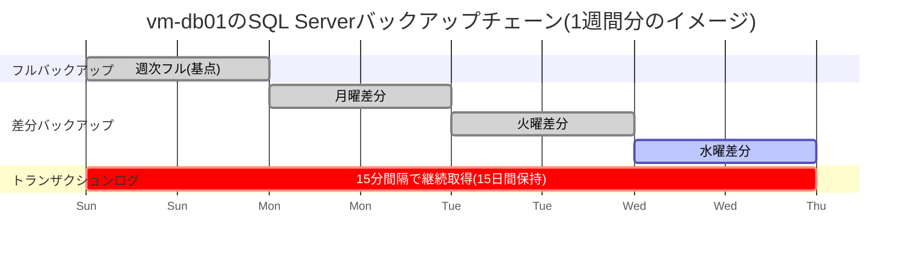
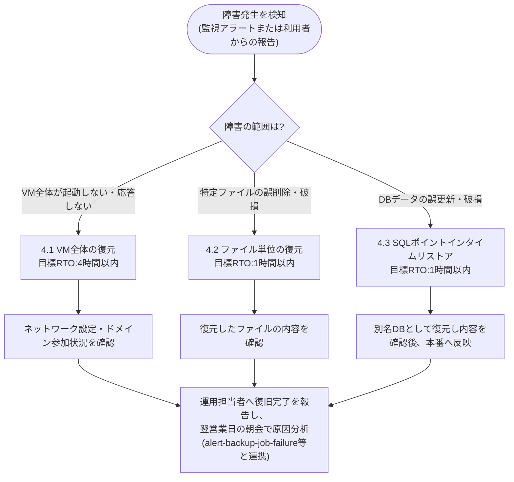
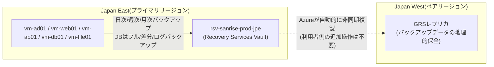
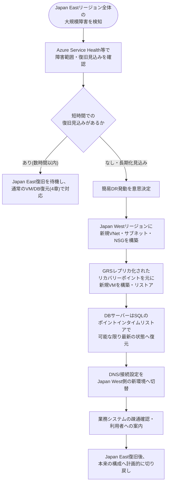

# 06. バックアップ・DR設計書

**この章のポイント**

- Recovery Services Vault(Azure Backupのバックアップデータを保管・管理するサービス。※詳しくは用語集(11-glossary.md)を参照)を中核とした、日次・週次・月次のバックアップ体制と、DBサーバー専用のトランザクションログバックアップの仕組みを、設計台帳の値に基づいて詳細に解説します。
- RPO(目標復旧時点)とRTO(目標復旧時間)という、バックアップ・DR設計の根幹をなす2つの指標を、はじめて学ぶ人にも直感的にわかる例え話で解説します。
- Recovery Services Vaultによるバックアップの取得方法(スナップショット・増分バックアップ)と、実際にデータを復元する際の操作イメージを、VM単位・ファイル単位・データベースのポイントインタイム単位に分けて説明します。
- コスト制約の中で「フルDR(リージョン間の常時レプリケーション)」ではなく「GRS(地理冗長ストレージ)による簡易DR」を選択した設計思想と、リージョン障害発生時の復旧の考え方を整理します。
- 「テストしていないバックアップは、バックアップとは呼べない」という運用上の鉄則と、定期的なリストア訓練の重要性・実施方法を解説します。

---

## 1. 本章の目的と全体方針

### 1.1 本章の位置づけ

00章(要件定義書)・01章(全体アーキテクチャ設計書)では、本システムのバックアップ・DR(Disaster Recovery、災害復旧。※詳しくは用語集を参照)体制の全体像を概観しました。本章では、その詳細設計として、**設計台帳(ledger)の`backup`セクションに定義された値**をもとに、①どのようなポリシーで、②いつ、③どこまでの期間データを保持し、④障害発生時にどう復旧するか、⑤その体制が本当に機能するかをどう検証し続けるか、という5点を掘り下げます。

バックアップ・DR設計は、これまでの章(02章:ネットワーク設計、03章:サーバー設計、04章:セキュリティ設計)で構築してきた「日常の業務システムを安全に稼働させる仕組み」に対して、「万が一データが壊れた・消えた・使えなくなったときに、どうやって元の状態に戻すか」という**事後対応(リカバリー)の仕組み**を与えるものです。どれほど堅牢なセキュリティ設計を行っても、人為的ミス・ランサムウェア・ハードウェア障害・自然災害といった事態を完全にゼロにすることはできません。バックアップ・DR設計は、こうした「起きてしまった後」にどう立ち直るかを担保する、最後の砦にあたる設計領域です。

### 1.2 現状課題との対応関係

00章で整理した現状課題のうち、本章が直接的に解決の対象とするのは主に課題③と課題⑥です。

| # | 現状の課題 | 本章での対応 |
|---|---|---|
| 6 | バックアップが磁気テープによる手動運用であり、リストア検証やDR訓練が実施できておらず復旧の実効性が担保されていない | Recovery Services Vault(`rsv-sanrise-prod-jpe`)によるポリシーベースの自動バックアップへの全面切り替え(3章)、明確なRPO/RTO目標の設定(2章)、定期的なリストア訓練の運用ルール化(6章) |
| 3 | 自社データセンターの単一拠点運用のため、地震・水害等の災害時における事業継続(BCP)対策が不十分である | Recovery Services VaultのGRS(Geo冗長ストレージ)によるJapan Westリージョンへのバックアップデータ自動複製と、簡易DR手順の整備(5章) |

旧環境では、磁気テープへの手動バックアップが行われていたものの、「取得すること」自体が目的化しており、「取得したデータから実際に復旧できるか」の検証(リストアテスト)が一度も行われていませんでした。これは「バックアップがある」という安心感だけを提供し、実際の事業継続力にはつながっていなかったことを意味します。本章の設計は、この状態を「自動化されたポリシーに基づく取得」「明確な数値目標(RPO/RTO)」「定期的な検証」の3点セットに置き換えることを目的としています。

### 1.3 本設計が目指すバックアップ・DRモデル

本設計は、以下の3つの層を組み合わせることで、コスト制約の中でも実効性のあるバックアップ・DR体制を実現しています。

| 層 | 目的 | 主な仕組み |
|---|---|---|
| ① 予防的な定期バックアップ | データが壊れる前の状態に、決められた頻度・保持期間で確実に戻せるようにする | Recovery Services Vaultの日次・週次・月次バックアップ、DBサーバーの差分・ログバックアップ |
| ② 迅速な復旧手順 | 障害発生時に、目標時間内(RTO)でシステムを復旧できるようにする | VM全体の復元、ファイル単位の復元、SQL Serverのポイントインタイムリストア |
| ③ 最低限の地理的保全(簡易DR) | 自社データセンターの単一拠点運用と同じ轍を踏まないよう、Azure側でも地理的なリスク分散を行う | GRS(Geo冗長ストレージ)によるJapan Westリージョンへのバックアップデータ複製 |

以降、②のRTO・RPOの基礎から順に、設計台帳の値に基づいて詳しく解説します。

---

## 2. RPOとRTOの基礎(初心者向け解説)

バックアップ・DR設計を理解するうえで欠かせないのが、**RPO(Recovery Point Objective、目標復旧時点)**と**RTO(Recovery Time Objective、目標復旧時間)**という2つの指標です。この2つは名前が似ているため混同されがちですが、意味するものはまったく異なります。

### 2.1 RPOとは(たとえ話で理解する)

RPOは、「障害が発生したとき、**どの時点のデータまで**戻せればよいか」を示す指標です。値が小さいほど、失われるデータの範囲(データロス)が小さくなります。

> **たとえ話**:あなたが小説を書いていて、こまめに「上書き保存」をする代わりに、1時間おきに自動でバックアップファイルが作られる設定にしていたとします。もしPCが突然壊れてしまったら、直前の1時間分の執筆内容は失われますが、それ以前の内容は1時間前のバックアップファイルから復元できます。この「最大1時間分は失われる可能性がある」という許容範囲が、RPOにあたります。RPOを30分に縮めたければ、バックアップの取得頻度を30分おきに上げる必要があります。

つまりRPOは、**バックアップの取得頻度**によって決まります。頻繁に取得するほどRPOは短くなりますが、その分バックアップにかかる処理負荷やストレージコストは増えるため、「どこまでのデータ損失なら業務上許容できるか」を業務側と合意したうえで、頻度を設計する必要があります。

### 2.2 RTOとは(たとえ話で理解する)

RTOは、「障害が発生してから、**どのくらいの時間で**システムを復旧させられればよいか」を示す指標です。値が小さいほど、業務が止まる時間(ダウンタイム)が短くなります。

> **たとえ話**:先ほどの小説の例で言えば、PCが壊れたあと、新しいPCを用意し、バックアップファイルを探し出し、必要なソフトをインストールし、ファイルを開いて執筆を再開できるまでにかかる「作業時間」が、RTOにあたります。バックアップファイル自体が存在していても、それを取り出して使える状態に戻すまでに何時間もかかってしまっては、業務への影響は変わりません。

つまりRTOは、**復旧作業にかかる手順の複雑さ・自動化の度合い**によって決まります。バックアップから新しいVMを自動的に組み立てる仕組みがあればRTOは短くなりますし、手作業でOSを1からインストールしてデータを移し替えるような復旧方法ではRTOは長くなります。

### 2.3 RPOとRTOの違い(表での整理)

初心者がつまずきやすいポイントなので、改めて対比表で整理します。

| 観点 | RPO(目標復旧時点) | RTO(目標復旧時間) |
|---|---|---|
| 問いかけ | 「どの時点のデータまで戻せればよいか」 | 「どのくらいの時間で復旧できればよいか」 |
| 何によって決まるか | バックアップの**取得頻度** | 復旧作業の**手順・自動化の度合い** |
| 値が小さい(厳しい)とどうなるか | 失われるデータの範囲が狭くなる代わりに、バックアップの処理負荷・コストが増える | 業務停止時間が短くなる代わりに、復旧手順の整備・冗長化にコストがかかる |
| 本設計での基本値 | 24時間以内(業務システム全体) | 4時間以内(業務システム全体) |

### 2.4 本設計のRPO/RTO目標値

設計台帳の方針は以下のとおりです。

> 業務システム全体でRPO 24時間以内(日次バックアップに基づく)。DBサーバー(受発注・在庫データ)はトランザクションログバックアップにより最大15分以内のデータロスに抑制する。
>
> 業務システム全体でRTO 4時間以内(VM全体のリストアによる復旧)。個別ファイルまたはデータベース単体の復旧はRTO 1時間以内を目標とする。

これを表にまとめると以下のとおりです。

| 対象 | RPO(目標復旧時点) | RTO(目標復旧時間) |
|---|---|---|
| 業務システム全体(VM単位のリストア) | 24時間以内(日次バックアップに基づく) | 4時間以内 |
| DBサーバー(`vm-db01`)のデータベース | 15分以内(トランザクションログバックアップに基づく) | 1時間以内(個別データベースの復旧目標) |
| 個別ファイルの復旧(ファイルサーバー等) | 24時間以内(日次バックアップに基づく) | 1時間以内(個別ファイルの復旧目標) |

### 2.5 なぜDBサーバーだけRPOが特別に厳しいのか(設計思想)

`vm-web01`や`vm-ap01`、`vm-file01`はRPO 24時間以内(日次バックアップ)であるのに対し、`vm-db01`だけはRPO 15分以内という、はるかに厳しい目標が設定されています。これは何となく決めた数値ではなく、**それぞれのサーバーが保持しているデータの性質の違い**に基づいた設計判断です。

| サーバー | 保持しているデータの性質 | 「1日分のデータが失われる」ことの業務影響 |
|---|---|---|
| `vm-web01`(Webサーバー) | 画面表示用のプログラム本体(状態を持たない) | ほぼなし。プログラムファイル自体はデプロイし直せば復元できる |
| `vm-ap01`(APサーバー) | 業務ロジックのプログラム本体(状態を持たない) | ほぼなし。同上 |
| `vm-file01`(ファイルサーバー) | 見積書・納品書等の帳票データ | 直近1日分の帳票作成作業をやり直す必要があるが、多くは再発行・再印刷で対応可能 |
| `vm-db01`(DBサーバー) | 受発注データ・在庫データという、その瞬間ごとに更新され続ける業務トランザクションの記録そのもの | **最大1日分の受発注記録・在庫の増減記録が消失する**。「昨日の注文が誰からいつ来たか分からなくなる」「在庫数が実態と合わなくなる」など、業務そのものが成立しなくなる致命的な影響 |

Web層・AP層はプログラムの実行環境であり、仮に1日前の状態に戻っても「同じプログラムがもう一度動き出すだけ」で業務上の実害はほぼありません。一方でDB層は、日々刻々と書き込まれる受発注・在庫という**再現不可能な業務記録そのもの**を保持しています。だからこそ、DBサーバーだけは日次バックアップに加えて15分間隔のトランザクションログバックアップ(データベースへの変更操作を記録した「ログ」を細かく取得し、任意の時点まで巻き戻せるようにする仕組み)を追加取得し、RPOを大幅に短縮しています。この「守るべきデータの重要度に応じてバックアップの手厚さを変える」という考え方は、限られたコストの中で効果を最大化するバックアップ設計の基本原則です。

---

## 3. Recovery Services Vaultの基本設計

### 3.1 基本情報

すべてのAzureリソースは、リソースグループ`rg-sanrise-prod-jpe`(Japan East リージョン)にまとめて配置する方針(01章参照)に従い、Recovery Services Vaultも同一リソースグループ・同一リージョンに配置します。

| 項目 | 値 |
|---|---|
| Recovery Services Vault名 | `rsv-sanrise-prod-jpe` |
| バックアップポリシー名 | `bkp-sanrise-standard-daily` |
| リソースグループ | `rg-sanrise-prod-jpe` |
| リージョン | Japan East(`japaneast`) |
| ストレージ冗長性 | GRS(Geo冗長ストレージ。バックアップデータをペアリージョンであるJapan Westへ自動複製) |
| 保護対象VM | `vm-ad01`、`vm-web01`、`vm-ap01`、`vm-db01`、`vm-file01`(全5台) |

命名規則は、制約条件にあるCAF(Microsoft Cloud Adoption Framework)の略語規則に従い、Recovery Services Vaultには`rsv-`、バックアップポリシーには`bkp-`のプレフィックスを付与しています。ポリシー名`bkp-sanrise-standard-daily`は、「標準(standard)構成で、日次(daily)を基本周期とするポリシー」であることが名前から一目でわかるよう命名されています。

### 3.2 Recovery Services Vaultとは何か、バックアップ取得の仕組み

Recovery Services Vaultは、Azure VM・SQL Server・ファイル共有などのバックアップデータを一元的に保管・管理する、Azure Backupのマネージドサービスです。物理的なテープ装置やバックアップサーバーを自前で用意する必要がなく、ポリシー(いつ・どのくらいの頻度で・どのくらいの期間保持するかというルール)を設定するだけで、以降のバックアップ取得・古い世代の自動削除がすべて自動化されます。

VM単位のバックアップは、大まかに以下の流れで取得されます。

1. **初回のフルバックアップ**:対象VMのOSディスク・データディスクの内容をまるごと複製し、Recovery Services Vaultのストレージへ保存します。
2. **以降の増分バックアップ**:2回目以降は、前回のバックアップ取得時点から**変更があった差分データのみ**を取得します。これにより、毎回ディスク全体をコピーするよりも大幅に処理時間・データ転送量を削減できます。
3. **リカバリーポイントの生成**:取得したフルバックアップと増分バックアップを組み合わせることで、「ある日時の状態」を復元できる単位(リカバリーポイント)がバックアップのたびに1つずつ生成されます。
4. **ポリシーに基づく自動削除**:保持期間(3.4節)を過ぎた古いリカバリーポイントは自動的に削除され、ストレージの使用量が際限なく増え続けることを防ぎます。

この仕組みにより、旧環境で行っていた「担当者が磁気テープを手動で交換・保管する」という属人的な作業から、「ポリシーを設定すれば、あとは自動で回り続ける」運用へ転換しています。

### 3.3 バックアップ対象と方式の全体像

設計台帳の方針は以下のとおりです。

> 毎日02:00(日次バックアップ)に加え、毎週日曜02:00分を週次バックアップとして長期保持用に取得。DBサーバー(`vm-db01`)はAzure Backup SQL Server内ワークロードバックアップにより、フルバックアップを週1回、差分バックアップを日次、トランザクションログバックアップを15分間隔で追加取得する。

5台のVMは、バックアップの方式によって2つのグループに分かれます。

| サーバー | 役割 | バックアップ方式 |
|---|---|---|
| `vm-ad01` | AD DS(ドメインコントローラ)+ DNSサーバー | Azure VMバックアップ(VM全体を対象とした日次・週次・月次バックアップ) |
| `vm-web01` | Webサーバー(IIS) | Azure VMバックアップ(同上) |
| `vm-ap01` | APサーバー(業務アプリケーション) | Azure VMバックアップ(同上) |
| `vm-file01` | ファイルサーバー(部門共有・帳票保管) | Azure VMバックアップ(同上) |
| `vm-db01` | DBサーバー(SQL Server 2022) | **Azure Backup SQL Server内ワークロードバックアップ**(フル・差分・トランザクションログの3段構成、3.5節で詳述) |

`vm-db01`だけが特別な方式を採っているのは、2.5節で述べたとおり、RPO 15分以内という厳しい目標を満たすためには、VM全体を丸ごとバックアップする方式(1日1回が限度)ではなく、SQL Server自体の機能と連携してトランザクションログ単位で細かく取得できる専用のワークロードバックアップが必要だからです。

### 3.4 VMレベルバックアップ(`vm-ad01`・`vm-web01`・`vm-ap01`・`vm-file01`)の頻度・保持期間

設計台帳の方針は以下のとおりです。

> 日次バックアップ:30日間保持/週次バックアップ:12週間保持/月次バックアップ(月初分):12ヶ月保持。

| バックアップ種別 | 取得タイミング | 保持期間 |
|---|---|---|
| 日次バックアップ | 毎日02:00 | 30日間 |
| 週次バックアップ | 毎週日曜02:00 | 12週間(約3ヶ月) |
| 月次バックアップ | 月初分の週次バックアップを流用 | 12ヶ月(1年) |

バックアップの取得時刻を深夜02:00に設定しているのは、業務システムの利用が最も少ない時間帯を狙い、バックアップ処理によるディスクI/O負荷が日中の業務(受発注入力や在庫照会)のパフォーマンスに影響を与えないようにするためです。また、日次・週次・月次という3段階の保持ポリシーを組み合わせることで、「直近1ヶ月はいつでも日単位で細かく戻せる」「過去1年以内であれば月単位で戻せる」という、目的に応じた柔軟な復旧が可能になっています。例えば、「先月の棚卸し前の在庫状態を確認したい」といった、事故対応以外の業務上の要望にも月次バックアップが応えられます。

### 3.5 DBサーバー(`vm-db01`)専用のSQL Serverワークロードバックアップ

`vm-db01`は、Azure Backup SQL Server内ワークロードバックアップという専用の仕組みを使い、以下の3段構成でバックアップを取得します。

| バックアップ種別 | 取得頻度 | 保持期間 | 役割 |
|---|---|---|---|
| フルバックアップ | 週1回 | (VMレベルの月次と同様の枠組みで長期保持) | データベース全体の完全な複製を取得する基点 |
| 差分バックアップ | 日次 | (フルバックアップの保持期間に準ずる) | 直近のフルバックアップからの変更分のみを取得し、日々の復旧ポイントを増やす |
| トランザクションログバックアップ | 15分間隔 | 15日間 | データベースへの変更操作(INSERT/UPDATE/DELETE等)の記録を細かく取得し、任意の時点への復元(ポイントインタイムリストア)を可能にする |

以下は、この3段構成が組み合わさって「任意の時点への復元」を可能にする仕組みを示した図です。

この図が示すとおり、ある時点のデータベースを復元するには「①直近のフルバックアップ」「②そこから障害発生日までの差分バックアップ」「③障害発生直前までのトランザクションログ」の3つを順番に適用する必要があります。Azure Backupはこの組み合わせをすべて自動的に管理しており、利用者は「戻したい日時」を指定するだけで、裏側でどのフル・差分・ログを組み合わせるべきかを自動的に判断してくれます。

**なぜVM全体のバックアップだけでは不十分なのか(設計思想)**:VM全体のバックアップは、ディスクのスナップショット(ある瞬間の状態を丸ごと保存する仕組み)を1日1回取得する方式のため、原理的にRPOは「最短でも1日」までしか縮められません。一方、SQL Serverのトランザクションログバックアップは、データベースエンジン自身が変更操作を記録し続けている仕組みを利用するため、15分といった短い間隔での取得が可能です。受発注データという「秒単位で更新され続ける業務トランザクション」を扱うDBサーバーには、この専用の仕組みが不可欠であると判断しました。

### 3.6 バックアップ通信経路とNSGルール

DBサーバーのSQL Serverワークロードバックアップは、VM内で動作するバックアップ拡張機能が、取得したバックアップデータ(フル・差分・ログの実データ)を直接Azure Storageへアップロードする方式を取ります。このため、`vm-db01`が配置されている`snet-db-prod-jpe`のNSG(`nsg-db-prod-jpe`)には、以下のアウトバウンド許可ルールが明示的に設定されています。

| NSG名 | 優先度 | ルール名 | 方向 | 宛先ポート | 送信元 | 宛先 | 許可/拒否 | 理由 |
|---|---|---|---|---|---|---|---|---|
| `nsg-db-prod-jpe` | 110 | `Allow-Db-To-AzureBackup-Outbound` | Outbound | 443 | `10.10.3.0/24`(`snet-db-prod-jpe`) | Storage(サービスタグ) | Allow | Azure Backup(MARSエージェント/バックアップ拡張機能)によるバックアップデータのAzure Storageへの送信を許可 |

**なぜDBサブネットにだけ、この専用ルールが明示的に用意されているのか(設計思想)**:標準的なAzure VMバックアップ(`vm-ad01`・`vm-web01`・`vm-ap01`・`vm-file01`が使用する方式)は、管理対象ディスクをストレージ基盤のレイヤーでスナップショットする仕組みのため、ゲストOS内部からのネットワーク通信を必要とせず、NSGの制御対象になりません。これに対して、`vm-db01`が使うSQL Serverワークロードバックアップは、ゲストOS内で動作するバックアップ拡張機能自身がバックアップストリームをAzure Storageへ直接送信する方式であるため、ゲストOSからの送信(アウトバウンド)通信としてNSGを通過する必要があります。DB層は本設計の中でも最も厳格な多層防御の対象(04章参照)であるため、「暗黙的に許可されているから通る」状態を避け、必要な通信を明示的に許可ルールとして書き出すことで、後から見た人が「なぜこの通信が許可されているのか」を一目で理解できるようにしています。

### 3.7 バックアップデータの保護(暗号化・誤削除対策)

設計台帳の方針は以下のとおりです。

> バックアップデータはRecovery Services Vault側で保管時暗号化(プラットフォーム管理キー)される。

Recovery Services Vaultに保管されるバックアップデータは、Microsoftが管理する暗号化キーによって自動的に保管時暗号化(Encryption at Rest)されます。暗号化キーの管理を利用者側で意識する必要がなく、追加の設定なしに標準で有効になっている点が特徴です(暗号化の全体像は04章5節を参照)。

また、Azure Backupには**ソフト削除(Soft Delete)**という機能が既定で有効になっています。これは、バックアップデータが誤って、あるいは悪意を持って削除されてしまった場合でも、既定で14日間は削除された状態のまま論理的に保持され、その期間内であれば復元できるという保護機能です。ランサムウェア被害の典型的なパターンの一つに「攻撃者が業務データを暗号化する前に、まずバックアップを消去して復旧の道を断つ」というものがありますが、ソフト削除が有効になっていれば、たとえバックアップの削除操作自体が行われてしまっても、即座にデータが失われることを防げます。将来的にセキュリティ要件がさらに高まった場合は、MUA(Multi-User Authorization、バックアップの重要な操作に複数管理者の承認を必須化する機能)や、より長期の不変性(イミュータブル)ポリシーの適用も拡張オプションとして検討に値します。

---

## 4. 復元(リストア)の仕組みと手順

バックアップは「取得すること」がゴールではなく、「必要なときに、必要な形で復元できること」がゴールです。本設計では、障害の種類や影響範囲に応じて、3種類の復元方法を使い分けます。

### 4.1 VM全体の復元(ディスクリストア/VM再作成)

VM自体が起動しなくなった、あるいはディスクが破損したといった、VM単位の障害が発生した場合の復元方法です。

| ステップ | 内容 |
|---|---|
| ① 対象の特定 | Azureポータルで`rsv-sanrise-prod-jpe`を開き、復旧したいVM(例:`vm-ap01`)を選択する |
| ② リカバリーポイントの選択 | 復元したい日時に最も近いリカバリーポイント(3.2節)を一覧から選ぶ |
| ③ 復元方法の選択 | 「新しいVMとして復元する」「既存のVMを置き換える」「ディスクのみを復元して手動でVMに接続する」のいずれかを選択する |
| ④ 復元の実行と待機 | Azure Backupがバックエンドで自動的にディスクを再構築し、指定した構成でVM(またはディスク)を作成する |
| ⑤ 動作確認 | ネットワーク設定(プライベートIPアドレス、NSG適用状況)やドメイン参加状況を確認し、正常に業務システムへ組み込まれることを確認する |

この方式によるRTO目標は4時間以内です。VM全体の再構築が必要になる規模の障害では、リストア処理自体に加えて、ネットワーク設定の再確認やアプリケーションの疎通確認といった周辺作業にも時間を要するため、単純なデータ転送時間だけでなく、こうした確認作業まで含めて4時間以内で収まるよう、日頃から復元手順を明文化しておくことが重要です。

### 4.2 ファイル単位の復元(アイテムレベル回復)

`vm-file01`上の特定のファイル(例:「昨日削除してしまった納品書のExcelファイル」)だけを復元したい場合、VM全体を復元し直す必要はありません。Azure Backupには、バックアップデータの中から特定のファイル・フォルダーだけを取り出して復元する「アイテムレベル回復」という機能があり、VM全体を止めることなく、対象ファイルだけを元の場所や別の場所へコピーできます。この方式によるRTO目標は1時間以内です。

### 4.3 SQL Serverのポイントインタイムリストア

`vm-db01`のデータベースについては、3.5節のフル・差分・トランザクションログの組み合わせにより、**任意の時点(分単位)の状態**へデータベースを復元できます。これをポイントインタイムリストア(Point-in-Time Restore)と呼びます。

> **例**:「本日14時32分に、誤ったバッチ処理で在庫データが大量に上書きされてしまった」という事故が起きた場合、14時31分59秒時点の状態へデータベースを復元することで、事故直前の正しいデータを取り戻せます。この方式によるRTO目標は1時間以内です。

ポイントインタイムリストアは、通常は本番のデータベースを直接上書きするのではなく、**別名のデータベースとして復元**し、内容を確認したうえで必要なデータだけを本番へ反映する、あるいは業務影響を確認したうえで正式に切り替える、という手順を取ることが推奨されます。いきなり本番データベースを上書きしてしまうと、復元先の選定を誤った場合に取り返しがつかなくなるためです。

### 4.4 復元手順の全体フロー

### 4.5 RTO目標との整合性

「業務システム全体でRTO 4時間以内」という目標に対し、本設計はVM全体の復元手順(4.1節)で対応します。ただし4時間という時間は、Azure Backup側の技術的なリストア処理時間だけで消費してよい時間ではありません。実際には、①障害の検知・切り分け(監視アラートを受けての判断)、②リストアの実行、③ネットワーク・アプリケーションの疎通確認、④利用者への復旧連絡、という一連の流れ全体で4時間以内に収める必要があります。このため、運用マニュアルには本節のフロー図をそのまま手順書として組み込み、判断に迷う時間を極力減らすことが、RTO目標を実際に達成するための鍵になります。

---

## 5. DR(災害復旧)方針:リージョン障害への備え

### 5.1 なぜフルDR(Azure Site Recovery)を採用しなかったか

設計台帳の方針は以下のとおりです。

> コスト重視の構成のためリージョン内可用性ゾーンの冗長化やAzure Site Recoveryによるリージョン間フェイルオーバーは本フェーズでは導入せず、Recovery Services VaultのGeo冗長ストレージ(GRS)によりバックアップデータをJapan Westへ自動レプリケーションすることで最低限の地理的保全を確保する。

Azure Site Recovery(ASR、VMをリージョン間で常時レプリケーションし、災害時に短時間でフェイルオーバーできるようにするサービス。※詳しくは用語集を参照)を使えば、Japan Eastリージョン全体が利用不能になるような大規模災害が発生した場合でも、数十分程度でJapan Westリージョン側の複製VMへ切り替えることが可能になります。しかし、ASRは常時レプリケーション用の複製リソース(実質的にレプリカVM相当の待機環境)を維持し続ける必要があり、平常時から追加のコストが発生し続けます。

| 選択肢 | 概要 | メリット | デメリット・採用しなかった理由 |
|---|---|---|---|
| リージョン内可用性ゾーン冗長化 | 同一リージョン内の物理的に分離されたデータセンター(可用性ゾーン)にVMを分散配置する | リージョン内の一部データセンター障害には強くなる | リージョン全体の障害(大規模災害等)には対応できない。また常時複数ゾーンにVMを配置するための追加コストが発生する |
| Azure Site Recovery(リージョン間レプリケーション) | Japan Westに常時同期された複製VMを維持し、災害時に短時間でフェイルオーバーする | リージョン全体の障害にも数十分〜数時間程度で対応できる、最も高い可用性 | 常時稼働する複製環境の維持コストが発生し、「月額運用コストを抑制する」という制約条件に反する |
| Recovery Services VaultのGRS(**採用**) | バックアップデータそのものをJapan Westへ自動複製する(VM自体は複製しない) | 追加のVM維持コストがほぼ発生せず、Recovery Services Vaultの標準機能の範囲でリージョン間の地理的保全を実現できる | リージョン障害時、Japan West側でVMを一から構築してリストアする必要があり、即時のフェイルオーバーはできない(復旧に数時間単位の時間を要する) |

RTO 4時間以内という非機能要件に対し、GRSベースの簡易DR手順でも対応可能と判断し、常時コストが発生するASRは「将来的な事業拡大時に追加検討する」将来オプションと位置づけました。これは、03章・04章でも繰り返し登場した「壊れないようにする(予防・常時冗長化)」よりも「壊れても許容時間内に確実に戻せるようにする(事後のリカバリー)」を優先する、本プロジェクト全体を貫くコスト効率重視の可用性設計思想と一致しています。

### 5.2 GRS(Geo冗長ストレージ)の仕組みとペアリージョン

GRS(Geo-Redundant Storage、地理冗長ストレージ)は、Recovery Services Vaultに保存されたバックアップデータを、**プライマリリージョンとは離れた別のリージョンへ非同期に自動複製する**Azureストレージの冗長化オプションです。

本設計のプライマリリージョンはJapan East(`japaneast`)であり、そのペアリージョン(Azureがあらかじめ地理的に離れた場所に設定している、対になるリージョン)はJapan West(西日本リージョン)です。GRSを選択すると、追加の構成や運用操作をすることなく、Recovery Services Vault内のバックアップデータが自動的にJapan Westへも複製されます。

**設計思想のポイント**は、「VMそのもの」ではなく「バックアップデータ」だけを別リージョンへ保全するという発想です。VM自体を複製する(ASR)よりもコストを大幅に抑えつつ、「Japan Eastのデータセンターが壊滅的な被害を受けても、少なくとも業務データそのものは失わない」という、事業継続における最低限のセーフティネットを確保しています。これは、旧環境の課題③(自社データセンターの単一拠点運用によるBCP不足)に対する、コストと効果のバランスを取った現実的な回答です。

### 5.3 簡易DR手順(リージョン障害時の復旧シナリオ)

設計台帳の方針は以下のとおりです。

> 大規模障害時は西日本リージョンへ新規VMを構築し、GRS化されたリカバリーポイントからリストアする簡易DR手順を運用マニュアルに定める。

Japan Eastリージョン自体が長時間利用不能になるような大規模障害を想定した、簡易DR手順の流れを以下に示します。

この手順が「簡易」と位置づけられているのは、平常時からJapan West側に何も用意しておかず、**障害発生後に初めてネットワーク・VMをゼロから構築する**前提だからです。ASRのような常時レプリケーション環境がないため、Japan East復旧を待てるかどうかの判断(手順C)を最初に行い、本当に長期化が見込まれる場合にのみ簡易DR手順(E以降)へ進むという判断フローを組み込んでいます。この手順は、平時から運用マニュアルとして文書化しておき、担当者が交代しても迷わず実行できる状態にしておくことが重要です。

### 5.4 将来のAzure Site Recovery導入時の拡張イメージ

設計台帳の方針は以下のとおりです。

> 将来的な事業拡大時にはAzure Site Recoveryによるレプリケーション構成の導入を追加検討する。

事業規模が拡大し、RTO要件がより厳しくなった場合(例:「4時間以内」から「30分以内」への短縮が求められる場合)には、本設計のGRSベースの簡易DRから、Azure Site Recoveryによる常時レプリケーション構成への切り替えを検討します。その際も、本章で整備したRecovery Services Vault(`rsv-sanrise-prod-jpe`)やバックアップポリシー(`bkp-sanrise-standard-daily`)の設計・運用ノウハウ(バックアップ対象の切り分け、保持期間の考え方)はそのまま活用でき、ゼロからの再設計にはなりません。段階的な拡張を見据えた設計になっている点も、本設計のポイントの一つです。

---

## 6. バックアップ・リストアの定期訓練(なぜ重要か)

### 6.1 「テストしていないバックアップは、バックアップではない」

バックアップ・DR設計において、実務上もっとも軽視されがちでありながら、もっとも重要なのが**リストア訓練(バックアップから実際に復元できるかを定期的に検証する取り組み)**です。旧環境の課題⑥として挙げられているとおり、サンライズ物産では磁気テープによるバックアップは取得していたものの、リストア検証やDR訓練が一度も実施されていませんでした。

これは決して珍しいケースではありません。バックアップの「取得」は自動化されていても、「本当にそのデータから正しく復元できるか」は、実際にリストアを試みるまでは誰にもわからないからです。バックアップの取得ジョブ自体は成功していても、以下のような問題が本番のリストア時に初めて発覚するケースは実務で頻繁に起こります。

| 起こりがちな問題 | 発覚するタイミング |
|---|---|
| バックアップの取得先メディア(テープ・ディスク)自体が劣化・破損していた | いざ復元しようとしたときに、データが読み込めない |
| バックアップの対象範囲に、実は必要なファイル・データベースが含まれていなかった | 復元してみたら、必要なデータが入っていなかった |
| 復元手順書が古いままで、実際の環境構成と食い違っていた | 手順どおりに進めても、ネットワーク設定やアプリケーションの疎通が取れない |
| 復元にかかる実際の時間が、想定していたRTOを大幅に超えていた | 訓練を1度もしていないため、実際にどれだけ時間がかかるか誰も把握していない |

「バックアップを取得している」ことと「復旧できる」ことの間には、これだけのギャップが存在し得ます。定期的なリストア訓練は、このギャップを事前に発見し、実際の障害が起きる前に手順・体制を改善しておくための、唯一確実な手段です。

### 6.2 訓練の種類と推奨頻度

本設計におけるリストア訓練は、対象とする復元方式(4章)ごとに、以下のような形で定期的に実施することを推奨します。

| 訓練項目 | 検証内容 | 推奨頻度 | 検証方法(例) |
|---|---|---|---|
| VM全体の復元訓練 | 4.1節のVM全体復元手順が、手順書どおりに実行でき、RTO 4時間以内に収まるか | 半期に1回 | 隔離用の検証リソースグループへ`vm-ap01`等を実際に復元し、所要時間を計測する |
| ファイル単位の復元訓練 | 4.2節のアイテムレベル回復が正しく機能するか | 四半期に1回 | `vm-file01`上の任意のテストファイルを復元し、内容の整合性を確認する |
| SQLポイントインタイムリストア訓練 | 4.3節の任意時点への復元が正しく機能し、データの整合性が保たれるか | 四半期に1回 | 別名データベースとして特定時点へ復元し、レコード件数や主要データの整合性を確認する |
| 簡易DR訓練 | 5.3節の手順に沿って、Japan West側でVNet・VMの構築からリストアまでを一連で実施できるか | 年1回 | 検証用サブスクリプションまたは検証用リソースグループでJapan West側の環境構築〜リストアまでを通しで実施する |
| バックアップジョブ監視の疎通確認 | `alert-backup-job-failure`アラートが、実際にバックアップ失敗時に正しく通知されるか(監視設計の章参照) | 半期に1回 | あえて一時的にバックアップ対象から除外する等でジョブを失敗させ、通知が届くことを確認する |

訓練の頻度は、対象の重要度とRTO目標の厳しさに応じて設定しています。特にRPO 15分・RTO 1時間という最も厳しい目標を持つDBサーバーについては、四半期に1回という高頻度でポイントインタイムリストアの実効性を検証し、想定外の手順の陳腐化を早期に発見できるようにしています。

### 6.3 訓練記録のテンプレート例

リストア訓練を実施した際は、以下のような項目を記録として残し、次回の訓練や引き継ぎ時に活用できるようにします。

| 記録項目 | 記入内容の例 |
|---|---|
| 実施日 | 2026年〇月〇日 |
| 訓練項目 | VM全体の復元訓練(`vm-ap01`) |
| 使用したリカバリーポイント | 訓練実施前日02:00の日次バックアップ |
| 開始時刻・完了時刻 | 開始 10:00 / 完了 12:40(所要時間 2時間40分) |
| RTO目標との比較 | 目標4時間以内 → 実績2時間40分(達成) |
| 発見された問題点 | 復元後、NSGの適用状況の確認手順が手順書に明記されておらず、確認に時間を要した |
| 是正アクション | 手順書に「復元後のNSG適用状況の確認手順」を追記し、次回訓練で再検証する |
| 実施者・承認者 | 記入者名・確認者名 |

このように「実施して終わり」にせず、発見された問題点を必ず是正アクションに落とし込み、手順書自体を継続的に改善していくサイクル(PDCA)を回すことが、リストア訓練を形骸化させないための鍵です。旧環境で欠けていたのは、まさにこの「検証と改善のサイクル」であったことを踏まえ、本設計では訓練を運用ルールとして明文化しています。

---

## 7. まとめ:本章の設計思想の振り返り

本章で行ったバックアップ・DR設計の要点を、改めて「なぜそうしたのか」という観点で整理します。

1. **DBサーバーだけRPOを15分以内という厳しい水準に設定した**のは、Web/AP層のプログラムと異なり、DB層が保持する受発注・在庫データは「その瞬間ごとに更新され続ける、再現不可能な業務記録」であり、失われた場合の業務影響が桁違いに大きいためです。守るべきデータの重要度に応じてバックアップの手厚さを変える、という考え方に基づいています。
2. **磁気テープの手動運用からRecovery Services Vaultによる自動化へ全面的に切り替えた**のは、旧環境で属人化していたバックアップ運用を、ポリシーベースで自動的に回り続ける仕組みへ置き換え、取得漏れ・保持期間管理ミスといった人為的リスクを排除するためです。
3. **フルDR(Azure Site Recovery)ではなくGRSによる簡易DRを選択した**のは、「月額運用コストを抑制する」という制約条件のもとで、常時レプリケーション環境の維持コストをかけずに、RTO 4時間以内という非機能要件を満たせると判断したためです。VMそのものではなくバックアップデータだけを地理的に保全するという発想が、コストと効果のバランスを取る鍵になっています。
4. **VM単位・ファイル単位・データベースのポイントインタイム単位という3種類の復元方法を使い分ける設計にした**のは、障害の影響範囲に応じて最も効率のよい復旧手段を選べるようにし、不必要に大がかりな復元作業(軽微な障害なのにVM全体を作り直す等)を避けるためです。
5. **定期的なリストア訓練を運用ルールとして明文化した**のは、「バックアップを取得していること」と「実際に復旧できること」の間にあるギャップを、実際の障害が発生する前に発見・是正するためです。旧環境の最大の課題である「リストア検証・DR訓練の未実施」に対する、本章での最も直接的な回答です。

これらの設計判断はいずれも、00章で整理した現状課題(特に課題③:単一拠点運用によるBCP不足、課題⑥:磁気テープ手動バックアップとリストア未検証)へ論理的に紐づいています。バックアップ・DR体制にかかる月額コストの詳細(Recovery Services Vaultの利用料等)は、コスト設計の章でまとめて解説します。

---

## 理解度チェック

**Q1. RPO(目標復旧時点)とRTO(目標復旧時間)の違いを、それぞれ何によって決まるかも含めて説明してください。**

A. RPOは「障害発生時に、どの時点のデータまで戻せればよいか」を示す指標で、バックアップの取得頻度によって決まります。頻度を上げるほどRPOは短くなります。RTOは「障害発生から、どのくらいの時間でシステムを復旧させられればよいか」を示す指標で、復旧作業の手順の複雑さ・自動化の度合いによって決まります。本設計では業務システム全体でRPO 24時間以内・RTO 4時間以内、DBサーバーはトランザクションログバックアップによりRPO 15分以内を目標としています。

**Q2. なぜ`vm-db01`(DBサーバー)だけ、他のVMと異なる特別なバックアップ方式(SQL Serverワークロードバックアップ)を採用しているのですか?**

A. `vm-web01`や`vm-ap01`はプログラムの実行環境であり状態を持たないため、1日1回のVM全体バックアップでも業務影響は小さいのに対し、`vm-db01`は受発注・在庫データという「秒単位で更新され続ける再現不可能な業務記録」を保持しているためです。VM全体のバックアップ(1日1回が限度)ではRPOを短縮できないため、フルバックアップ(週1回)・差分バックアップ(日次)・トランザクションログバックアップ(15分間隔)を組み合わせたSQL Server専用の仕組みにより、RPO 15分以内という厳しい目標を実現しています。

**Q3. 本設計ではAzure Site Recovery(ASR)によるリージョン間フェイルオーバーを採用せず、GRS(Geo冗長ストレージ)による簡易DRを採用しています。その理由と、簡易DRの弱点は何ですか?**

A. ASRは常時レプリケーション用の複製リソースを維持し続ける必要があり、平常時から追加コストが発生し続けるため、「月額運用コストを抑制する」という制約条件に反します。GRSはバックアップデータのみをJapan Westへ複製する仕組みで追加コストが小さく、RTO 4時間以内という非機能要件は満たせると判断し採用しました。弱点は、リージョン障害時にVM自体は複製されていないため、Japan West側で新規にネットワーク・VMをゼロから構築してリストアする必要があり、ASRのような即時フェイルオーバーはできない点です。

**Q4. 「テストしていないバックアップは、バックアップとは呼べない」とはどういう意味ですか?具体的にどのような問題が本番リストア時に発覚し得ますか?**

A. バックアップの取得ジョブが成功していても、実際にそのデータから正しく復元できるかは、実際にリストアを試みるまでは誰にもわからない、という意味です。バックアップメディアの劣化・破損、必要なデータが取得対象に含まれていなかった、復元手順書が実際の環境と食い違っている、想定よりリストアに時間がかかりRTOを超過する、といった問題は、定期的なリストア訓練を行わない限り、実際の障害発生時まで発覚しません。

**Q5. `vm-db01`のSQL Serverワークロードバックアップの通信に関して、`nsg-db-prod-jpe`にはなぜ`Allow-Db-To-AzureBackup-Outbound`という明示的な許可ルールが用意されているのですか?**

A. 標準的なAzure VMバックアップはストレージ基盤のレイヤーでディスクをスナップショットする仕組みのためゲストOSからの通信を必要としませんが、`vm-db01`が使うSQL Serverワークロードバックアップは、ゲストOS内で動作するバックアップ拡張機能自身がバックアップデータをAzure Storageへ直接送信する方式のため、ゲストOSからのアウトバウンド通信としてNSGを通過する必要があるためです。DB層は本設計で最も厳格な多層防御の対象であるため、この通信を暗黙的にではなく明示的な許可ルールとして書き出しています。
