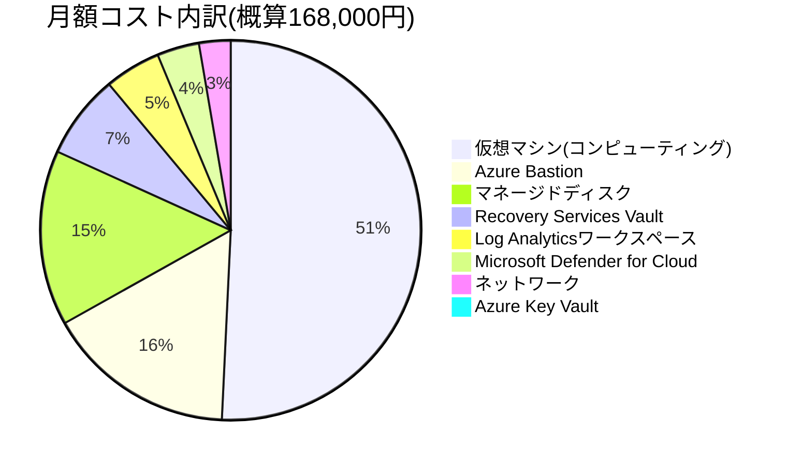

# 07. コスト設計書

## この章のポイント

- 設計台帳(ledger)に基づく月額運用コスト概算**168,000円**の内訳8項目を一覧化し、それぞれ「何に対する費用か」「なぜその金額・構成になっているのか」を解説します。
- Azureのコスト管理の基礎知識(**従量課金**、**予約インスタンス(Reserved Instances)**、**Azure Hybrid Benefit**、**Azure Cost Management + Billing**)を、クラウド未経験の方にも分かる例えで紹介します。
- 「ポートフォリオとしての検証用途のため、月額運用コストを抑制する目的でVMサイズはBシリーズ(バースト可能インスタンス)を基本とする」という制約条件(00-overview-requirements.md)が、各コスト項目の設計判断にどう反映されているかを明らかにします。
- 実際に自分のAzureサブスクリプションでこのポートフォリオを検証する際に**必ず設定すべき予算アラート**と、**検証後に忘れると課金が止まらないリソースの後片付け手順**を、具体的なコマンド付きで説明します。
- 自動シャットダウン・VMサイズの見直し・Azure Hybrid Benefitなど、今回採用しなかったものも含めた**コスト最適化のアイデア**を整理し、本番運用へ引き上げる場合の考え方にも触れます。

---

## 1. 本章の目的とコスト設計の考え方

### 1.1 なぜ「コスト設計」を独立した章として扱うのか

インフラ設計というと、可用性やセキュリティの話が中心になりがちですが、実務では**「その設計にいくらかかるのか」を説明できることも設計者の重要な仕事**です。特に本プロジェクトの発注元である株式会社サンライズ物産にとっては、老朽化した自社データセンターのハードウェア保守契約(2026年9月末終了予定)を更新するか、Azureへ移行するかという意思決定そのものが**コスト比較を伴う経営判断**になります。そのため本章では、単に「月額いくらです」と数字を示すだけでなく、次の3点を明確にすることを目的とします。

1. 各コンポーネントの費用が**何に対して発生しているのか**(従量課金の単位・課金構造)を理解する
2. なぜこの構成・サイズ・SKU(**Stock Keeping Unit**の略。Azureでは「同じサービスの中のグレード・料金プラン」を指す言葉として使われます。※詳しくは用語集(11-glossary.md)を参照)を選んだのか、**コストと要件のトレードオフ**を説明できるようにする
3. 実際に自分のAzureサブスクリプションで検証する人が、**想定外の課金で困らないようにする**

### 1.2 コスト設計の大前提:制約条件C-01

要件定義書(00-overview-requirements.md)で整理された制約条件のうち、本章のコスト試算全体を貫く大前提となっているのが以下の1文です。

> 「ポートフォリオとしての検証用途のため、月額運用コストを抑制する目的でVMサイズはBシリーズ(バースト可能インスタンス)を基本とする」

この制約条件が意味するのは、**「これは24時間365日、大量の受発注データを処理し続ける本番の卸売業システムそのものではなく、そのシステムを模した検証環境である」**という前提です。この前提を理解しないまま金額だけを見ると、「なぜ本番の基幹システムなのにこんなに安いのか」「可用性ゾーンやAzure Site Recoveryを使わないのは手抜きではないか」という誤解を招きかねません。本章の随所で「本来の本番運用ならどう変わるか」という視点もあわせて補足していきます。

### 1.3 CapExからOpExへ:オンプレミスとAzureのコスト構造の違い

サンライズ物産の現行システムは2009年に自社データセンター内の物理サーバーとして構築されたものであり、その費用構造とAzure移行後の費用構造は根本的に異なります。この違いを理解しておくと、コスト試算の数字が「何と比較して」意味を持つのかが分かりやすくなります。

| 観点 | 従来(オンプレミス・自社データセンター) | Azure移行後 |
|---|---|---|
| 費用の性質 | **CapEx**(Capital Expenditure、資本的支出。サーバー購入時に一括で発生する初期投資費用。※詳しくは用語集(11-glossary.md)を参照)中心。サーバー機器を購入し、減価償却する | **OpEx**(Operating Expenditure、運用的支出)中心。使った分だけ月々支払う従量課金が基本 |
| ハードウェア更新 | 5〜10年周期でサーバー機器を購入し直す必要があり、まとまった予算確保が必要(今回はこの更新時期が2026年9月に到来) | Azure側が物理基盤の更新を担うため、利用者側でのハードウェア更新は不要 |
| キャパシティ変更 | サーバー増強には機器の追加調達・納期待ちが発生する | VMサイズの変更(スケールアップ・ダウン)は管理画面やコマンドから数分〜十数分で反映可能 |
| 障害時の予備機 | 予備機を自社で保有しない限り、故障時の代替機調達に時間がかかる | Azure基盤側の物理故障はAzureが自動的に別ホストへVMを退避する仕組みを持つ(詳細は05-operations-monitoring.md) |
| 保守契約 | ハードウェア保守契約を個別に締結・更新する必要がある(今回はこれが期限切れの発端) | Azure自体の基盤保守はサービス利用料に含まれる |

この比較からも分かる通り、Azure移行の狙いは単なる「延命」ではなく、**大きな初期投資と保守契約更新のサイクルから脱却し、使った分だけ支払う体制に切り替えること**にあります。次節以降で具体的な月額試算を見ていきます。

---

## 2. 月額運用コストの試算内訳

### 2.1 試算サマリー

設計台帳(ledger)で定義された月額運用コストの概算合計は**168,000円**です。内訳は以下の8項目です。金額の大きい順ではなく、システム構成要素としての関連性順(コンピューティング→ストレージ→アクセス管理→可用性→監視→セキュリティ→ネットワーク)に並べています。

| No. | 項目 | 月額概算(円) | 構成比 | 概要 |
|---|---|---:|---:|---|
| 1 | 仮想マシン(コンピューティング/Windows Serverライセンス込み) | 85,000 | 約50.6% | vm-ad01・vm-web01・vm-ap01・vm-db01・vm-file01の5台分のVM実行料金 |
| 2 | マネージドディスク(OS/データディスク) | 25,000 | 約14.9% | 各VMのOSディスク・データディスクの合計 |
| 3 | Azure Bastion(Basic SKU) | 27,000 | 約16.1% | 踏み台接続サービスの固定時間課金+アウトバウンドデータ処理分 |
| 4 | Recovery Services Vault(バックアップ) | 12,000 | 約7.1% | VM 5台分の保護インスタンス課金+GRSストレージ使用量 |
| 5 | Log Analyticsワークスペース | 8,000 | 約4.8% | 5台のVMからのログ・メトリック取り込み量(従量課金) |
| 6 | Azure Key Vault | 500 | 約0.3% | シークレット・証明書操作のトランザクション課金 |
| 7 | ネットワーク(Bastion用Public IP・送信データ転送) | 4,500 | 約2.7% | Standard SKU Public IP料金+リージョン外送信データ転送量 |
| 8 | Microsoft Defender for Cloud(サーバー向けプラン) | 6,000 | 約3.6% | VM 5台に対する脆弱性評価・脅威検知の追加費用 |
| | **合計** | **168,000** | **100%** | |

> ※構成比は四捨五入して表示しているため、合計しても100.0%にぴったり一致しない場合があります。



この円グラフから分かる通り、**「仮想マシン」と「Azure Bastion」の2項目だけで全体の3分の2弱(約66.7%)を占めています**。次節から各項目を詳しく見ていきます。

### 2.2 仮想マシン(コンピューティング/Windows Serverライセンス込み)― 85,000円/月

もっとも金額が大きい項目です。内訳となる5台のVMは以下の通りです(詳細スペックは03-server-design.mdを参照)。

| VM名 | 役割 | VMサイズ | OS | 備考 |
|---|---|---|---|---|
| vm-ad01 | AD DS(ドメインコントローラ)+DNSサーバー | Standard_B2ms | Windows Server 2022 Datacenter | |
| vm-web01 | Webサーバー(IIS) | Standard_B2s | Windows Server 2022 Datacenter | |
| vm-ap01 | APサーバー(業務アプリケーション) | Standard_B2ms | Windows Server 2022 Datacenter | |
| vm-db01 | DBサーバー | Standard_B4ms | Windows Server 2022 Datacenter(SQL Server 2022 Standard Edition搭載) | 5台中もっとも大きいサイズ+SQL Serverライセンスが加算される |
| vm-file01 | ファイルサーバー | Standard_B2s | Windows Server 2022 Datacenter | |

**なぜBシリーズ(バースト可能インスタンス)を基本としたのか**:Bシリーズは、CPU使用率が「ベースライン性能」と呼ばれる基準値を下回っている間は使わなかった分を**CPUクレジット**として貯め、逆に瞬間的に処理が集中したときはそのクレジットを消費して一時的に高い性能を発揮できる仕組みのVMです。受発注・在庫管理システムのような社内業務システムは、営業時間中の特定タイミング(月末の一括発注処理、朝の在庫照会集中など)を除けば常時高負荷というわけではなく、Bシリーズの特性と相性が良い上、常時フル稼働を前提とするDシリーズ等の汎用インスタンスと比べて単価が安く設定されています。この特性が、制約条件C-01(月額運用コスト抑制)を満たす上での主要な選定理由です。

**なぜvm-db01だけB4msというワンサイズ上のスペックなのか**:データベースサーバーはWeb層・AP層からの問い合わせを一手に受ける役割であり、CPU・メモリ双方の余裕が他の層より必要になるためです。加えてSQL Server 2022 Standard Editionのライセンス費用が同居しているため、5台の中で最も高コストな構成になっていると考えられます(個々のVM単位の課金内訳は本設計書では公開していませんが、規模とライセンスの有無から見て、5台のうちvm-db01への配分がもっとも大きいと推定されます)。

**「ライセンス込み」という表記の意味**:この項目名にある「Windows Serverライセンス込み」とは、AzureのVM利用料金の中にWindows Serverのライセンス費用があらかじめ含まれた「**PAYG(Pay-As-You-Go、従量課金)**」レートで試算していることを意味します。後述する「Azure Hybrid Benefit」(3.3節)を使うと、この項目の金額をさらに引き下げられる可能性があります。

### 2.3 マネージドディスク(OS/データディスク)― 25,000円/月

| ディスクの用途 | 採用ディスク種別 | 対象VM |
|---|---|---|
| OSディスク(全VM共通) | Standard SSD | vm-ad01(E10)、vm-web01(E6)、vm-ap01(E10)、vm-db01(OS用)、vm-file01(E6、データディスク含む) |
| データ/ログ/tempdb用ディスク | Premium SSD | vm-db01のみ、OSディスクとは別に分離 |

**なぜDBサーバーだけPremium SSDを別ディスクとして分離しているのか**:データベースの性能は、CPUよりもむしろ**ディスクI/O(データの読み書き速度)**に左右されやすいという特性があります。特にトランザクションログへの書き込みは、SQL Serverの応答性能に直結します。そのため、OS用のディスクとデータ・ログ・tempdb(SQL Serverが一時的な作業領域として使う特殊なデータベース)用のディスクを分離した上で、後者にはStandard SSDより高速・低レイテンシなPremium SSDを採用しています。一方でWeb/AP層やファイルサーバーは業務データそのものを保持しているわけではない(または相対的にI/O要求が緩やか)ため、コストと性能のバランスに優れるStandard SSDで十分と判断しています。**「必要な箇所にだけ高性能・高コストなリソースを投入する」**という考え方は、コスト設計における基本方針です。

### 2.4 Azure Bastion(Basic SKU)― 27,000円/月

全項目の中で2番目に大きい金額です。Azure Bastionは、VMにパブリックIPアドレスを一切付与せず、Azureポータル経由のブラウザ操作だけで安全にRDP/SSH接続できるようにするマネージド型の踏み台サービスです(詳細は02-network-design.md、04-security-design.mdを参照)。

**なぜこれほど高額に感じる項目なのか**:Azure Bastionは「**使った分だけ**」ではなく「**デプロイされて存在している時間に応じて**」課金される、**固定時間課金(ホスティング時間課金)**のサービスです。管理者が一度もRDP接続しなかった月でも、Bastionリソースが存在し続けている限り課金は発生します。これに加えて、Bastion経由の通信量(アウトバウンドデータ処理分)も上乗せされます。

**なぜそれでも採用したのか(設計思想)**:現行システムの課題の一つに「サーバー管理者が固定グローバルIP経由でVMへ直接RDP接続しており、共有の管理者アカウントも常態化していてアクセス統制・監査ログが不十分」という問題がありました。Azure Bastionを導入することで、①VMへのパブリックIP付与を完全に廃止でき攻撃対象領域(アタックサーフェス)を縮小できる、②接続ログがAzure側に記録され「誰が」「いつ」「どのVMに」接続したかを追跡できる、という2つの効果が得られます。これは非機能要件「サーバー管理者はAzure Bastion経由でのみ各VMに接続でき、VMには一切パブリックIPアドレスを付与しない」を満たすための必須コンポーネントであり、**セキュリティ・監査性の確保をコスト削減より優先した意思決定**です。なお、コストを抑える工夫については5.4節で改めて取り上げます。

### 2.5 Recovery Services Vault(バックアップ)― 12,000円/月

Recovery Services Vault(`rsv-sanrise-prod-jpe`)によるバックアップ運用の費用です。課金は主に、①保護しているVMの台数に応じた「**保護インスタンス課金**」、②実際にバックアップデータを保管する容量に応じた「**バックアップストレージ課金**」の2つで構成されます。

**なぜGRS(Geo冗長ストレージ)を使っているのにこの金額で収まっているのか**:バックアップ・DR戦略(詳細は別章のバックアップ・DR設計書で解説)では、コスト重視の方針からAzure Site Recovery(リージョン間でVMそのものをリアルタイム近くレプリケーションする、より高機能・高コストなDRサービス)は本フェーズで採用せず、Recovery Services Vaultの**GRS**(バックアップデータをJapan Eastから離れたJapan Westへ自動的に複製するストレージ冗長オプション)のみで最低限の地理的保全を確保する、という設計にしています。GRSはバックアップストレージの冗長化オプションの一つとして選択するだけで実現でき、VMそのものを別リージョンで待機させ続けるASRのような常時稼働コストが発生しないため、比較的少額でリージョン間の地理的保全を得られる、コストパフォーマンスに優れた選択です。

### 2.6 Log Analyticsワークスペース ― 8,000円/月

Log Analyticsワークスペース(`log-sanrise-prod-jpe`)は、5台のVMから収集したCPU使用率・ディスク空き容量・Heartbeat(生存確認信号)などのメトリックとログを蓄積するデータベースです(詳細は05-operations-monitoring.mdを参照)。課金は、**取り込んだデータ量(GB単位)に応じた従量課金(Pay-As-You-Goプラン)**が基本です。

**コストとのバランス**:現行システムの課題「サーバー監視が担当者の目視確認中心であり、CPU/ディスク逼迫や障害の予兆を早期に検知できていない」を解決するために監視は必須ですが、収集するログの種類や保持期間を増やすほど取り込みデータ量が増え、この項目のコストも比例して増加します。5台程度のVM規模であれば月額8,000円程度に収まりますが、将来的にVM台数や収集項目(詳細なアプリケーションログなど)を増やす場合は、この項目のコストが増加しやすい点に注意が必要です。データ量が一定規模を超える場合は、後述する「コミットメント層(一定量を先払いすることで単価を下げるプラン)」の検討も選択肢になります。

### 2.7 Azure Key Vault ― 500円/月

Azure Key Vault(`kv-sanrise-prod-jpe`)は、各VMのローカル管理者パスワードやSQL Server関連の認証情報、TDE(透過的データ暗号化)証明書のバックアップなどの秘密情報を一元管理するサービスです(詳細は04-security-design.mdを参照)。課金は**シークレット・証明書に対する操作(読み取り・書き込み等)の回数に応じたトランザクション課金**が基本であり、本設計では利用頻度が低いため、ほぼ定額に近い少額(500円/月)で収まっています。

**費用対効果の高い設計判断**:非機能要件「SQL接続文字列やサービスアカウントのパスワード等の秘密情報は、コードや構成ファイルに直接記載せずAzure Key Vaultで一元管理する」を満たすためのコンポーネントですが、月額500円という金額はこのポートフォリオ全体のわずか0.3%に過ぎません。**「パスワードや証明書を平文でコードや構成ファイルに書いてしまう」という重大なセキュリティリスクを、月々500円程度の投資で大幅に低減できる**という点で、費用対効果が非常に高い設計要素だと言えます。

### 2.8 ネットワーク(Bastion用Public IP・送信データ転送)― 4,500円/月

このシステムの中で唯一パブリックIPアドレスを持つのはAzure Bastion専用のPublic IPアドレス(Standard SKU)であり、その料金と、Azureのリージョン外(インターネット等)へ送信されるデータ転送量(**送信データ転送/Egress**、Azureでは同一リージョン内の通信やインバウンド通信は原則無料ですが、アウトバウンド方向の通信には課金が発生する仕組みになっています)の概算がこの項目です。VM自体にはパブリックIPを一切付与しない設計(非機能要件)のため、この項目はBastion関連の費用に限定されています。

### 2.9 Microsoft Defender for Cloud(サーバー向けプラン)― 6,000円/月

Microsoft Defender for Cloudのサーバー向けプラン(Defender for Servers)を5台のVMに適用した際の追加費用です。Defender for Serversは、OSやミドルウェアの脆弱性を自動的にスキャンして報告する「脆弱性評価」機能や、不審なプロセス・ログイン試行を検知する「脅威検知」機能を提供します。

**なぜこの機能に投資するのか**:現行システムの課題の一つ「OSがWindows Server 2012 R2でメーカーサポートが終了しており、脆弱性対応ができない状態が続いている」は、Windows Server 2022への刷新によって根本原因は解消されますが、Windows Server 2022自体も将来的に新たな脆弱性が発見される可能性は当然あります。Defender for Cloudを導入することで、パッチ未適用の脆弱性や設定不備を**継続的に、自動で**検知できる体制を整え、「気づいたら何年もサポート外のまま放置されていた」という同じ過ちを繰り返さない仕組みを、コストをかけてでも組み込んでいます。

---

## 3. Azureのコスト管理の基本(初心者向け)

クラウドの請求書は、オンプレミスの「サーバーを1台いくらで買う」という感覚とは異なり、**「使った量・使った時間に応じて、複数のサービスの料金が積み上がる」**という仕組みで構成されています。ここではその基本的な考え方を、初めてAzureに触れる方向けに整理します。

### 3.1 従量課金(Pay-As-You-Go)の仕組み

**従量課金(Pay-As-You-Go、PAYG)**とは、電気・ガス・水道のように「使った分だけ料金を支払う」課金モデルです。Azureのほぼすべてのサービスはこの考え方が基本になっており、サービスの種類によって課金の単位(**メーター**と呼ばれます)が異なります。

| サービス | 主な課金の単位(メーター) | 本設計での該当項目 |
|---|---|---|
| 仮想マシン(コンピューティング) | VMが起動(実行中)している時間(秒単位で計測し、時間単位に換算して請求) | 2.2節 |
| マネージドディスク | ディスクを作成してから存在している時間(VMが停止していてもディスク自体は課金され続ける) | 2.3節 |
| Azure Bastion | デプロイされて存在している時間(固定時間課金)+処理したデータ量 | 2.4節 |
| ストレージ(バックアップ等) | 保存しているデータ量(GB)、および冗長化方式(LRS/GRS等) | 2.5節 |
| Log Analytics | 取り込んだログ・メトリックのデータ量(GB) | 2.6節 |
| Key Vault | シークレット等への操作回数(トランザクション数) | 2.7節 |
| ネットワーク送信データ転送 | インターネット等、リージョン外へ送信したデータ量(GB) | 2.8節 |

ここで初学者がつまずきやすいポイントは、**「VMを止めれば課金がすべて止まる」わけではない**という点です。VMのコンピューティング課金は止まりますが、そのVMに紐づくマネージドディスクやPublic IPアドレスは、VMが停止していても存在している限り課金が続きます。この点は4章で改めて詳しく取り上げます。

### 3.2 予約インスタンス(Reserved Instances)とSavings Plan

**予約インスタンス(Reserved Instances、RI)**とは、「今後1年間(または3年間)、このVMサイズ・このリージョンを使い続けます」とあらかじめ利用期間を予約(コミット)することで、都度払いの従量課金と比べて大幅な割引を受けられる購入方式です。似た仕組みに、VMサイズやリージョンを固定せず「1時間あたりいくら使う」という金額ベースでコミットする**Savings Plan**もあります。いずれも、**「使う量が事前にほぼ確定している、長期的に稼働し続けるワークロード」に向いた購入方式**です。

**なぜ本設計では予約インスタンスを採用していないのか**:本プロジェクトはポートフォリオとしての検証用途であり、①検証が終われば環境ごと削除する可能性がある、②1年・3年という長期コミットに対して事前に支払う(または月払いでも契約期間の縛りが生じる)ため、途中で解約すると割引メリットを活かしきれない、という理由から、都度払いの従量課金(PAYG)を前提とした試算にしています。逆にいえば、**もしこの構成が実際に本番の基幹システムとして1年以上稼働し続けることが確定しているのであれば、予約インスタンスやSavings Planへの切り替えを積極的に検討すべき**であり、これは5章のコスト最適化のアイデアでも取り上げます。

### 3.3 Azure Hybrid Benefit

**Azure Hybrid Benefit(AHB)**とは、企業がすでに保有しているWindows ServerやSQL Serverのライセンス(**Software Assurance**という保守契約が付帯したライセンス、または対象のサブスクリプションライセンス)を、Azure上のVMに「持ち込む」ことで、VM料金に含まれるライセンス費用分の支払いを免除してもらえる制度です。適用すると、2.2節で触れた「ライセンス込み」の料金から、インフラ利用分のみの料金に切り替わり、コンピューティング費用を引き下げられます。

**サンライズ物産にとっての意味合い**:現行システムはWindows Server 2012 R2上で稼働しており、ハードウェア保守契約とは別に、Windows ServerやSQL Serverのライセンス契約(ボリュームライセンス等)を保有している可能性があります。もしこれらのライセンスにSoftware Assuranceが付帯している場合、Azure移行後もそのライセンス資産を無駄にせず、Azure Hybrid Benefitとして持ち込むことでコンピューティング費用(特に2.2節の85,000円の中でも高価なvm-db01のSQL Serverライセンス分)を圧縮できる可能性があります。本設計台帳の試算はこの適用を**行わない前提(ライセンス込みの標準的なPAYGレート)**で保守的に見積もっているため、実際の導入検討フェーズでは、既存ライセンス契約の内容を確認したうえでAzure Hybrid Benefitの適用可否を精査することをお勧めします(5.3節でも改めて触れます)。

### 3.4 Azure Cost Management + Billingとタグによる可視化

**Azure Cost Management + Billing**は、Azureポータルに標準搭載されているコスト管理・分析用の無料ツールです。主に次の機能を持ちます。

| 機能 | 概要 |
|---|---|
| コスト分析(Cost Analysis) | 期間・サービス種別・リソースグループ・タグなどの軸でコストを集計し、グラフで可視化する |
| 予算(Budgets) | 「月額◯円まで」という予算枠を設定し、一定割合(例:50%・80%・100%)に達したらメール通知する | 
| **Azure Advisor**のコスト推奨事項 | 使用率の低いVM・未使用のPublic IP・未接続のディスクなどを自動検出し、「サイズを下げる」「削除する」といった具体的な推奨アクションを提示する |
| タグ(Tags) | リソースに「部門名」「環境(prod/test)」「プロジェクト名」などの任意のラベルを付与し、コストをその単位で集計できるようにする仕組み |

タグについて補足すると、本設計のリソースグループ`rg-sanrise-prod-jpe`のように、CAF(Microsoft Cloud Adoption Framework)の命名規則で環境(`prod`)やリージョン(`jpe`=japaneast)を名前に含めておくことに加えて、実務では`CostCenter`(コスト部門コード)や`Environment`といったタグを個々のリソースにも付与しておくと、複数プロジェクトが同居する組織のサブスクリプションでも「どの部門・どのプロジェクトの費用か」をコスト分析画面から即座に絞り込めるようになります。

---

## 4. 自分のAzureサブスクリプションで検証する際の注意点

本ポートフォリオを実際に自分のAzure無料アカウントや個人サブスクリプションで構築・検証してみたいという方向けに、想定外の課金を防ぐための具体的な注意点をまとめます。**「動かして終わり」ではなく「後片付けまでがワンセット」**という意識が重要です。

### 4.1 検証前に必ず行うこと:予算とコストアラートの設定

検証用リソースをデプロイする**前に**、必ずAzureポータルの「Cost Management + Billing」から予算(Budget)を設定してください。手順の一例は以下の通りです。

1. Azureポータルで「Cost Management + Billing」を開き、対象のサブスクリプション(またはリソースグループ`rg-sanrise-prod-jpe`)を選択する
2. 「予算(Budgets)」メニューから新規予算を作成し、たとえば月額上限を20,000円(本設計の月額概算168,000円よりも十分低い、個人検証として現実的な金額)に設定する
3. アラートしきい値を**50%・80%・100%**の3段階で設定し、超過が見込まれた時点でメール通知が届くようにする
4. 可能であれば、Action Group(通知先グループ)と連携させ、メールに加えてSMS等の通知経路も確保する

**なぜ「デプロイ後」ではなく「デプロイ前」に設定すべきなのか**:予算アラートは設定した時点から集計が始まるため、後から設定しても、それまでに発生した費用は当然そのまま計上されています。特にAzure Bastionのような固定時間課金のリソース(2.4節)は「うっかり数日放置してしまった」だけでも数千円単位の課金が発生し得るため、**構築前の予算設定を検証プロジェクトの最初の一手にする**ことを強く推奨します。

### 4.2 無料枠・試用アカウントを使う場合の注意

Azureには学習目的向けに無料アカウント(一定期間有効なクレジット、および一部サービスの「常に無料」枠)が提供されている場合があります。これらを利用する場合は、次の点に注意してください。

- 無料試用の特典には、VMサイズやリージョンに**制限(クォータ)**が設けられている場合があり、本設計台帳のVMサイズ(Standard_B2ms、Standard_B4ms等)がそのまま利用できるとは限りません。事前にサブスクリプションの種類ごとの制限を確認してください。
- 無料クレジットには有効期限があり、期限を過ぎると通常の従量課金に自動的に切り替わる、またはリソースが一時停止される場合があります。検証スケジュールと無料期間の残日数を照らし合わせておくことが重要です。

### 4.3 停止しても課金が止まらないリソースがあることに注意

初学者が特に混乱しやすいポイントとして、「VMを止めた=お金がかからなくなった」という誤解があります。実際には、リソースの種類によって「止める(停止/割り当て解除)」ときの挙動が異なります。

| リソース | 「止める」操作 | 止めた後も課金が続くもの |
|---|---|---|
| 仮想マシン | ポータルまたは`az vm deallocate`コマンドで**割り当て解除(Deallocate)**する(単なるOSシャットダウンでは不十分。OS内から「シャットダウン」しただけではAzure側の課金対象である「確保された計算リソース」は解放されず、コンピューティング課金が止まりません) | マネージドディスク(OS/データ)、Bastion用以外の静的Public IP(本設計では該当なし) |
| Azure Bastion | **停止という概念自体が存在しません**。稼働をやめたい場合はBastionリソースそのものを削除する必要があります | (削除するまで課金が継続) |
| Recovery Services Vault | バックアップを止めても、既に取得済みのリカバリーポイント(バックアップデータ)がVault内に残っている限り、そのストレージ分の課金は継続します | 保護を停止しても既存の復旧ポイントは自動では消えない |
| Azure Key Vault | 削除しても、既定で**ソフト削除(Soft Delete)**が有効なため、一定の保持期間(既定で90日)は「削除済みだが完全には消えていない」状態で残り続けます | 保持期間中は同名のVaultを新規作成できない場合がある(トランザクション課金自体はほぼ発生しませんが、名前の競合に注意) |

特に**Azure Bastionは「止める」という選択肢がなく、必要なときだけデプロイし、不要になったら削除する運用が前提**になっている点は、個人で検証する場合に強く意識してください。検証を数日〜数週間空けるのであれば、Bastionだけ先に削除しておき、次に必要になったタイミングで再作成する、という運用が現実的なコスト対策になります(5.4節でも代替案を紹介します)。

### 4.4 検証後の後片付け(リソース削除)手順

検証が完了したら、以下の手順でリソースを削除し、課金を確実に止めてください。**単に画面を閉じるだけでは課金は止まりません。**

**手順1:バックアップの保護を解除する(Recovery Services Vaultがある場合)**

Recovery Services Vault(`rsv-sanrise-prod-jpe`)は、バックアップ対象(VM)の保護を停止し、保存されているすべての復旧ポイントを削除しない限り、Vault自体を削除できません。Azureポータルの場合はVaultの「バックアップ項目」から対象VMごとに「バックアップの停止」を選択し、「バックアップデータの削除」まで実施する必要があります。この手順を飛ばしてリソースグループごと削除しようとすると、Vaultだけが削除に失敗して残ってしまうことがあります。

**手順2:リソースグループごと一括削除する**

本設計は`rg-sanrise-prod-jpe`という単一のリソースグループにすべてのリソースを集約しているため(01-architecture.md参照)、手順1が完了していれば、以下のコマンド一発でリソースグループ配下のリソースをまとめて削除できます。

```bash
# 削除対象と削除予定であることを確認してから実行する
az group delete --name rg-sanrise-prod-jpe --yes --no-wait
```

**なぜ「単一リソースグループにまとめる」設計がここで活きるのか**:もし関連リソースが複数のリソースグループにまたがっていた場合、削除漏れのリソースグループが残り、そこに残存する少額課金に検証者が気づかないまま数ヶ月放置してしまう、というありがちな失敗につながります。すべてを1つのリソースグループにまとめておく設計(01-architecture.mdで解説)は、可読性だけでなく**「後片付けの単位を明確にする」というコスト管理上の効果**も持っています。

**手順3:リソースグループ削除後に「取り残されがちな」ものを確認する**

以下は、リソースグループ削除だけでは完全に消えない、または削除後も痕跡が残りやすい要注意ポイントです。

- **Key Vaultのソフト削除**:`kv-sanrise-prod-jpe`は、リソースグループごと削除してもソフト削除状態(既定で90日間)で裏側に残り続けます。同じ名前のKey Vaultを再作成しようとしてエラーになる場合は、以下のコマンドで完全削除(パージ)する必要があります。

```bash
az keyvault purge --name kv-sanrise-prod-jpe --location japaneast
```

- **Microsoft Defender for Cloudのプラン設定**:Defender for Serversはサブスクリプション単位で有効・無効を切り替える設定であり、VMを削除してもプラン自体が「有効」のままになっている場合があります。他のVMを新たに作成した際に意図せずDefenderの課金が再度発生しないよう、Defender for Cloudの「環境設定」画面でプランを「オフ(無料プラン)」に戻したか確認してください。
- **孤立したリソース**:Public IPアドレスやマネージドディスクは、紐づいていたVM等を先に削除しても、それ自体が単独で残る(切り離される)ことがあります。リソースグループ削除コマンドを実行すればグループごと消えますが、リソースグループを残したまま個別にVMだけ削除した場合は特に注意してください。
- **請求の反映タイムラグ**:リソースを削除しても、その日までの利用分の請求はコスト分析画面へ反映されるまで数時間〜1日程度のタイムラグがあることがあります。削除直後に「0円になっていない」ことをもって削除失敗と判断せず、翌日以降に改めてコスト分析で確認してください。

---

## 5. コスト最適化のアイデア

本章2節の試算(168,000円/月)は、あくまで「常時稼働させ続けた場合」の概算です。ここでは、要件を維持しながらさらにコストを抑えるための具体的なアイデアを、実現しやすいものから順に紹介します。

### 5.1 自動シャットダウンによるVM稼働時間の削減

Azure VMには、ポータルの「操作」メニューから設定できる**自動シャットダウン(Auto-shutdown)**という標準機能があります。「毎日21:00に自動的にVMを割り当て解除する」といったスケジュールを組むだけで、夜間・休日など使わない時間帯のコンピューティング課金(2.2節、85,000円の内数)を削減できます。

- 例えば「平日9:00〜21:00のみ稼働」という運用にできれば、単純計算でコンピューティング課金を週の稼働時間ベースで半分未満に圧縮できる可能性があります(ディスク等、稼働時間に依存しない費用は変わらず発生する点に注意)。
- Azureには「自動シャットダウン」はあっても標準の「自動起動」機能は用意されていないため、朝の自動起動まで自動化したい場合は、Azure Automationのランブック(定型処理を自動実行する仕組み)やLogic Appsでスケジュール起動を組む必要があります。個人のポートフォリオ検証であれば、朝は手動で起動し、夜は自動シャットダウンに任せる、という運用でも十分に効果があります。
- 本設計はBicepによるIaC(Infrastructure as Code)で構築される前提のため(01-architecture.md参照)、検証セッションのたびに`az deployment group create`で環境一式を再構築し、終わったら4.4節の手順で完全に削除する、という「使うときだけ作る」運用も、自動シャットダウンより一歩進んだコスト最適化として選択肢になります。

### 5.2 VMサイズの見直し(ライトサイジング)

1.3節で触れた通り、Bシリーズは「ベースライン性能を超えた分をCPUクレジットで賄う」仕組みのため、**実際の負荷傾向を見てサイズを調整し続けること**がコスト最適化の基本です。

- Azure Monitorで収集したCPU使用率の推移(05-operations-monitoring.mdのダッシュボード項目参照)を2週間〜1ヶ月程度観察し、常にベースラインを大きく下回っているVMがあれば、ワンランク下のサイズ(例:Standard_B2ms→Standard_B2s)への変更を検討します。
- 逆に、CPUクレジットが慢性的に枯渇し性能低下(スロットリング)が頻発するようであれば、Bシリーズ内でのサイズアップ、またはベースライン性能という概念を持たない汎用インスタンス(Dsv5シリーズ等)への変更を検討します。ただし汎用インスタンスはBシリーズより単価が高くなる傾向があるため、コストと性能要件のバランスを見て判断します。
- Azure Advisor(3.4節)は、実際の使用率データをもとに「このVMは縮小可能です」といった推奨事項を自動的に提示してくれるため、定期的にAdvisorの推奨事項を確認する運用をお勧めします。

### 5.3 Azure Hybrid Benefitの適用検討

3.3節で紹介した通り、サンライズ物産が既存のWindows Server/SQL Serverライセンス(Software Assurance付き)を保有している場合、Azure Hybrid Benefitを適用することで2.2節のコンピューティング費用(85,000円)を圧縮できる可能性があります。特にSQL Server 2022 Standard Editionを搭載するvm-db01は、ライセンス費用の占める割合が大きいと考えられるため、既存ライセンス契約の棚卸しとあわせて適用可否を精査する価値の高い最適化ポイントです。

### 5.4 Azure Bastionのコスト圧縮

2.4節で述べた通りAzure Bastion(27,000円/月)は2番目に大きい費用項目であり、以下のような圧縮余地があります。

- **Bastion Developer SKU(開発者向けSKU)の活用**:同時接続数が限定される代わりに大幅に安価(場合によっては無料枠に近い水準)で提供される開発者向けのSKUが用意されている場合があります。本番相当のBasic/Standard SKUと異なり同時に複数人が接続する用途には向きませんが、**一人で検証するポートフォリオ用途であれば機能的に十分**なケースが多く、コスト削減効果の大きい選択肢です。導入時点の最新のSKU提供状況・機能差分は必ずAzure公式ドキュメントで確認してください。
- **不要な期間はBastionごと削除する**:4.3節で述べた通りBastionには「停止」がないため、検証を数日〜数週間空ける場合は思い切って削除し、必要になったタイミングでIaC(Bicepテンプレート)から再作成する運用がもっとも確実なコスト削減になります。

### 5.5 その他の最適化余地

| 最適化の切り口 | 具体的なアイデア |
|---|---|
| ディスク | 実際に必要なサイズより大きいディスクを確保していないか定期的に見直す。長期間使っていないディスクのスナップショットが残っていないか確認する |
| バックアップ保持期間 | 日次30日・週次12週・月次12ヶ月という保持期間(バックアップ・DR設計書参照)は、コンプライアンス要件と保存コストのバランスで決まる。要件上不要に長い保持期間を設定していないか定期的に見直す |
| Log Analyticsの保持期間・取り込み対象 | 監視要件を満たす範囲で、詳細ログの取り込み対象・保持期間を絞り込む。データ量が大きくなる場合はコミットメント層(一定量を先払いする段階制プラン)への切り替えを検討する |
| タグとコスト分析の定例運用 | 3.4節のタグ運用とAzure Advisorの推奨事項確認を月次の定例作業として組み込み(05-operations-monitoring.mdの月次コストレビュー参照)、費用の増減傾向を継続的に監視する |
| スポットVM(参考) | 大幅な割引価格で使える代わりにAzure側の都合でいつでも中断され得る「スポットVM」という購入方式もありますが、AD DS・DB等の常時安定稼働が求められる本設計の各VMには不向きであり、採用していません。バッチ処理用の使い捨てVM等、中断されても業務影響が小さい用途に限定して検討すべき選択肢です |

### 5.6 コラム:このシステムを本当の本番運用に引き上げるとしたら

このポートフォリオはあくまで検証用途としてコストを最小化した構成であるため、仮に株式会社サンライズ物産の本当の基幹システムとして継続的に本番運用する場合は、以下のような追加投資が現実的に必要になります。コスト最適化とは逆方向の話になりますが、「なぜ今回はこの金額で収まっているのか」を裏側から理解する助けになります。

- **可用性ゾーン(AZ)をまたいだVMの冗長化**:単一のVMではAzureの計画メンテナンスや万一の障害時にダウンタイムが発生し得るため、可用性セット・可用性ゾーンを使った冗長構成にすると、VM台数実質2倍相当のコンピューティング費用が追加でかかります。
- **Azure Site Recoveryによるリージョン間DR**:2.5節で述べた通り本設計はGRSバックアップのみですが、より短いRTO(目標復旧時間)を求めるならASRの導入が必要になり、レプリケーション用のストレージ・帯域・待機系リソースの費用が追加されます。
- **Bシリーズから汎用/メモリ最適化インスタンスへの変更**:受発注件数が本格的に増え、常時高いCPU負荷がかかる状態になった場合、バースト前提のBシリーズでは性能不足やクレジット枯渇によるスロットリングが常態化するリスクがあるため、Dsv5シリーズ等への切り替えが必要になり、コンピューティング費用は増加します。
- **予約インスタンス・Azure Hybrid Benefitの本格適用**:一方で、長期稼働が確定するのであれば3.2節・3.3節で紹介した予約インスタンスやAzure Hybrid Benefitを組み合わせることで、単価上昇分の一部〜大部分を相殺できる可能性もあります。

つまり、**「検証用途としては妥当な168,000円」と「本番の基幹システムとして求められる金額」は同じ設計思想の上にあっても数字は変わる**、ということを踏まえてこの試算を読んでいただくことが重要です。

---

## 理解度チェック

**Q1. 設計台帳における月額運用コストの概算合計と、その中でもっとも金額の大きい項目は何ですか?**
A1. 月額概算は168,000円で、もっとも金額が大きいのは「仮想マシン(コンピューティング/Windows Serverライセンス込み)」の85,000円(全体の約50.6%)です。5台のVM(vm-ad01、vm-web01、vm-ap01、vm-db01、vm-file01)の合計金額です。

**Q2. Azure Bastionのコストが高くなりやすい理由は何ですか?**
A2. Azure Bastionは実際に接続した回数や時間ではなく、リソースがデプロイされて存在している時間に応じて課金される固定時間課金の仕組みだからです。また「停止」という概念がなく、課金を止めるにはリソース自体を削除する必要があります。

**Q3. 予約インスタンス(Reserved Instances)を本設計で採用していない理由を説明してください。**
A3. 予約インスタンスは1年・3年といった長期利用のコミットメントを前提に割引を受ける仕組みですが、本プロジェクトはポートフォリオとしての検証用途であり、途中で環境を削除する可能性もあるため、都度払いの従量課金(PAYG)を前提に試算しているためです。長期の本番稼働が確定した場合は採用を検討すべき選択肢です。

**Q4. Azure Hybrid Benefitとは何ですか、また本設計での位置づけを説明してください。**
A4. すでに保有しているWindows Server/SQL Serverのライセンス(Software Assurance付き等)をAzure VMに持ち込み、VM料金からライセンス費用分を差し引いてもらえる制度です。本設計台帳の試算はこれを適用しない前提(ライセンス込みの標準料金)で保守的に見積もっており、実際の導入時には既存ライセンスの棚卸しをした上で適用を検討するコスト最適化の余地として位置づけています。

**Q5. 自分のAzureサブスクリプションでこのポートフォリオを検証した後、必ず実施すべきことは何ですか?**
A5. リソースグループ(`rg-sanrise-prod-jpe`)ごと削除して課金を止めることです。ただしRecovery Services Vault(`rsv-sanrise-prod-jpe`)はバックアップ保護を先に解除しないと削除できず、Key Vault(`kv-sanrise-prod-jpe`)は削除後もソフト削除で一定期間残り続け、Microsoft Defender for Cloudのプランはサブスクリプション単位で有効なままになる場合があるなど、リソースグループ削除だけでは完全に片付かないものがある点に注意が必要です。
