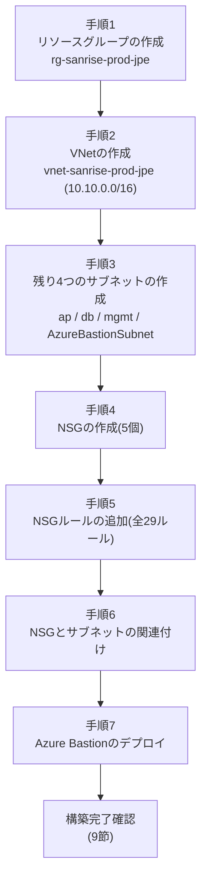

# 08. 構築手順書(ネットワーク編)

## この章のポイント

- 02章(ネットワーク設計書)・04章(セキュリティ設計書)で決定した設計値を、実際にAzureポータル上でどの画面のどのボタンを押して構築するかを、番号付き手順として1つずつ具体的に解説します。
- 構築順序は「リソースグループ→VNet→サブネット→NSG→NSGとサブネットの関連付け→Azure Bastion」という、Azureのリソース依存関係(先に作らないと後の手順が実行できない関係)に基づいた順番になっています。
- 各手順の直後に「確認方法」を明記し、次の手順に進む前に必ず自分の手で結果を確認する習慣を身につけられるようにしています。
- 初心者がつまずきやすいポイント(既定のアドレス空間の消し忘れ、NSGのプロトコル欄の制約など)を、実際につまずく箇所の直後に配置して解説します。
- ポータル操作と対になる、Bicep(`iac/bicep`配下)によるコマンドラインでの代替構築方法にも触れ、画面操作とコードがどう対応するかを示します。

---

## 1. 本章の目的と前提条件

### 1.1 本章で構築する範囲

本章は、受発注・在庫管理システムの基盤となる「ネットワーク部分」――リソースグループ、VNet(仮想ネットワーク)、5つのサブネット、5つのNSG(ネットワーク セキュリティ グループ)、そしてAzure Bastion――をAzureポータル上で実際に構築する手順を扱います。VM(仮想マシン)本体の作成、AD DS(Active Directory Domain Services、ドメインコントローラの役割。※詳しくは用語集(11-glossary.md)を参照)のセットアップ、Key Vault、Log Analytics、Recovery Services Vaultの構築は、それぞれ別の構築手順書で扱うため、本章の対象外です。

本章を実施する前に、以下のドキュメントに目を通しておくことを推奨します。設計の「値」だけでなく「なぜその値にしたのか」を理解してから手を動かすことで、単なる作業のコピーではなく、実務で応用の効く理解につながります。

| 参照ドキュメント | 本章を実施する前に確認しておくべき内容 |
|---|---|
| 00-overview-requirements.md | 本プロジェクトの背景・現状課題・要件(なぜAzureへ移行するのか) |
| 01-architecture.md | リソースグループの構成方針、CAF(Cloud Adoption Framework)命名規則の全体像 |
| 02-network-design.md | VNet/サブネットのCIDR設計、多層防御の考え方、DNS設計 |
| 04-security-design.md | Azure Bastionの設計思想、RBAC(ロールベースアクセス制御)の考え方 |

### 1.2 前提条件(必要な権限・準備物)

| 項目 | 内容 |
|---|---|
| Azureサブスクリプション | 有効なAzureサブスクリプションを保有していること |
| RBACロール | 対象サブスクリプション、または構築対象のリソースグループ(`rg-sanrise-prod-jpe`)に対して、少なくとも**共同作成者(Contributor)**ロールが割り当てられていること(04章3.5節を参照)。VNet・NSG・Bastionを作成するにはこのロールで十分です |
| ブラウザ | Azureポータル(https://portal.azure.com )にアクセスできる最新のWebブラウザ |
| Azure CLI(任意) | Bicepによるコマンドライン構築(本章10節)を試す場合に必要。ローカル端末にAzure CLIとBicep CLIをインストールしておく |
| 設計台帳の値 | 本章で入力する名前・CIDR・ポート番号はすべて設計台帳(00〜04章に掲載の値)から一切変更せずに使用します |

> **よくあるつまずきポイント**
> - サブスクリプションが複数ある環境(個人検証用サブスクリプションと組織の本番サブスクリプションが両方見える等)では、画面右上または各作成画面の「サブスクリプション」欄で**意図したサブスクリプションを選び間違える**ことがあります。作業前に画面右上のアカウントメニューで現在のサブスクリプション名を必ず確認してください。
> - Contributorロールだけでは、後述するAzure BastionへのRDP接続(04章2.5節)や、他ユーザーへの権限付与はできません。本章の「構築」自体はContributorロールで完結しますが、「接続確認」を行う担当者には別途Readerロール等が必要になる点を覚えておいてください。

### 1.3 全体の作業の流れ

本章では、以下の7つの手順を、この順番のとおりに実施します。順番を入れ替えると、後続の手順が実行できない(依存先がまだ存在しない)ため、必ずこの順序を守ってください。



| No. | 手順 | 主な成果物(設計台帳の値) |
|---|---|---|
| 1 | リソースグループの作成 | `rg-sanrise-prod-jpe`(Japan East) |
| 2 | VNetの作成(+最初のサブネット) | `vnet-sanrise-prod-jpe`(`10.10.0.0/16`)、`snet-web-prod-jpe`(`10.10.1.0/24`) |
| 3 | 残り4つのサブネットの作成 | `snet-ap-prod-jpe`、`snet-db-prod-jpe`、`snet-mgmt-prod-jpe`、`AzureBastionSubnet` |
| 4 | NSGの作成 | `nsg-bastion-prod-jpe`、`nsg-web-prod-jpe`、`nsg-ap-prod-jpe`、`nsg-db-prod-jpe`、`nsg-mgmt-prod-jpe` |
| 5 | NSGルールの追加 | 5つのNSGに対する計29件の受信/送信セキュリティ規則 |
| 6 | NSGとサブネットの関連付け | 5つのサブネットそれぞれに対応するNSGを紐付け |
| 7 | Azure Bastionのデプロイ | `bas-sanrise-prod-jpe`(Basic SKU) |

**なぜこの順番にしたのか(設計思想)**:Azureのリソースには「先に存在していないと作成できない」という依存関係があります。サブネットはVNetの内側にしか作れず、NSGをサブネットに関連付けるには両方が存在している必要があり、Azure Bastionは`AzureBastionSubnet`という専用サブネットが先に用意されていないとデプロイできません。この依存関係をそのまま手順の順序に反映させることで、手戻り(前の手順に戻ってやり直すこと)を防いでいます。

---

## 2. 手順1:リソースグループの作成

リソースグループとは、関連するAzureリソースをまとめて管理するための「入れ物」です。本プロジェクトでは、すべてのリソースを単一のリソースグループ`rg-sanrise-prod-jpe`にまとめます(01章のリソースグループ設計方針を参照)。

### 2.1 操作手順

1. **Azureポータル > ホーム > リソース グループ > + 作成** をクリックします。(ホーム画面に「リソース グループ」のタイルが見当たらない場合は、画面上部の検索ボックスに「リソース グループ」と入力し、サービス一覧から選択してください)
2. 「基本」タブで以下の値を入力します。

   | 項目 | 入力値 |
   |---|---|
   | サブスクリプション | (お使いのサブスクリプションを選択) |
   | リソース グループ名 | `rg-sanrise-prod-jpe` |
   | リージョン | `Japan East` |

3. 「タグ」タブは任意のため、本手順では省略して構いません(実務では`Environment: Production`等のタグ付けが推奨されますが、01章の命名規則で環境情報(`prod`)がリソース名自体に含まれているため、本ポートフォリオでは必須としていません)。
4. 「確認と作成」タブで入力内容を確認し、検証に成功した(緑色のチェックマークが表示される)ことを確認して **「作成」** をクリックします。
5. デプロイが完了したら「リソースに移動」をクリックします。

### 2.2 確認方法

リソースグループの概要(Overview)画面で、以下を確認します。

| 確認項目 | 期待する値 |
|---|---|
| リソース グループ名 | `rg-sanrise-prod-jpe` |
| リージョン | Japan East |
| リソース数 | 0(この時点ではまだ何も作成していないため) |

### 2.3 よくあるつまずきポイント

> **よくあるつまずきポイント**
> - リージョンの既定値が「East US」等、Japan East以外になっていることに気づかず、そのまま作成してしまうケースがあります。制約条件(利用リージョンはJapan East単一リージョンに限定)に反するため、リージョン欄は必ず目視で確認してください。
> - リソースグループ名の末尾のタイプミス(例:`rg-sanrise-prod-jpee`のような二重文字)は、他のすべてのリソースの配置先を誤らせる原因になります。作成前にコピー&ペーストで入力し、目視確認する習慣をつけてください。
> - リソースグループは作成後に**名前の変更ができません**(Azureの仕様)。名前を間違えた場合はリソースグループごと削除して作り直す必要があるため、この最初の手順こそ慎重に確認することが重要です。

---

## 3. 手順2:仮想ネットワーク(VNet)の作成

### 3.1 操作手順

1. **Azureポータル > リソースの作成 > ネットワーキング > 仮想ネットワーク** をクリックします。
2. 「基本」タブで以下の値を入力します。

   | 項目 | 入力値 |
   |---|---|
   | サブスクリプション | (お使いのサブスクリプション) |
   | リソース グループ | `rg-sanrise-prod-jpe`(手順1で作成済みのものを選択) |
   | 仮想ネットワーク名 | `vnet-sanrise-prod-jpe` |
   | リージョン | `Japan East` |

3. 「セキュリティ」タブでは、DDoS Protection・Azureファイアウォール・Azure Bastionの有効化オプションが表示されますが、**すべて既定の「無効」のまま**次へ進みます。Azure Bastionは本章の手順7で、サブネット構成を確定させたうえで個別にデプロイするため、ここでは有効化しません。
4. 「IPアドレス」タブで、VNetのアドレス空間とサブネットを設定します。
   1. 既定で表示されている「IPv4アドレス空間」(多くの場合`10.0.0.0/16`)の右側にあるゴミ箱アイコンをクリックして**削除**します。
   2. 「IPv4アドレス空間を追加する」の欄に `10.10.0.0/16` と入力し、追加します。
   3. 既定で作成される「default」という名前のサブネット行の鉛筆(編集)アイコンをクリックし、以下の値に変更して保存します。

      | 項目 | 変更後の値 |
      |---|---|
      | サブネット名 | `snet-web-prod-jpe` |
      | サブネットアドレス範囲 | `10.10.1.0/24` |

      (残り4つのサブネットは、VNet作成後に手順3でまとめて追加します。ここでは最初の1つだけを設定します)

5. 「タグ」タブは省略します。
6. 「確認と作成」タブで検証成功を確認し、**「作成」** をクリックします。

### 3.2 確認方法

VNetの概要画面で、以下を確認します。

| 確認項目 | 期待する値 |
|---|---|
| 名前 | `vnet-sanrise-prod-jpe` |
| リソース グループ | `rg-sanrise-prod-jpe` |
| リージョン | Japan East |
| アドレス空間 | `10.10.0.0/16`(1つだけであること) |
| サブネット数 | 1(`snet-web-prod-jpe`) |

左メニューの「設定 > アドレス空間」でアドレス空間が`10.10.0.0/16`の1行のみであること、「設定 > サブネット」で`snet-web-prod-jpe`(`10.10.1.0/24`)が表示されていることを、それぞれ確認してください。

### 3.3 よくあるつまずきポイント

> **よくあるつまずきポイント**
> - 既定のIPv4アドレス空間(`10.0.0.0/16`)を削除し忘れ、`10.10.0.0/16`を追加しただけで進めてしまうと、VNetのアドレス空間が2つ併存した状態になります。設計台帳が意図する範囲より広くなってしまい、意図しないIPアドレスの重複・混乱の原因になるため、追加前に必ず既定の範囲を削除してください。
> - サブネット名を`snet-web-prod-jpe`ではなく既定の`default`のまま残してしまうと、01章のCAF命名規則に反し、後続の構築手順書(NSGルールの適用先を名前で指定する場面等)で混乱の元になります。編集後は必ずサブネット一覧の表示名を確認してください。
> - VNetの**アドレス空間は作成後でも(サブネットと重複しない範囲であれば)追加・変更が可能**ですが、**サブネットは一度作成してリソース(VMのNIC等)を配置すると縮小・変更が難しくなります**(02章5節のつまずきポイント4)。本手順のようにVM配置前の段階で正しいCIDRを入力しておくことが重要です。

---

## 4. 手順3:残りのサブネットの作成

手順2でVNetと1つ目のサブネット(`snet-web-prod-jpe`)を作成しました。ここでは残り4つのサブネット(`snet-ap-prod-jpe`、`snet-db-prod-jpe`、`snet-mgmt-prod-jpe`、`AzureBastionSubnet`)を追加します。

### 4.1 操作手順(共通操作)

1. **Azureポータル > リソース グループ(`rg-sanrise-prod-jpe`) > `vnet-sanrise-prod-jpe`** を開きます。
2. 左メニューの **「設定」 > 「サブネット」** をクリックします。
3. 上部の **「+ サブネット」** をクリックします。
4. 「サブネットの追加」画面で、以下の表に従って値を入力し、**「保存」** をクリックします。
5. 3〜4を、残り3つのサブネット分繰り返します。

### 4.2 入力する値

| 追加順 | サブネット名 | サブネットアドレス範囲(CIDR) | 用途 |
|---|---|---|---|
| 1 | `snet-ap-prod-jpe` | `10.10.2.0/24` | AP層(業務アプリケーションサーバー) |
| 2 | `snet-db-prod-jpe` | `10.10.3.0/24` | DB層(SQL Serverによるデータベースサーバー) |
| 3 | `snet-mgmt-prod-jpe` | `10.10.4.0/24` | 管理用サブネット(AD DS/DNS、ファイルサーバー) |
| 4 | `AzureBastionSubnet` | `10.10.5.0/26` | Azure Bastion専用サブネット(名称固定) |

`AzureBastionSubnet`を追加する際は、「サブネット名」の入力欄に`AzureBastionSubnet`と入力すると、Azureポータルが「Bastion用の候補」として自動的にサジェスト(入力候補)を表示することが多いため、それを選択すると入力ミスを防げます。表示されない場合は、`AzureBastionSubnet`という文字列を**大文字・小文字を一切変えずに**手入力してください。

### 4.3 確認方法

VNetの「設定 > サブネット」画面で、以下の5行が表示されていることを確認します。

| サブネット名 | アドレス範囲 | NSG(この時点では未設定でよい) |
|---|---|---|
| `snet-web-prod-jpe` | `10.10.1.0/24` | - |
| `snet-ap-prod-jpe` | `10.10.2.0/24` | - |
| `snet-db-prod-jpe` | `10.10.3.0/24` | - |
| `snet-mgmt-prod-jpe` | `10.10.4.0/24` | - |
| `AzureBastionSubnet` | `10.10.5.0/26` | - |

### 4.4 よくあるつまずきポイント

> **よくあるつまずきポイント**
> - `AzureBastionSubnet`を、社内の命名規則に寄せて`snet-bastion-prod-jpe`のような名前で作成してしまうミスが非常に多く見られます。Azureの仕様上、Bastion用のサブネットはこの固定文字列以外の名前では使用できません(02章5節のつまずきポイント1)。手順7でBastionをデプロイする際に「利用可能な`AzureBastionSubnet`が見つかりません」というエラーになり、この手順まで戻ってやり直すことになるため、特に注意してください。
> - `AzureBastionSubnet`のアドレス範囲を`/27`以下の狭い範囲で入力すると保存時にエラーになります。Azure Bastionは最低でも`/26`(64アドレス)を要求するため、必ず`10.10.5.0/26`とおりに入力してください。
> - サブネットのアドレス範囲が、VNet全体のアドレス空間(`10.10.0.0/16`)に含まれていない、または既存のサブネットと範囲が重複していると、保存時にエラーメッセージが表示されます。入力前に02章2.2節のサブネット一覧表と見比べて確認する習慣をつけると、手戻りを防げます。

---

## 5. 手順4:NSG(ネットワークセキュリティグループ)の作成

ここからは、通信を制御するNSGを作成していきます。本手順ではまずNSGという「入れ物」を5つ作成し、ルールの追加(手順5)とサブネットへの関連付け(手順6)は後続の手順で行います。

### 5.1 操作手順(共通操作)

1. **Azureポータル > リソースの作成 > ネットワーキング > ネットワークセキュリティグループ** をクリックします。
2. 「基本」タブで以下の値を入力します。

   | 項目 | 入力値 |
   |---|---|
   | サブスクリプション | (お使いのサブスクリプション) |
   | リソース グループ | `rg-sanrise-prod-jpe` |
   | 名前 | (下表を参照) |
   | リージョン | `Japan East` |

3. 「確認と作成」タブで検証成功を確認し、**「作成」** をクリックします。
4. 1〜3を、残り4つのNSG分繰り返します(合計5回)。

### 5.2 作成する5つのNSG

| 作成順 | NSG名 | 適用予定のサブネット(手順6で関連付け) |
|---|---|---|
| 1 | `nsg-bastion-prod-jpe` | `AzureBastionSubnet` |
| 2 | `nsg-web-prod-jpe` | `snet-web-prod-jpe` |
| 3 | `nsg-ap-prod-jpe` | `snet-ap-prod-jpe` |
| 4 | `nsg-db-prod-jpe` | `snet-db-prod-jpe` |
| 5 | `nsg-mgmt-prod-jpe` | `snet-mgmt-prod-jpe` |

### 5.3 確認方法

リソースグループ`rg-sanrise-prod-jpe`の概要画面で、「種類」列が「ネットワーク セキュリティ グループ」のリソースが5件表示されていることを確認します。名前が上表の5つと完全に一致していることも併せて確認してください。

### 5.4 よくあるつまずきポイント

> **よくあるつまずきポイント**
> - この時点ではNSGの中身(ルール)は空(既定ルールのみ)の状態です。「作成しただけでは何も制御されていない」ことを理解し、必ず次の手順5でルールを追加してから運用を始めてください。
> - 02章5節のつまずきポイント5のとおり、**1つのサブネットに関連付けられるNSGは常に1つ**です。「Web層にもう1つ別のNSGを重ねて適用する」といった構成はできないため、必要なルールはすべて1つのNSG(`nsg-web-prod-jpe`)にまとめて定義する必要があります。

---

## 6. 手順5:NSGルールの追加

### 6.1 ルール追加の基本操作(実演:`nsg-bastion-prod-jpe`の例)

NSGのルールは、1件ずつ「受信セキュリティ規則」または「送信セキュリティ規則」の画面から追加します。ここでは例として、`nsg-bastion-prod-jpe`の受信ルール`AllowHttpsInbound`(優先度100)を追加する手順を詳しく説明します。

1. **Azureポータル > リソース グループ(`rg-sanrise-prod-jpe`) > `nsg-bastion-prod-jpe`** を開きます。
2. 左メニューの **「設定」 > 「受信セキュリティ規則」** をクリックします。
3. 上部の **「+ 追加」** をクリックします。
4. 「受信セキュリティ規則の追加」画面で、以下の値を入力します。

   | 項目 | 入力値 |
   |---|---|
   | ソース | サービスタグ |
   | ソースのサービス タグ | `Internet` |
   | ソース ポート範囲 | `*` |
   | 宛先 | IP アドレス |
   | 宛先IPアドレス/CIDR範囲 | `10.10.5.0/26` |
   | サービス | カスタム |
   | 宛先ポート範囲 | `443` |
   | プロトコル | `TCP` |
   | アクション | 許可 |
   | 優先度 | `100` |
   | 名前 | `AllowHttpsInbound` |

5. **「追加」** をクリックします。

以降のすべてのルールも、この画面操作を繰り返し、値だけを変えて入力していきます。送信(アウトバウンド)ルールを追加する場合は、手順2で「送信セキュリティ規則」を選択する点だけが異なります。

> **よくあるつまずきポイント:プロトコル欄に「TCP,UDP」は入力できない**
>
> 設計台帳(および02章のNSGルール表)には、`Allow-Web-To-AdDns-Outbound`のように、プロトコル欄が「TCP,UDP」とまとめて記載されているルールがあります。しかしAzureのNSGルールは、**1件のルールにつきプロトコルを1つ(TCP・UDP・ICMP・Any のいずれか)しか指定できません**。「TCP,UDP」という選択肢はポータルのドロップダウンに存在せず、この点で手が止まってしまう初心者が多く見られます。
>
> 対処法は、**同じ通信要件を、TCP用・UDP用の2本のルールに分けて作成する**ことです。ポート番号・送信元・宛先・許可/拒否・設計意図はまったく同じで、プロトコルだけが異なる2本のルールになります。本章では、該当するルールについて優先度を1つずつずらし、ルール名の末尾に`-Tcp`・`-Udp`を付与して区別する形で構築します(該当箇所は6.3〜6.6節の表に反映済みです)。設計思想(なぜこの通信が必要か)そのものは変わらないため、02章の設計意図の説明と併せて理解してください。

### 6.2 `nsg-bastion-prod-jpe` に追加するルール(合計9件)

Azure Bastionを正しく動作させるための必須ルールです。値の変更・追加・削除を行うとBastionが正常に動作しなくなるため、下表のとおり過不足なく入力してください(設計意図の詳細は02章6.2節を参照)。

**受信セキュリティ規則**

| 追加順 | 優先度 | 名前 | ソースの種類 | ソース | ソースポート範囲 | 宛先の種類 | 宛先 | 宛先ポート範囲 | プロトコル | アクション |
|---|---|---|---|---|---|---|---|---|---|---|
| 1 | 100 | AllowHttpsInbound | サービスタグ | `Internet` | `*` | IPアドレス | `10.10.5.0/26` | `443` | TCP | 許可 |
| 2 | 110 | AllowGatewayManagerInbound | サービスタグ | `GatewayManager` | `*` | IPアドレス | `10.10.5.0/26` | `443` | TCP | 許可 |
| 3 | 120 | AllowAzureLoadBalancerInbound | サービスタグ | `AzureLoadBalancer` | `*` | IPアドレス | `10.10.5.0/26` | `443` | TCP | 許可 |
| 4 | 130 | AllowBastionHostCommunicationInbound | IPアドレス | `10.10.5.0/26` | `*` | IPアドレス | `10.10.5.0/26` | `8080,5701` | TCP | 許可 |
| 5 | 4096 | DenyAllInbound | Any | `*` | `*` | Any | `*` | `*` | Any | 拒否 |

**送信セキュリティ規則**

| 追加順 | 優先度 | 名前 | ソースの種類 | ソース | ソースポート範囲 | 宛先の種類 | 宛先 | 宛先ポート範囲 | プロトコル | アクション |
|---|---|---|---|---|---|---|---|---|---|---|
| 1 | 100 | AllowSshRdpOutbound | IPアドレス | `10.10.5.0/26` | `*` | サービスタグ | `VirtualNetwork` | `22,3389` | TCP | 許可 |
| 2 | 110 | AllowAzureCloudOutbound | IPアドレス | `10.10.5.0/26` | `*` | サービスタグ | `AzureCloud` | `443` | TCP | 許可 |
| 3 | 120 | AllowBastionHostCommunicationOutbound | IPアドレス | `10.10.5.0/26` | `*` | IPアドレス | `10.10.5.0/26` | `8080,5701` | TCP | 許可 |
| 4 | 130 | AllowGetSessionInformationOutbound | IPアドレス | `10.10.5.0/26` | `*` | サービスタグ | `Internet` | `80` | TCP | 許可 |

> **補足**:優先度4096の`DenyAllInbound`は、Azureが自動的に用意する既定ルール(優先度65500番台)とほぼ同じ働きをしますが、02章6.1節で説明したとおり「意図を明文化する」ために明示的に追加しています。省略しても動作上の実害はありませんが、本設計台帳に従い追加してください。

### 6.3 `nsg-web-prod-jpe` に追加するルール(合計7件)

6.1節の「よくあるつまずきポイント」のとおり、優先度110のルールはTCP用・UDP用の2本に分けて入力します。

**受信セキュリティ規則**

| 追加順 | 優先度 | 名前 | ソースの種類 | ソース | ソースポート範囲 | 宛先の種類 | 宛先 | 宛先ポート範囲 | プロトコル | アクション |
|---|---|---|---|---|---|---|---|---|---|---|
| 1 | 100 | Allow-Bastion-Rdp-Inbound | IPアドレス | `10.10.5.0/26` | `*` | IPアドレス | `10.10.1.0/24` | `3389` | TCP | 許可 |
| 2 | 110 | Allow-CorpIntranet-Https-Inbound | IPアドレス | `172.16.0.0/16` | `*` | IPアドレス | `10.10.1.0/24` | `443` | TCP | 許可 |
| 3 | 4000 | Deny-Internet-Inbound | サービスタグ | `Internet` | `*` | IPアドレス | `10.10.1.0/24` | `*` | Any | 拒否 |

**送信セキュリティ規則**

| 追加順 | 優先度 | 名前 | ソースの種類 | ソース | ソースポート範囲 | 宛先の種類 | 宛先 | 宛先ポート範囲 | プロトコル | アクション |
|---|---|---|---|---|---|---|---|---|---|---|
| 1 | 100 | Allow-Web-To-Ap-Outbound | IPアドレス | `10.10.1.0/24` | `*` | IPアドレス | `10.10.2.0/24` | `8443` | TCP | 許可 |
| 2 | 110 | Allow-Web-To-AdDns-Outbound-Tcp | IPアドレス | `10.10.1.0/24` | `*` | IPアドレス | `10.10.4.0/24` | `53,88,389,445` | TCP | 許可 |
| 3 | 111 | Allow-Web-To-AdDns-Outbound-Udp | IPアドレス | `10.10.1.0/24` | `*` | IPアドレス | `10.10.4.0/24` | `53,88,389,445` | UDP | 許可 |
| 4 | 200 | Deny-Web-To-Db-Outbound | IPアドレス | `10.10.1.0/24` | `*` | IPアドレス | `10.10.3.0/24` | `*` | Any | 拒否 |

### 6.4 `nsg-ap-prod-jpe` に追加するルール(合計6件)

**受信セキュリティ規則**

| 追加順 | 優先度 | 名前 | ソースの種類 | ソース | ソースポート範囲 | 宛先の種類 | 宛先 | 宛先ポート範囲 | プロトコル | アクション |
|---|---|---|---|---|---|---|---|---|---|---|
| 1 | 100 | Allow-Web-To-Ap-Inbound | IPアドレス | `10.10.1.0/24` | `*` | IPアドレス | `10.10.2.0/24` | `8443` | TCP | 許可 |
| 2 | 110 | Allow-Bastion-Rdp-Inbound | IPアドレス | `10.10.5.0/26` | `*` | IPアドレス | `10.10.2.0/24` | `3389` | TCP | 許可 |
| 3 | 200 | Deny-Db-To-Ap-Inbound | IPアドレス | `10.10.3.0/24` | `*` | IPアドレス | `10.10.2.0/24` | `*` | Any | 拒否 |

**送信セキュリティ規則**

| 追加順 | 優先度 | 名前 | ソースの種類 | ソース | ソースポート範囲 | 宛先の種類 | 宛先 | 宛先ポート範囲 | プロトコル | アクション |
|---|---|---|---|---|---|---|---|---|---|---|
| 1 | 100 | Allow-Ap-To-Db-Outbound | IPアドレス | `10.10.2.0/24` | `*` | IPアドレス | `10.10.3.0/24` | `1433` | TCP | 許可 |
| 2 | 110 | Allow-Ap-To-AdDns-Outbound-Tcp | IPアドレス | `10.10.2.0/24` | `*` | IPアドレス | `10.10.4.0/24` | `53,88,389,445` | TCP | 許可 |
| 3 | 111 | Allow-Ap-To-AdDns-Outbound-Udp | IPアドレス | `10.10.2.0/24` | `*` | IPアドレス | `10.10.4.0/24` | `53,88,389,445` | UDP | 許可 |

### 6.5 `nsg-db-prod-jpe` に追加するルール(合計6件)

**受信セキュリティ規則**

| 追加順 | 優先度 | 名前 | ソースの種類 | ソース | ソースポート範囲 | 宛先の種類 | 宛先 | 宛先ポート範囲 | プロトコル | アクション |
|---|---|---|---|---|---|---|---|---|---|---|
| 1 | 100 | Allow-Ap-To-Db-Inbound | IPアドレス | `10.10.2.0/24` | `*` | IPアドレス | `10.10.3.0/24` | `1433` | TCP | 許可 |
| 2 | 110 | Allow-Bastion-Rdp-Inbound | IPアドレス | `10.10.5.0/26` | `*` | IPアドレス | `10.10.3.0/24` | `3389` | TCP | 許可 |
| 3 | 120 | Deny-Web-To-Db-Inbound | IPアドレス | `10.10.1.0/24` | `*` | IPアドレス | `10.10.3.0/24` | `*` | Any | 拒否 |

**送信セキュリティ規則**

| 追加順 | 優先度 | 名前 | ソースの種類 | ソース | ソースポート範囲 | 宛先の種類 | 宛先 | 宛先ポート範囲 | プロトコル | アクション |
|---|---|---|---|---|---|---|---|---|---|---|
| 1 | 100 | Allow-Db-To-AdDns-Outbound-Tcp | IPアドレス | `10.10.3.0/24` | `*` | IPアドレス | `10.10.4.0/24` | `53,88,389,445` | TCP | 許可 |
| 2 | 101 | Allow-Db-To-AdDns-Outbound-Udp | IPアドレス | `10.10.3.0/24` | `*` | IPアドレス | `10.10.4.0/24` | `53,88,389,445` | UDP | 許可 |
| 3 | 110 | Allow-Db-To-AzureBackup-Outbound | IPアドレス | `10.10.3.0/24` | `*` | サービスタグ | `Storage` | `443` | TCP | 許可 |

### 6.6 `nsg-mgmt-prod-jpe` に追加するルール(合計4件)

**受信セキュリティ規則**

| 追加順 | 優先度 | 名前 | ソースの種類 | ソース | ソースポート範囲 | 宛先の種類 | 宛先 | 宛先ポート範囲 | プロトコル | アクション |
|---|---|---|---|---|---|---|---|---|---|---|
| 1 | 100 | Allow-Bastion-Rdp-Inbound | IPアドレス | `10.10.5.0/26` | `*` | IPアドレス | `10.10.4.0/24` | `3389` | TCP | 許可 |
| 2 | 110 | Allow-VNet-To-AdDns-Inbound-Tcp | IPアドレス | `10.10.0.0/16` | `*` | IPアドレス | `10.10.4.0/24` | `53,88,389,445,3268` | TCP | 許可 |
| 3 | 111 | Allow-VNet-To-AdDns-Inbound-Udp | IPアドレス | `10.10.0.0/16` | `*` | IPアドレス | `10.10.4.0/24` | `53,88,389,445,3268` | UDP | 許可 |
| 4 | 4000 | Deny-Internet-Inbound | サービスタグ | `Internet` | `*` | IPアドレス | `10.10.4.0/24` | `*` | Any | 拒否 |

**送信セキュリティ規則**

| 追加順 | 優先度 | 名前 | ソースの種類 | ソース | ソースポート範囲 | 宛先の種類 | 宛先 | 宛先ポート範囲 | プロトコル | アクション |
|---|---|---|---|---|---|---|---|---|---|---|
| 1 | 100 | Allow-Mgmt-To-EntraId-Outbound | IPアドレス | `10.10.4.0/24` | `*` | サービスタグ | `AzureActiveDirectory` | `443` | TCP | 許可 |

### 6.7 確認方法

各NSGの左メニュー「設定 > 受信セキュリティ規則」「設定 > 送信セキュリティ規則」画面で、上表の件数どおりのルールが表示されていること、優先度・名前・ポート番号に入力ミスがないことを1件ずつ見比べて確認します。特に以下の点は見落としやすいため重点的に確認してください。

- 優先度の数字が、意図した順番(小さい数字ほど先に評価される)になっているか
- 宛先ポート範囲のカンマ区切り(例:`53,88,389,445`)にスペースや全角文字が混入していないか
- TCP/UDPの分割ルール(6.3〜6.6節)が、両方とも漏れなく作成されているか

### 6.8 よくあるつまずきポイント

> **よくあるつまずきポイント**
> - 「ソース」欄で先に種類(Any / IPアドレス / サービスタグ)を選択しないと、値の入力欄そのものが表示されません。値が入力できない場合は、まず種類の選択が済んでいるか確認してください。
> - `AllowBastionHostCommunicationInbound`のような、送信元と宛先が同じ範囲(`10.10.5.0/26`→`10.10.5.0/26`)を指定するルールは、「自分自身への通信を許可している」ように見えて違和感を覚えるかもしれません。これはBastionホスト同士(複数インスタンス構成時)の内部通信を許可するための、Azure公式ドキュメントで必須とされているルールです(02章6.2節参照)。
> - ルールの優先度は**NSG内で一意(重複不可)**である必要があります。TCP/UDP分割ルールを追加する際、既存の他のルールの優先度と衝突しないよう、本章の表どおりの優先度を使用してください。

---

## 7. 手順6:NSGとサブネットの関連付け

NSGを作成し、ルールを追加しただけでは、まだどのサブネットにも効果は及びません。最後にNSGを対象のサブネットへ**関連付け(アソシエイト)**する操作が必要です。

### 7.1 操作手順

1. **Azureポータル > リソース グループ(`rg-sanrise-prod-jpe`) > `vnet-sanrise-prod-jpe`** を開きます。
2. 左メニューの **「設定」 > 「サブネット」** をクリックします。
3. 関連付け対象のサブネット名(例:`snet-web-prod-jpe`)をクリックします。
4. サブネットの設定画面で **「ネットワーク セキュリティ グループ」** のドロップダウンから、対応するNSG(例:`nsg-web-prod-jpe`)を選択します。
5. **「保存」** をクリックします。
6. 3〜5を、残り4つのサブネット分繰り返します。

### 7.2 関連付けの対応表

| サブネット名 | 関連付けるNSG名 |
|---|---|
| `snet-web-prod-jpe` | `nsg-web-prod-jpe` |
| `snet-ap-prod-jpe` | `nsg-ap-prod-jpe` |
| `snet-db-prod-jpe` | `nsg-db-prod-jpe` |
| `snet-mgmt-prod-jpe` | `nsg-mgmt-prod-jpe` |
| `AzureBastionSubnet` | `nsg-bastion-prod-jpe` |

### 7.3 確認方法

VNetの「設定 > サブネット」一覧画面に戻り、「ネットワーク セキュリティ グループ」列に、上表のとおりのNSG名がそれぞれ表示されていることを確認します。あるいは、各NSG側の左メニュー「設定 > サブネット」画面からも、関連付け済みのサブネットを確認できます(こちらは1つのNSGに対して関連付けられているサブネットの一覧が表示されます)。

### 7.4 よくあるつまずきポイント

> **よくあるつまずきポイント**
> - サブネットとNSGの組み合わせを取り違えて関連付けてしまう(例:`snet-web-prod-jpe`に誤って`nsg-db-prod-jpe`を関連付ける)ミスが起こりやすいです。関連付け後は必ず7.3節の確認方法で1件ずつ見比べてください。誤った組み合わせのまま気づかずに進むと、通信できるはずの経路が塞がれたり、逆に塞ぐべき経路が空いたままになったりします。
> - 既に別のNSGが関連付けられているサブネットに新しいNSGを選択すると、**古いNSGとの関連付けは自動的に解除**されます(1サブネットにつき1NSGの制約、02章5節参照)。意図した置き換えであれば問題ありませんが、誤操作で別のNSGを外してしまわないよう、選択前に現在の関連付け状況を確認する習慣をつけてください。
> - NSGはサブネット単位だけでなく、VMのNIC(ネットワークインターフェース)単位にも関連付けることができますが、本設計では**サブネット単位のみに統一**しています。NICレベルでの個別設定は行わない方針です(理由:ルールの適用範囲がサブネット単位に一元化され、どのNSGがどの通信を制御しているかの見通しが良くなるため)。

---

## 8. 手順7:Azure Bastionのデプロイ

いよいよ最後に、管理アクセスの入口となるAzure Bastionをデプロイします。Bastionは`AzureBastionSubnet`(手順3・手順6で作成・NSG関連付け済み)が存在していないとデプロイできないため、必ずここまでの手順を先に完了させてください。

### 8.1 操作手順

1. **Azureポータル > リソース グループ(`rg-sanrise-prod-jpe`) > `vnet-sanrise-prod-jpe`** を開きます。
2. 左メニューの **「設定」 > 「Bastion」** をクリックします。
3. **「Bastionの使用」**(または「Bastionを作成する」)ボタンをクリックします。VNetの画面から作成すると、対象VNetと`AzureBastionSubnet`が自動的に選択されるため、この経路が最も簡単です。(別解として **Azureポータル > リソースの作成 > ネットワーキング > Bastion** から作成することもできますが、その場合は仮想ネットワークを手動で`vnet-sanrise-prod-jpe`に選び直す必要があります)
4. Bastionの作成画面で以下の値を入力します。

   | 項目 | 入力値 |
   |---|---|
   | サブスクリプション | (お使いのサブスクリプション) |
   | リソース グループ | `rg-sanrise-prod-jpe` |
   | 名前 | `bas-sanrise-prod-jpe` |
   | リージョン | Japan East(仮想ネットワークから自動設定) |
   | 層(SKU) | `Basic` |
   | 仮想ネットワーク | `vnet-sanrise-prod-jpe`(自動選択) |
   | サブネット | `AzureBastionSubnet`(自動選択・`10.10.5.0/26`) |
   | パブリックIPアドレス | 新規作成 |
   | パブリックIPアドレス名 | `pip-bastion-prod-jpe`(※設計台帳には明記がないため、既存のCAF命名規則に倣い本手順で定義する名称です) |
   | パブリックIPアドレスのSKU | `Standard`(固定・変更不可) |
   | 割り当て方法 | `静的`(固定・変更不可) |

5. 「確認と作成」タブで検証成功を確認し、**「作成」** をクリックします。
6. デプロイには**10分前後**かかる場合があります。デプロイ画面を閉じても処理は継続されるため、他の作業と並行して待つことができます。

### 8.2 確認方法

デプロイ完了後、Bastionリソース(`bas-sanrise-prod-jpe`)の概要画面で以下を確認します。

| 確認項目 | 期待する値 |
|---|---|
| プロビジョニング状態 | Succeeded |
| リソース グループ | `rg-sanrise-prod-jpe` |
| リージョン | Japan East |
| SKU(層) | Basic |
| 仮想ネットワーク/サブネット | `vnet-sanrise-prod-jpe` / `AzureBastionSubnet` |
| パブリックIPアドレス | `pip-bastion-prod-jpe`(Standard SKU・静的) |

> **補足**:この時点ではまだVM(`vm-web01`等)が構築されていないため、実際にRDP接続して疎通確認を行うことはできません。Bastion経由の実接続確認は、VM構築(サーバー構築手順書)完了後に実施します。本章では、Bastionリソース自体が正常にデプロイされたこと(プロビジョニング状態がSucceeded)までを確認範囲とします。

### 8.3 よくあるつまずきポイント

> **よくあるつまずきポイント**
> - パブリックIPアドレスを新規作成する際、既定のSKUが「Basic」やままだったり、割り当て方法が「動的」になっていると、作成時にエラーになります。**Azure Bastionは必ずStandard SKU・静的割り当てのパブリックIPアドレスを要求**します。作成画面でBastion用の新規パブリックIPを選ぶと通常は自動的にStandard・静的が設定されますが、既存のパブリックIPを流用しようとした場合はこの条件を満たしているか確認してください。
> - `AzureBastionSubnet`のアドレス範囲が`/26`未満の場合や、そもそもこの名前のサブネットが存在しない場合、デプロイ時にエラーになります。手順3・手順4・手順6を正しく完了しているか、エラーメッセージの内容を確認しながら遡って確認してください。
> - Azure Bastion(Basic SKU)は**常時課金**されるリソースです(コスト設計の章を参照)。検証目的で一時的に利用する場合は、使い終わったら削除する、あるいは学習期間中はデプロイしたままにしておき最後にまとめて削除する、といった運用をコストと相談しながら判断してください。なお、削除後に再デプロイすると、パブリックIPアドレスが変わる可能性がある点にも留意してください。

---

## 9. 構築完了確認チェックリスト

本章の手順1〜7が完了した時点で、以下の状態になっていることを最終確認してください。

| No. | 確認項目 | 確認方法 | 判定 |
|---|---|---|---|
| 1 | リソースグループ`rg-sanrise-prod-jpe`がJapan Eastに存在する | リソースグループの概要画面 | ☐ |
| 2 | VNet`vnet-sanrise-prod-jpe`のアドレス空間が`10.10.0.0/16`の1つのみである | VNetの「アドレス空間」画面 | ☐ |
| 3 | 5つのサブネットが設計台帳どおりのCIDRで存在する | VNetの「サブネット」画面 | ☐ |
| 4 | 5つのNSG(`nsg-bastion/web/ap/db/mgmt-prod-jpe`)が存在する | リソースグループの概要画面(種類でフィルタ) | ☐ |
| 5 | 各NSGに設計台帳どおりの受信/送信ルールが過不足なく登録されている | 各NSGの「受信/送信セキュリティ規則」画面 | ☐ |
| 6 | 5つのサブネットそれぞれに、対応するNSGが正しく関連付けられている | VNetの「サブネット」一覧のNSG列 | ☐ |
| 7 | Azure Bastion(`bas-sanrise-prod-jpe`、Basic SKU)がプロビジョニング成功している | Bastionリソースの概要画面 | ☐ |
| 8 | いずれのVMにもパブリックIPアドレスが付与されていない(VM未構築の現時点では該当なし。次章以降のVM構築時に必ず再確認する項目) | (次章で確認) | ☐ |

すべてにチェックが入った状態が、本章(ネットワーク編)の完了条件です。次のサーバー構築手順書では、本章で用意した各サブネットへVM(`vm-ad01`、`vm-web01`、`vm-ap01`、`vm-db01`、`vm-file01`)を配置していきます。

---

## 10. Bicepによるコマンドライン構築(代替手順)

### 10.1 なぜBicepによる代替手順を用意するのか(設計思想)

ここまでのAzureポータルでの操作は、画面を見ながら値を確認できるため初学者には理解しやすい反面、手作業ゆえに入力ミス(タイプミス、優先度の付け忘れ等)が起こりやすく、また同じ環境をもう一度作り直す(検証用に複製する、誤って削除してしまった際に復旧する等)際に、毎回同じ手順をすべて再現するのは非効率です。

Bicep(Azureのインフラをコードで定義するためのマイクロソフト製言語。※詳しくは用語集(11-glossary.md)を参照)を使うと、本章で行った操作と同じ内容を**コードファイルとして記述し、コマンド一発で再現**できます。01章で述べた「将来のIaC(Infrastructure as Code)化を見据えた一貫性」という設計方針のとおり、本パックでは本章のポータル操作と対になる形で、`iac/bicep`配下にBicepテンプレート一式を用意する方針としています。両者は最終的にまったく同じAzureリソース(同じ名前・同じCIDR・同じルール)を作成するものであり、学習段階ではまずポータル操作で「何が作られるのか」を体で理解し、実務ではBicep側を正として再現性のある構築・変更管理を行う、という使い分けを想定しています。

### 10.2 想定するディレクトリ構成

| ファイル(想定) | 対応する本章の手順 | 主なパラメータ |
|---|---|---|
| `iac/bicep/main.bicep` | 全体のエントリポイント。以下の各モジュールを呼び出す | `location`、共通タグ |
| `iac/bicep/modules/network.bicep` | 手順2・手順3(VNet・5つのサブネット作成) | `vnetName`、`addressPrefix`、`subnets`(名前・CIDRの配列) |
| `iac/bicep/modules/nsg.bicep` | 手順4・手順5(NSGとルールの作成) | `nsgName`、`securityRules`(優先度・方向・プロトコル・ポート・ソース/宛先・アクションの配列) |
| `iac/bicep/modules/nsg-association.bicep` | 手順6(NSGとサブネットの関連付け) | `subnetId`、`nsgId` |
| `iac/bicep/modules/bastion.bicep` | 手順7(Azure Bastionのデプロイ) | `bastionName`、`sku`(Basic)、`subnetId`、`publicIpName` |
| `iac/bicep/parameters/prod.bicepparam` | 設計台帳の値そのもの(リソース名・CIDR・ポート番号等)をパラメータとして一元管理 | 本章で入力したすべての値 |

> **補足**:Bicepでは、NSGの1件のルールにつき`protocol`プロパティは`'Tcp'`・`'Udp'`・`'*'`等、単一の値しか指定できません。これはポータルの制約(6.1節)と同じAzureの仕様であり、コード上でも6.3〜6.6節と同様にTCP用・UDP用の2つのルールオブジェクトとして配列に定義する必要があります。

### 10.3 コマンド例

Azure CLIとBicep CLIをインストールした端末から、以下のようなコマンドで構築します(実際のパラメータファイルの中身は`iac/bicep`配下の実装に従ってください)。

```bash
# Azureへログイン
az login

# 対象サブスクリプションを選択
az account set --subscription "<サブスクリプションID または サブスクリプション名>"

# リソースグループの作成(手順1に相当)
az group create \
  --name rg-sanrise-prod-jpe \
  --location japaneast

# VNet/サブネット/NSG/Bastionの一括デプロイ(手順2〜7に相当)
az deployment group create \
  --resource-group rg-sanrise-prod-jpe \
  --template-file iac/bicep/main.bicep \
  --parameters iac/bicep/parameters/prod.bicepparam

# デプロイ結果の検証(what-ifで事前に差分を確認する場合)
az deployment group what-if \
  --resource-group rg-sanrise-prod-jpe \
  --template-file iac/bicep/main.bicep \
  --parameters iac/bicep/parameters/prod.bicepparam
```

`az deployment group create`は**宣言的**(こういう状態であるべき、という結果を記述する方式)にリソースを定義するため、既に同じ名前のリソースが存在する場合は新規作成ではなく差分の更新として動作します。これにより、手順1〜7を何度実行しても、意図せずリソースが重複作成される心配がなく、ポータルでの手作業よりも安全に「同じ環境を何度でも再現できる」という利点があります。

### 10.4 ポータル操作とBicepの使い分けの指針

| 場面 | 推奨する方法 |
|---|---|
| 初めてAzureのネットワーク構成を学ぶとき | 本章のポータル操作(画面を見ながら値の意味を理解できるため) |
| 同じ環境を何度も作り直す・複製するとき | Bicep(コマンド一発で再現でき、入力ミスが起きにくいため) |
| 変更履歴をGit等で管理したいとき | Bicep(コードのためバージョン管理システムでの差分管理・レビューが可能) |
| 緊急時に1つの値だけをその場で素早く確認・修正したいとき | ポータル操作(コードのビルド・デプロイ待ちが不要で即座に反映できるため) |

---

## 11. まとめ:本章の設計思想の振り返り

1. **構築順序をリソースの依存関係どおりにした**のは、依存先が存在しない状態で後続の手順を試みてエラーになる、という初心者が最も陥りやすい手戻りを防ぐためです。
2. **各手順の直後に「確認方法」を設けた**のは、複数の手順を連続して実施した後にまとめて確認すると、どの手順でミスが発生したのかを特定しにくくなるためです。1手順ごとに確認する習慣は、実務のトラブルシューティング能力の土台になります。
3. **設計台帳の値をポータル入力用の表として再構成した**のは、02章(設計書)が「なぜその通信を許可・拒否するのか」という設計意図の理解に主眼を置いているのに対し、本章(構築手順書)は「実際に画面のどこに何を入力するか」という作業の再現性に主眼を置いているためです。両者は目的が異なるため、あえて重複を厭わず本章にも値の一覧を掲載しています。
4. **NSGルールのTCP/UDP分割という実装上の制約を明示した**のは、設計書に書かれた論理的な要件と、実際にAzureへ実装する際の技術的な制約(1ルール1プロトコル)との間にギャップが存在することを、実務に出る前に体験しておいてもらうためです。こうしたギャップへの対処経験は、実際の現場での構築作業において非常に価値があります。
5. **Bicepによる代替手順を併記した**のは、ポータル操作だけを覚えても実務のIaC化の潮流には対応できないためです。まずポータルで「何が作られるか」を理解し、その理解を土台にコードでの再現方法へ進む、という学習の順序を意識した構成にしています。

次の構築手順書(サーバー編)では、本章で構築したネットワーク基盤(VNet・サブネット・NSG・Bastion)の上に、実際の5台のVM(`vm-ad01`、`vm-web01`、`vm-ap01`、`vm-db01`、`vm-file01`)をデプロイする手順を解説します。

---

## 理解度チェック

**Q1. VNetのアドレス空間を編集する際、既定で表示されている`10.0.0.0/16`のような範囲を削除せずに`10.10.0.0/16`を追加してしまうと、どのような問題が起きますか?**

A. VNetのアドレス空間が2つ併存した状態になってしまいます。設計台帳が意図する`10.10.0.0/16`単独の範囲より広くなり、意図しないIPアドレス設計の混乱を招くため、追加する前に既定のアドレス空間を必ず削除する必要があります。

**Q2. `AzureBastionSubnet`という名前のサブネットを、他の命名規則に沿った名前(例:`snet-bastion-prod-jpe`)に変更して作成した場合、何が起こりますか?**

A. Azure Bastionをデプロイしようとした際に、専用サブネットが見つからずエラーになります。Azure Bastion用のサブネットは、大文字・小文字も含めて`AzureBastionSubnet`という固定文字列でなければならないためです。

**Q3. 設計台帳のNSGルールで「プロトコル:TCP,UDP」と記載されているものを、Azureポータルで1件のルールとしてそのまま入力できますか? できない場合、どう対処しますか?**

A. できません。AzureのNSGルールは1件につきプロトコルを1つ(TCP・UDP・ICMP・Anyのいずれか)しか指定できないためです。対処法として、同じソース・宛先・ポート・アクションのまま、TCP用とUDP用の2本のルールに分けて作成します(優先度は重複しないようにずらします)。

**Q4. NSGのルールを追加しただけで、そのNSGは対象のサブネットの通信を制御し始めますか?**

A. いいえ、制御し始めません。NSGとそのルールは、対象のサブネット(またはNIC)に**関連付け(アソシエイト)**して初めて効果を発揮します。本章では手順6でこの関連付け作業を行っています。

**Q5. Azure Bastionをデプロイする際、パブリックIPアドレスを新規作成する場合、どのSKUと割り当て方法が必須ですか?**

A. Standard SKU、かつ静的(Static)割り当てのパブリックIPアドレスが必須です。Basic SKUや動的(Dynamic)割り当てのパブリックIPアドレスはAzure Bastionでは使用できません。
