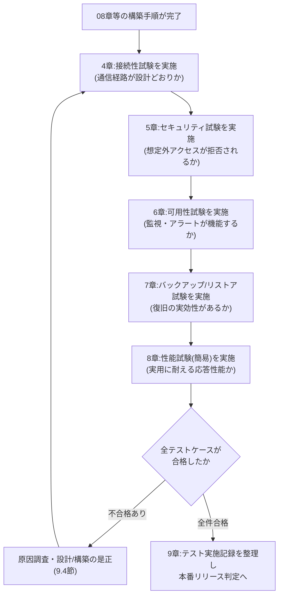
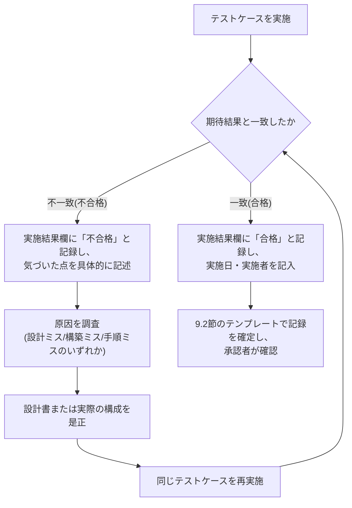

# 10. テスト仕様書

## この章のポイント

- 02章(ネットワーク設計書)〜07章(コスト設計書)・08章(構築手順書)で定めた設計値・構築手順どおりに、実際のAzure環境が動いているかを検証するための**テストケース(試験項目)**を、接続性・セキュリティ・可用性・バックアップ/リストア・性能(簡易)の5区分・合計32件、表形式で提示します。
- 「動いているように見える」ことと「設計書どおりに動いている」ことは別物である、という考え方を軸に、**なぜテストを設計書どおりに実施しなければならないのか**を、未経験の方にも分かる具体例で解説します。
- サンライズ物産の旧環境最大の反省点である「バックアップは取得していたが、リストア検証を一度もしていなかった」という状態を、本プロジェクトでは二度と繰り返さないための試験計画になっていることを示します。
- 試験を実施した記録を「言った・言わない」ではなく客観的な証跡として残すための、**実施日・実施者・合否を記録するテンプレート**の使い方を具体例つきで解説します。
- 各テストケースは、02〜06章で定義したNSGルール名・アラート名・IPアドレス等の設計台帳(ledger)の値をそのまま参照しており、設計書と試験項目が1対1で対応づく(トレーサビリティが確保される)ように作成しています。

---

## 1. 本章の目的と位置づけ

### 1.1 本章の位置づけ

これまでの章では、「どう設計するか」(02章:ネットワーク設計書、03章:サーバー設計書、04章:セキュリティ設計書、05章:運用監視設計書、06章:バックアップ・DR設計書)と、「どう作るか」(08章:構築手順書)を扱ってきました。しかし、設計書に正しいことを書き、手順書どおりに操作したつもりでも、**実際に構築した環境が本当に設計書どおりに動いているか**は、誰かが実際に確認するまでは分かりません。設定項目を1つ入力し忘れる、優先度の数字を1桁打ち間違える、チェックボックスの入れ忘れ――こうした小さなミスは、どれほど注意していても人間である以上ゼロにはできません。

本章「テスト仕様書」は、構築が完了した環境に対して、**「設計書に書かれたとおりに、実際に動作するか」を1件ずつ客観的に確認する工程**を定義するものです。具体的には、以下の5つの観点でテストケースを用意します。

| 試験区分 | 確認する観点 | 主な参照章 |
|---|---|---|
| 接続性試験 | サブネット間・層間の通信が、許可すべきものは通り、禁止すべきものは通らないか | 02章(ネットワーク設計書) |
| セキュリティ試験 | 想定していないアクセス(権限のないユーザーの操作、MFA未完了のサインイン等)が確実に拒否されるか | 04章(セキュリティ設計書) |
| 可用性試験 | CPU逼迫・ディスク逼迫・VM停止等の異常を、監視の仕組みが自動的に検知・通知できるか | 05章(運用監視設計書) |
| バックアップ/リストア試験 | バックアップが確実に取得され、かつ実際にデータを復元できるか | 06章(バックアップ・DR設計書) |
| 性能試験(簡易) | Bシリーズ・Premium SSD等、コスト重視で選定した構成が、実用に耐える応答性能を発揮するか | 03章(サーバー設計書) |

つまり本章は、02〜07章という「設計の図面」と、08章という「その図面に基づく施工」の**両方が正しく現実になっているか**を検証する、最後の関門にあたる章です。設計・構築・テストという3つの工程は、それぞれ担当者が異なる場合もありますが、本ポートフォリオでは「設計した内容を、自らテストして裏付ける」という一連の流れを一人で追体験できるようにしています。

### 1.2 現状課題との対応関係

00章(要件定義書)で整理した現状課題のうち、本章のテストが直接的に「本当に解消されたか」を裏付ける対象は、以下のとおりです。

| # | 現状の課題 | 本章のテストでの対応 |
|---|---|---|
| 4 | サーバー管理者が固定グローバルIP経由でVMへ直接RDP接続しており、共有の管理者アカウントも常態化していてアクセス統制・監査ログが不十分である | 接続性試験(4章)でBastion経由以外の経路が遮断されることを、セキュリティ試験(5章)で共有アカウントや過剰権限での操作が拒否されることを、それぞれ実際に確認する |
| 5 | サーバー監視が担当者の目視確認中心であり、CPU/ディスク逼迫や障害の予兆を早期に検知できていない | 可用性試験(6章)で、5種類のアラートが実際にしきい値超過時に自動発報し、担当者へ通知されることを確認する |
| 6 | バックアップが磁気テープによる手動運用であり、リストア検証やDR訓練が実施できておらず復旧の実効性が担保されていない | バックアップ/リストア試験(7章)で、バックアップの取得だけでなく、実際にVM・ファイル・データベースを復元できることまで確認する |
| 3 | 自社データセンターの単一拠点運用のため、地震・水害等の災害時における事業継続(BCP)対策が不十分である | バックアップ/リストア試験(7章)のGRSレプリカ確認により、地理的な保全が機能していることを確認する |
| 1・2 | 基幹サーバーの老朽化・OSサポート切れ | Windows Server 2022への刷新自体の効果を、性能試験(簡易、8章)で実際の応答性能として確認する |

このように、本章の各試験区分は「設計書に対応関係が明記されているから安心」ではなく、「実際に試してみて、その対応が機能していることを自分の目で確かめる」ための工程です。00章で整理した6つの課題は、いずれも旧環境で「気づかないまま放置されていた」問題でした。本章のテストは、Azure移行後に同じ轍を踏まないための「気づく仕組み」そのものだといえます。

---

## 2. なぜテストは設計書どおりに行う必要があるのか(初心者向け解説)

### 2.1 「動いている」ことと「設計どおりに動いている」ことの違い

インフラ構築の現場でよくある誤解に、「画面が表示された」「エラーが出なかった」=「正しく構築できた」というものがあります。しかし、この2つは似ているようでまったく別物です。

> **たとえ話**:新築の家が完成し、電気がつき、水道からお湯が出て、ドアの鍵もかかるとします。これだけを見れば「家として機能している」ように見えます。しかし、それだけでは「設計図どおりの耐震基準を満たしているか」「電気配線が図面どおりに安全な経路を通っているか」までは分かりません。完成検査(施工が設計図・建築基準どおりに行われたかを確認する検査)を省略してしまうと、大地震が来て初めて「実は柱の位置が図面と違っていた」と発覚する、というような事態が起こり得ます。

本プロジェクトでも同じことが言えます。たとえば、社内PCから受発注・在庫管理システムの画面(`vm-web01`)が正常に表示されたとしても、それだけでは「Web層からDB層(`vm-db01`)への直接通信がきちんと遮断されているか」(02章6.3〜6.5節の多層防御)までは分かりません。画面が表示されることと、裏側のセキュリティ設計が意図どおりに機能していることは、まったく別の確認事項なのです。**「動いている」という表面的な事実の背後にある、設計書に書かれた「意図」が実際に実現されているかどうかを1つずつ裏付けていく作業が、テストです。**

### 2.2 なぜ「設計書に書かれた値」でテストしなければならないのか

テストを行う際、面倒だからといって「だいたい似たような条件」で確認を済ませてしまうと、テストの結果が本番環境の実態を証明しなくなってしまいます。以下の表で、良くない例と正しい進め方を比較します。

| 観点 | やってはいけないテストの進め方(悪い例) | 設計書どおりのテストの進め方(本章の方針) |
|---|---|---|
| 使用するIPアドレス・ポート番号 | 「だいたいこのあたりのポートで通信できればOK」と、思い出せる範囲の値で確認する | 設計台帳に定義された正確な値(例:AP→DBは`1433`番、Web→APは`8443`番)を使い、それ以外のポートで代用しない |
| 確認する送信元 | 手近な端末から適当に試す | NSGルールが想定する送信元(例:社内イントラネット`172.16.0.0/16`、Bastionサブネット`10.10.5.0/26`)からきちんと試す |
| 確認する範囲 | 「表画面が映ればOK」と、見える部分だけを確認する | 許可すべき通信(例:Web→AP)だけでなく、**禁止すべき通信が実際に拒否されること**(例:Web→DB)まで、意図的に「失敗するはずの操作」も試す |
| 記録の残し方 | 「確認しました」の一言で済ませる | いつ・誰が・どの手順で・どんな結果だったかを記録に残す(9章) |

**なぜこれが重要なのか**を、本プロジェクトの設計に即して説明します。02章・04章で解説したとおり、本設計は「Web層からDB層への直接通信を明示的に拒否する」ルール(`Deny-Web-To-Db-Outbound`・`Deny-Web-To-Db-Inbound`)を二重に用意しています。もしテスト担当者が「Web画面からログインできたので合格」とだけ確認して終えてしまうと、**仮にこの拒否ルールの優先度設定を誤っていて実は素通りしてしまう状態になっていたとしても、誰にも気づかれないまま本番稼働してしまいます**。多層防御という設計思想は、実際に「拒否されるべき通信が本当に拒否されるか」を試してみて初めて、その効果を確認できるのです。テストケースが設計書の値(IPアドレス・ポート番号・NSGルール名など)を1対1で引用しているのは、**テスト結果が「確かにこの設計が機能している」ことの証拠になるようにするため**です。曖昧な条件でテストをしてしまうと、合格したときも不合格だったときも、「結局何を確認したのか」が後から分からなくなってしまいます。

### 2.3 旧環境の反省:「検証していない」は「できていない」と同じ

00章・06章で繰り返し触れているとおり、サンライズ物産の旧環境における最大の反省点は、「バックアップを取得してはいたが、実際にリストアできるかを一度も検証していなかった」ことでした。これは本章のテーマである「テスト」の重要性を象徴する事例です。バックアップの取得ジョブが毎晩正常終了していたとしても、いざという時に本当に復元できるかどうかは、**実際にリストアを試してみるまでは、誰にも分からない**からです。

同じ考え方は、ネットワーク設計・セキュリティ設計・監視設計のすべてに当てはまります。「NSGルールを設定した」「アラートルールを作成した」という**作業が完了したこと**と、「そのルールが実際に意図どおり機能すること」は、まったく別の話です。本章で定義するテストケースは、02〜06章で積み上げてきた設計判断1つひとつに対して、「本当にそのとおりに動くのか」を実地で裏付けるための、いわば**設計と現実をつなぐ最後の橋渡し**の役割を担っています。

---

## 3. テストの全体方針・進め方

### 3.1 テスト全体の流れ

本章のテストは、08章の構築手順(および、VM・Key Vault・Log Analytics・Recovery Services Vault等、他の構築手順書で構築される範囲)がすべて完了した後に実施します。全体の流れを以下に示します。

前段階(接続性)で通信経路そのものに不具合があると、後段階(セキュリティ・可用性)の試験結果が正しく評価できなくなるため、**上流(ネットワークの土台)から下流(性能等の応用的な確認)へ**という順序で実施することを基本方針とします。ただし、実際の現場では時間的な制約から複数区分を並行して進めることも多く、その場合も「接続性試験で確認した通信経路の前提が崩れていないか」を都度意識することが重要です。

### 3.2 5つの試験区分と目的

| 試験区分 | 目的 | ID接頭辞 | 件数 |
|---|---|---|---|
| 接続性試験 | サブネット間・層間の通信が、許可すべきものは通り、NSGルールで禁止した通信は確実に遮断されることを確認する | TC-NET | 9件 |
| セキュリティ試験 | ロール・条件付きアクセス・Key Vaultのアクセス制御など、想定外のアクセスが確実に拒否されることを確認する | TC-SEC | 7件 |
| 可用性試験 | CPU/ディスク逼迫・VM停止・バックアップ失敗等の異常を、監視の仕組みが自動的に検知・通知できることを確認する | TC-AVL | 5件 |
| バックアップ/リストア試験 | バックアップが確実に取得され、かつVM・ファイル・データベースを実際に復元できることを確認する | TC-BKP | 7件 |
| 性能試験(簡易) | Bシリーズ・Premium SSD等、コスト重視で選定した構成が、実用に耐える応答性能を発揮するかを簡易的に確認する | TC-PERF | 4件 |

合計32件のテストケースを、4章以降で1件ずつ表形式で提示します。各表の列は、「項目(何を確認するか)」「手順(どう確認するか)」「期待結果(設計書上、本来どうなるべきか)」「実施結果(実際にやってみてどうだったかを記入する欄)」の4つで構成し、実施結果欄は本仕様書の時点では未記入(記入欄)としています。実施結果欄の具体的な使い方は9章で解説します。

### 3.3 合否判定の基準

各テストケースの合否は、以下の基準で判定します。

| 判定 | 基準 |
|---|---|
| 合格(OK) | 手順どおりに実施した結果が、期待結果の記載内容と完全に一致した場合 |
| 不合格(NG) | 期待結果と異なる結果になった場合(例:遮断されるべき通信が通ってしまった、通るべき通信が拒否されてしまった、アラートが発報しなかった等) |
| 保留(要再確認) | 環境要因(検証用データの準備不足、一時的なネットワーク遅延等)により、テスト自体が正しく実施できなかった場合。原因を解消したうえで再実施し、改めて合格/不合格を判定する |

**なぜ「だいたい合っていればOK」という判定を認めないのか**:例えば接続性試験で「Web→DBの通信が一部のポートでは拒否されたが、別のポートでは確認していない」という状態を合格にしてしまうと、多層防御という設計思想(02章4.1節)が本当に機能しているかどうかを保証できなくなります。設計書に書かれた期待結果と完全に一致することを合格の条件とすることで、**「なんとなく大丈夫そう」という主観的な判断を排除し、誰が判定しても同じ結論になる客観的な基準**を維持しています。

---

## 4. 接続性試験

### 4.1 目的

02章(ネットワーク設計書)で設計したVNet・サブネット・NSGルールが、実際に「許可すべき通信は通し、禁止すべき通信は遮断する」という多層防御の意図どおりに機能していることを確認します。特に、**通るべき通信の確認(疎通確認)だけでなく、通らないべき通信が本当に拒否されることの確認**を同じ比重で行う点が本区分の特徴です。

### 4.2 テストケース一覧

| No. | 試験ID | 項目 | 手順 | 期待結果 | 実施結果 |
|---|---|---|---|---|---|
| 1 | TC-NET-01 | 社内イントラネット→`vm-web01`のHTTPS疎通確認 | 社内イントラネット(`172.16.0.0/16`)内の端末のブラウザから`vm-web01`(`10.10.1.4`)のHTTPS(443番)画面へアクセスする | 受発注・在庫管理システムのログイン画面が正常に表示される(`nsg-web-prod-jpe`の`Allow-CorpIntranet-Https-Inbound`、優先度110により許可) | (記入欄) |
| 2 | TC-NET-02 | インターネット→`vm-web01`への直接アクセス遮断確認 | 社内イントラネット以外(モバイル回線等の社外ネットワーク)の端末から、`vm-web01`への到達を試みる。あわせてAzureポータル上で`vm-web01`のネットワークインターフェースにパブリックIPアドレスが割り当てられていないことを確認する | パブリックIPアドレスが「なし」であることが確認でき、外部ネットワークからの到達経路自体が存在しない。仮にVNet内部から到達を試みた場合も`nsg-web-prod-jpe`の`Deny-Internet-Inbound`(優先度4000)により拒否される | (記入欄) |
| 3 | TC-NET-03 | `vm-web01`→`vm-ap01`(8443番)API疎通確認 | `vm-web01`上で`Test-NetConnection -ComputerName 10.10.2.4 -Port 8443`を実行する。あわせてWeb画面から受注登録等、AP層呼び出しを伴う業務操作を行う | TCP接続が成功(`TcpTestSucceeded : True`)し、業務操作(受注登録等)も正常に完了する(`nsg-web-prod-jpe`の`Allow-Web-To-Ap-Outbound`、`nsg-ap-prod-jpe`の`Allow-Web-To-Ap-Inbound`、いずれも優先度100により許可) | (記入欄) |
| 4 | TC-NET-04 | `vm-ap01`→`vm-db01`(1433番)SQL疎通確認 | `vm-ap01`上で`Test-NetConnection -ComputerName 10.10.3.4 -Port 1433`を実行する。あわせてアプリケーションからのデータベース参照・更新操作を行う | TCP接続が成功し、データベースへの参照・更新操作も正常に完了する(`nsg-ap-prod-jpe`の`Allow-Ap-To-Db-Outbound`、`nsg-db-prod-jpe`の`Allow-Ap-To-Db-Inbound`、いずれも優先度100により許可) | (記入欄) |
| 5 | TC-NET-05 | `vm-web01`→`vm-db01`直接通信の遮断確認(多層防御) | `vm-web01`上で`Test-NetConnection -ComputerName 10.10.3.4 -Port 1433`を実行する | TCP接続が失敗(`TcpTestSucceeded : False`)する。`nsg-web-prod-jpe`の`Deny-Web-To-Db-Outbound`(優先度200)、`nsg-db-prod-jpe`の`Deny-Web-To-Db-Inbound`(優先度120)の両方で二重に遮断されていることを、それぞれのNSGフローログでも確認する | (記入欄) |
| 6 | TC-NET-06 | `vm-db01`→`vm-ap01`逆方向通信の遮断確認 | `vm-db01`上で`Test-NetConnection -ComputerName 10.10.2.4 -Port 8443`を実行し、DB層からAP層への新規接続開始を試みる | TCP接続が失敗する。`nsg-ap-prod-jpe`の`Deny-Db-To-Ap-Inbound`(優先度200)により拒否される。なお、通常業務におけるAP→DBのSQL応答パケット自体はステートフルなNSGの性質上このルールと無関係に許可されるため、通常業務への影響がないことも併せて確認する | (記入欄) |
| 7 | TC-NET-07 | 各層→`vm-ad01`のDNS/AD認証通信確認 | `vm-web01`・`vm-ap01`・`vm-db01`・`vm-file01`の各VM上で`nslookup sanrise.local`を実行し、あわせて`Test-NetConnection -ComputerName 10.10.4.4 -Port 389`を実行する | いずれのVMからも名前解決・LDAP(389番)接続が成功する。`nsg-mgmt-prod-jpe`の`Allow-VNet-To-AdDns-Inbound`(優先度110、ポート53,88,389,445,3268、送信元`10.10.0.0/16`)により許可される | (記入欄) |
| 8 | TC-NET-08 | Azure Bastion経由RDP接続確認(全5台) | 管理者アカウントでAzureポータルにサインインし、`bas-sanrise-prod-jpe`経由で`vm-ad01`・`vm-web01`・`vm-ap01`・`vm-db01`・`vm-file01`の全VMへ順にRDP接続する | 全5台とも、Bastion経由でのRDP接続が成功する。各NSG(`nsg-mgmt/web/ap/db-prod-jpe`)の`Allow-Bastion-Rdp-Inbound`(送信元`10.10.5.0/26`、宛先3389)により許可されている | (記入欄) |
| 9 | TC-NET-09 | VMへの直接RDP接続不可の確認(パブリックIP不在) | Azureポータル上で全5台のVMのネットワークインターフェースを確認し、パブリックIPアドレスが割り当てられていないことを確認する。あわせてBastion以外の送信元(Bastionサブネット`10.10.5.0/26`以外)から各VMのプライベートIPへ直接RDP接続を試みる | 全5台ともパブリックIPアドレスが「なし」であることが確認できる。Bastion以外の送信元からのRDP接続は、いずれのNSGの`Allow-Bastion-Rdp-Inbound`にも送信元がマッチしないため拒否される | (記入欄) |

### 4.3 なぜこれらを試験するのか(設計思想との対応)

上記9件のうち、TC-NET-05・TC-NET-06は「通信が拒否されること」を確認する試験であり、一見すると「何も起きないことを確認する」という地味な作業に見えます。しかし、02章4.1節で解説したとおり、本設計の核心は**「1つの防御線が突破されても、被害が他層へ広がらないようにする」多層防御**にあります。この防御が本当に機能しているかは、実際に「拒否されるはずの通信」を意図的に発生させてみない限り確認できません。TC-NET-08・TC-NET-09は、現状課題④(固定グローバルIP経由の直接RDP接続)を解消したことの直接的な裏付けであり、Bastion経由の接続が成功することと、それ以外の経路が存在しないことの両方を確認して初めて、「アクセス経路がBastionに一本化された」と言い切ることができます。

---

## 5. セキュリティ試験

### 5.1 目的

04章(セキュリティ設計書)で設計したRBAC(ロールベースアクセス制御)・MFA(多要素認証)・条件付きアクセス・Key Vaultのアクセス制御が、実際に「想定していないアクセスを拒否する」という最小権限の原則どおりに機能していることを確認します。

### 5.2 テストケース一覧

| No. | 試験ID | 項目 | 手順 | 期待結果 | 実施結果 |
|---|---|---|---|---|---|
| 1 | TC-SEC-01 | Readerロールのみのユーザーによる構成変更操作の拒否確認 | Readerロール(閲覧専用)のみを付与したEntra IDアカウントでAzureポータルにサインインし、`nsg-web-prod-jpe`のルール変更、または任意のVMの再起動を試みる | 「この操作を実行するアクセス許可がありません」等のエラーが表示され、変更操作が実行できない(04章3.5節の想定ロール割当に基づく最小権限) | (記入欄) |
| 2 | TC-SEC-02 | MFA未完了状態でのAzureポータルサインイン拒否確認 | 管理者アカウントのID・パスワードのみでAzureポータルへのサインインを試み、追加のMFA(多要素認証)を意図的に完了させない | サインインが完了せず、追加の認証(スマートフォンアプリの承認等)が要求される。条件付きアクセスポリシーにより、MFAを完了しない限りアクセスできない(04章3.6節) | (記入欄) |
| 3 | TC-SEC-03 | Key Vaultへの未許可IDからのシークレット取得拒否確認 | `kv-sanrise-prod-jpe`に対して`Key Vault Secrets User`等のロールが割り当てられていないアカウント・マネージドIDから、シークレット取得(`Get-AzKeyVaultSecret`等)を試みる | 「Forbidden」等のアクセス拒否エラーが返り、シークレットの値が取得できない(04章4.5節のAzure RBACによる最小権限) | (記入欄) |
| 4 | TC-SEC-04 | 共有アカウントによるアクセス不可の確認 | 個人に紐づかない共有アカウント(旧環境で常態化していた運用を想定)で、Azureポータルへのサインイン、またはVMへのRDPログオンを試みる | Azureポータルへのサインインは個人のMicrosoft Entra IDアカウント+MFAに統制されているため、共有アカウントでの接続経路自体が存在しない。VMログオンについても、AD DS(`sanrise.local`)のドメイン資格情報またはKey Vault管理のローカル管理者資格情報が必要であり、身元不明なアカウントでは認証が成立しない | (記入欄) |
| 5 | TC-SEC-05 | NSGフローログでの拒否通信の記録確認 | TC-NET-05(`vm-web01`→`vm-db01`の直接通信試行)を実施した直後に、NSGフローログ(05章3.2節、監視ダッシュボード項目5)を確認する | 送信元`10.10.1.0/24`・宛先`10.10.3.0/24`・宛先ポート1433の通信が「拒否(Deny)」として記録され、拒否件数のサマリに反映されている | (記入欄) |
| 6 | TC-SEC-06 | インターネットからのBastion以外の経路での管理アクセス拒否確認 | インターネット上の任意の端末から、各VMのプライベートIPへの直接到達、または`AzureBastionSubnet`以外を経由した管理アクセスを試みる | 到達経路自体が存在せず接続できない。万一到達した場合でも、`nsg-mgmt-prod-jpe`・`nsg-web-prod-jpe`の`Deny-Internet-Inbound`(優先度4000)により遮断される | (記入欄) |
| 7 | TC-SEC-07 | 構成ファイルへの秘密情報直書きがないことの確認 | `vm-web01`・`vm-ap01`上のアプリケーション構成ファイル(`web.config`、`appsettings.json`等)を確認し、SQL接続文字列やパスワードが平文で記載されていないかを確認する | 構成ファイル内にパスワード等の秘密情報が記載されておらず、Key Vault(`kv-sanrise-prod-jpe`)からマネージドID経由で参照する構成になっている(04章4.2〜4.6節) | (記入欄) |

### 5.3 なぜこれらを試験するのか(設計思想との対応)

セキュリティ試験の多くは、接続性試験と同様に「拒否されること」を確認する試験です。特にTC-SEC-01・TC-SEC-03は、RBAC(役割に基づくアクセス制御)による最小権限が「絵に描いた設計」で終わっていないかを確認する重要な試験です。04章3.4節で述べたとおり、権限を必要以上に広く付与してしまうと、万が一アカウントが乗っ取られた際の被害範囲(ブラストラディウス)が拡大します。**「Readerロールのユーザーが実際に操作を拒否されること」を目視で確認して初めて、最小権限の設計が実効性を持つ**と言えます。TC-SEC-04は、現状課題④(共有の管理者アカウントの常態化)が本当に解消されたことを裏付ける試験であり、単に「新しい認証方式を導入した」だけでなく「旧来のやり方ではもうアクセスできない」ことまで確認する点に意味があります。

---

## 6. 可用性試験

### 6.1 目的

05章(運用監視設計書)で設計した5種類のアラートルールが、実際にしきい値を超えた際に自動検知・自動通知を行い、「担当者の目視確認」に頼らない運用体制が機能していることを確認します。

### 6.2 テストケース一覧

| No. | 試験ID | 項目 | 手順 | 期待結果 | 実施結果 |
|---|---|---|---|---|---|
| 1 | TC-AVL-01 | VM死活監視アラート(`alert-vm-unavailable`)発報確認 | 検証用の時間帯に`vm-ap01`を意図的に停止し、Log AnalyticsのHeartbeat(生存確認信号)が5分間欠落する状態を作る | `alert-vm-unavailable`が発報し、オンコール担当者へSMS/メールで即時通知され、重大度Sev1としてエスカレーションされる(05章3.1節) | (記入欄) |
| 2 | TC-AVL-02 | CPU高負荷時のアラート(`alert-vm-high-cpu`)発報確認 | 検証用の負荷生成ツールで`vm-ap01`のCPU使用率を85%超の状態に10分以上維持する | `alert-vm-high-cpu`が発報し、Action Group(`ag-sanrise-ops`)経由でインフラ運用担当者へメールおよびTeamsチャネルへの通知が届く | (記入欄) |
| 3 | TC-AVL-03 | ディスク空き容量低下時のアラート(`alert-disk-low-freespace`)発報確認 | `vm-file01`のデータディスクにダミーファイルを作成し、空き容量を10%未満まで低下させる | `alert-disk-low-freespace`が発報し、運用担当者へメール通知されると同時に、ITSMツールへ自動でチケットが起票される | (記入欄) |
| 4 | TC-AVL-04 | SQL Serverディスク逼迫時のアラート(`alert-sql-high-dtu-or-storage`)発報確認 | `vm-db01`のtempdb格納ディスクの空き容量を15%未満まで低下させる、または大量のトランザクションを発行しディスク書き込みレイテンシを増加させる | `alert-sql-high-dtu-or-storage`が発報し、DBA担当者へメール通知される | (記入欄) |
| 5 | TC-AVL-05 | Azure Bastion(Basic SKU)の同時接続確認 | 複数の管理者アカウント(または複数セッション)で、同時に`bas-sanrise-prod-jpe`経由の接続を試みる | 想定される運用規模(管理者数名程度)の同時接続であれば正常に接続できる。Basic SKUの制約(04章2.6節)を超えた場合の挙動(接続待ちまたはエラー)を確認し、将来のStandard SKU切替要否を判断する材料とする | (記入欄) |

### 6.3 なぜこれらを試験するのか(設計思想との対応)

05章2.1節で解説したとおり、Azure Monitorの仕組みは「収集(Azure Monitor)」「蓄積(Log Analytics)」「判定(アラートルール)」「通知(Action Group)」という4つの部品が連携して初めて機能します。アラートルールを画面上で「作成済み」にしただけでは、しきい値の設定を誤っていたり、Action Groupの連携が切れていたりしても気づけません。TC-AVL-01〜04は、実際にしきい値を超える状況を意図的に作り出し、**「異常が起きたら本当に人へ届くのか」という一連の流れをエンドツーエンドで確認する**試験です。これは、旧環境の課題⑤(担当者の目視確認中心で予兆を検知できない)を、Azure移行後に本当に解消できているかを裏付ける、本章で最も重要な試験の1つです。

---

## 7. バックアップ/リストア試験

### 7.1 目的

06章(バックアップ・DR設計書)で設計したバックアップポリシー(`bkp-sanrise-standard-daily`)が確実に機能し、かつ**実際にデータを復元できること**を確認します。旧環境最大の反省点である「リストア検証の未実施」を、本プロジェクトでは繰り返さないという方針を、実地の試験によって裏付ける区分です。

### 7.2 テストケース一覧

| No. | 試験ID | 項目 | 手順 | 期待結果 | 実施結果 |
|---|---|---|---|---|---|
| 1 | TC-BKP-01 | 日次VMバックアップジョブの正常完了確認 | `vm-web01`・`vm-ap01`・`vm-ad01`・`vm-file01`の日次バックアップジョブ(毎日02:00実行)の実行結果を、`rsv-sanrise-prod-jpe`のバックアップジョブ画面で確認する | 全ジョブが「完了」ステータスで完了しており、バックアップポリシー`bkp-sanrise-standard-daily`どおりの時刻に実行されている(06章3.4節) | (記入欄) |
| 2 | TC-BKP-02 | DBサーバーのトランザクションログバックアップ実行確認 | `vm-db01`のSQL Serverワークロードバックアップにおける、トランザクションログバックアップの実行履歴を確認する | 15分間隔で継続的にログバックアップが取得されており、直近の取得時刻から15分以上の空白が生じていない(06章3.5節、RPO 15分以内の目標) | (記入欄) |
| 3 | TC-BKP-03 | バックアップジョブ失敗時のアラート(`alert-backup-job-failure`)発報確認 | 検証用に、一時的に`vm-file01`をバックアップ対象から除外する等でジョブを意図的に失敗させる | `alert-backup-job-failure`が発報し、バックアップ管理者へメール通知される(05章3.1節) | (記入欄) |
| 4 | TC-BKP-04 | VM全体の復元(リストア)試験、RTO達成確認 | 06章4.1節の手順に従い、隔離用の検証リソースグループへ`vm-ap01`を実際に復元し、開始〜完了までの所要時間(ネットワーク設定・ドメイン参加状況の確認まで含む)を計測する | 復元処理が正常に完了し、動作確認まで含めた所要時間がRTO目標4時間以内に収まる | (記入欄) |
| 5 | TC-BKP-05 | ファイル単位の復元(アイテムレベル回復)試験 | `vm-file01`上の任意のテストファイルを削除し、Recovery Services Vaultのアイテムレベル回復機能で復元する(06章4.2節) | 削除したファイルが正しい内容で復元され、所要時間がRTO目標1時間以内に収まる | (記入欄) |
| 6 | TC-BKP-06 | SQL Serverポイントインタイムリストア試験 | 06章4.3節の手順に従い、`vm-db01`のデータベースを任意の過去時点(分単位)へ、別名データベースとして復元する | 指定した時点の状態でデータベースが復元され、レコード件数・主要データの整合性が確認でき、所要時間がRTO目標1時間以内に収まる | (記入欄) |
| 7 | TC-BKP-07 | GRSレプリカからの簡易DR確認 | 06章5.3節の簡易DR手順の一部として、`rsv-sanrise-prod-jpe`のGRS(Geo冗長ストレージ)によりJapan Westへ複製されたリカバリーポイントが参照できることを確認する | Japan West側のレプリカデータから、リストア可能なリカバリーポイントが存在することを確認できる | (記入欄) |

### 7.3 なぜこれらを試験するのか(設計思想との対応)

06章6.1節で述べたとおり、「テストしていないバックアップは、バックアップとは呼べない」というのが本設計の基本姿勢です。TC-BKP-01〜03は「バックアップが確実に取得され、失敗時には気づける」ことを、TC-BKP-04〜07は「取得したバックアップから、実際にデータを元通りに戻せる」ことを確認します。この2つは似ているようで異なる確認であり、**取得の確認だけで満足せず、必ず復元まで確認する**ことが、旧環境の反省(磁気テープは取っていたが、リストアは一度も試していなかった)を踏まえた本章の最大のこだわりです。特にTC-BKP-04では、単に「復元処理が成功した」だけでなく、RTO 4時間以内という非機能要件(06章2.4節)を実際の所要時間で満たせているかまで計測することが重要です。手順としてのリストアが可能でも、実際にかかる時間がRTO目標を超えていれば、その復旧体制は要件を満たしていないことになるためです。

---

## 8. 性能試験(簡易)

### 8.1 目的・位置づけ

本プロジェクトは、制約条件「ポートフォリオとしての検証用途のため、月額運用コストを抑制する目的でVMサイズはBシリーズを基本とする」という前提のもと、本格的な負荷試験(多数の仮想ユーザーを用いた長時間の負荷テスト等)を実施する規模・予算を想定していません。そのため本区分は、**あくまで「実用に耐える応答性能かどうか」を簡易的に確認する位置づけ**とし、詳細な性能限界の把握(キャパシティプランニング)は将来の事業拡大時の課題として切り分けます。

### 8.2 テストケース一覧

| No. | 試験ID | 項目 | 手順 | 期待結果 | 実施結果 |
|---|---|---|---|---|---|
| 1 | TC-PERF-01 | Web画面の応答時間簡易測定 | 社内イントラネットの端末から、受発注・在庫管理システムのログイン〜在庫一覧表示までの応答時間を、ブラウザの開発者ツール等で3回計測し平均を算出する | 応答時間が、旧環境と比較して劣化しておらず、利用者の体感上ストレスのない範囲(目安:3秒以内)に収まる | (記入欄) |
| 2 | TC-PERF-02 | Bシリーズのバースト機能(CPUクレジット)動作確認 | `vm-ap01`(`Standard_B2ms`)に対して短時間の高負荷を与え、CPU使用率の推移をLog Analyticsのメトリック画面で確認する | 負荷発生直後、CPU使用率がベースライン性能(1 vCPUあたり約60%)を超えて一時的にバーストし、CPUクレジットの消費に応じて性能が調整される挙動が確認できる(03章4.2節) | (記入欄) |
| 3 | TC-PERF-03 | SQL Serverディスク I/O レイテンシの簡易測定 | `vm-db01`のPremium SSD(データ/ログ/tempdb用に分離、03章5.4節)に対し、業務相当のバッチ処理(大量の受発注データ登録を想定した検証データ投入)を実行し、ディスク書き込みレイテンシをLog Analyticsで確認する | ディスク書き込みレイテンシが、`alert-sql-high-dtu-or-storage`のしきい値(空き容量15%未満等)に達しない範囲で安定して推移する | (記入欄) |
| 4 | TC-PERF-04 | 同時アクセス時の簡易負荷確認 | 複数の検証用クライアント(3〜5台相当)から同時にWeb画面へアクセスし、受発注登録操作を並行して実施する | `vm-web01`(`Standard_B2s`)の応答が極端に遅延せず、CPU使用率が`alert-vm-high-cpu`のしきい値(85%)に達しない。達した場合はVMサイズのスケールアップ要否を検討する材料とする | (記入欄) |

### 8.3 なぜこれらを試験するのか(設計思想との対応)

03章4.4節で述べたとおり、本設計は「まずは小さく始めて、必要になったら引き上げる」という段階的なアプローチを前提にBシリーズを採用しています。この前提が成り立つためには、少なくとも**現時点の利用規模において実用上問題のない性能が出ていること**の確認が欠かせません。TC-PERF-02は、Bシリーズ特有の「バースト」という挙動が実際に機能していることを確認する試験であり、単に「性能が足りているか」だけでなく、「コスト効率の良い仕組みが設計どおりに動いているか」という観点からも重要です。

---

## 9. テスト実施記録の運用(記録テンプレートの使い方)

### 9.1 なぜ記録を残すのか

00章で整理した現状課題の根底には、共通して「作業が属人化しており、誰が・いつ・何を確認したのかが後から分からない」という問題がありました(バックアップ運用、パッチ適用、アクセス管理いずれも同様)。テストについても同じ問題が起こり得ます。「確認しました」という口頭の申し送りだけでは、**担当者が異動・退職した後に、いつ・どんな条件で・誰が確認したテスト結果なのかを誰も検証できなくなってしまいます**。また、監査や引き継ぎの場面で「本当にテストを実施したのか」を客観的に示す証跡がなければ、せっかく丁寧に試験を設計しても、その実施事実を証明できません。

このため、本章のテストケースは必ず**実施日・実施者・合否**の3点を記録として残すことを運用ルールとします。これは06章6.3節で示したリストア訓練記録テンプレートと同じ考え方であり、「実施して終わり」にせず、後から誰でも「いつ・誰が・どうだったか」を追跡できる状態を作ることが目的です。

### 9.2 記録テンプレート

各テストケースを実施した際は、4〜8章の表の「実施結果」欄に加えて、以下の項目をあわせて記録します。実務では、この記録テンプレートをExcelやテスト管理ツールの1行として、テストケース1件につき1レコードの形で管理します。

| 記録項目 | 記入内容 |
|---|---|
| 試験ID | 4〜8章で付番したID(例:`TC-NET-05`) |
| 実施日 | 実際にテストを実施した年月日 |
| 実施者 | テストを実施した担当者の氏名 |
| 実施結果(合否) | 「合格(OK)」「不合格(NG)」「保留(要再確認)」のいずれか(3.3節の基準に基づく) |
| 実施時の状況・気づいた点 | 期待結果と異なった内容、気づいた設定不備、想定外の挙動など、具体的な事実を記録する |
| 是正アクション(不合格の場合) | 原因と対応方針、対応担当者、再試験予定日 |
| 承認者 | テスト結果を確認し、記録の内容に問題がないことを確認した上位者・レビュー担当者の氏名 |

### 9.3 記入例

実際にどのように記入するかを、TC-NET-05(`vm-web01`→`vm-db01`直接通信の遮断確認)を例に示します。

| 記録項目 | 記入内容(例) |
|---|---|
| 試験ID | TC-NET-05 |
| 実施日 | 2026年9月1日 |
| 実施者 | 山田太郎(インフラ運用担当) |
| 実施結果(合否) | 不合格(NG) |
| 実施時の状況・気づいた点 | `Test-NetConnection`の結果が`TcpTestSucceeded : True`となり、Web層からDB層への通信が意図せず成功してしまった。`nsg-db-prod-jpe`の`Deny-Web-To-Db-Inbound`ルールの優先度を確認したところ、`Allow-Ap-To-Db-Inbound`(優先度100)より小さい優先度(例:90)で誤って登録されており、意図しない順序で評価されていたことが判明した |
| 是正アクション(不合格の場合) | `Deny-Web-To-Db-Inbound`の優先度を設計台帳どおりの120へ修正。修正後、同日中に再試験を実施し合格を確認(2026年9月1日 16:30、山田太郎) |
| 承認者 | 佐藤花子(情報システム部門責任者) |

この例が示すとおり、記録を残すことで初めて「設定を誤っていたが、その日のうちに発見・是正し、再試験で合格を確認した」という一連の事実が、後から誰でも追跡できる形で残ります。もし記録を残さず口頭確認だけで済ませていたら、この不具合はテスト実施時にたまたま気づかれただけで終わり、修正した事実も再試験で解消した事実も、後から検証できなくなってしまいます。

### 9.4 不合格時の対応フロー

テストケースが不合格(NG)だった場合の対応の流れを以下に示します。

**なぜ「原因を切り分ける」ステップを必ず挟むのか**:テストが不合格だった場合、その原因は大きく分けて「設計書自体が誤っていた」「構築手順どおりに作られていなかった(作業ミス)」「テストの手順自体に誤りがあった」の3パターンが考えられます。原因を切り分けずに闇雲に設定を変更してしまうと、他の正しく機能していた設定を壊してしまう恐れがあります。09章の記録テンプレートに「実施時の状況・気づいた点」を具体的に記述する欄を設けているのは、この原因切り分けを後から振り返りやすくするためでもあります。

---

## 10. まとめ:本章の設計思想の振り返り

本章で行ったテスト仕様設計の要点を、改めて「なぜそうしたのか」という観点で整理します。

1. **「動いている」ではなく「設計書どおりに動いている」ことを確認する試験設計にした**のは、画面が表示される・接続できるといった表面的な事実だけでは、02〜06章で積み上げてきた多層防御・最小権限・バックアップ体制といった設計上の「意図」が本当に実現されているかを保証できないためです。
2. **「通ること」だけでなく「通らないこと」も同じ比重で試験項目に含めた**のは、多層防御(02章)や最小権限(04章)といった「防ぐ」ための設計は、実際に禁止対象の操作を試してみない限り効果を確認できないためです。
3. **バックアップの取得確認だけでなく、必ず復元(リストア)まで試験対象に含めた**のは、旧環境最大の反省点である「リストア検証の未実施」を、Azure移行後に絶対に繰り返さないという方針を、本ポートフォリオでも一貫させるためです。
4. **性能試験を「簡易」にとどめた**のは、本プロジェクトの制約条件(月額運用コストの抑制、ポートフォリオとしての検証規模)を踏まえ、過剰な負荷試験に工数をかけるのではなく、実用上問題のない範囲を確認することに絞る現実的な判断をしたためです。
5. **試験の実施結果を必ず実施日・実施者・合否とともに記録するテンプレートを設けた**のは、00章で整理した現状課題の根底にある「属人化・証跡不足」という問題を、テスト工程自体でも繰り返さないためです。

これらの判断はいずれも、00章で整理した現状課題・要件、および02〜08章で積み上げてきた設計判断へ論理的に紐づいています。本章のテストがすべて合格した状態こそが、「サンライズ物産の老朽化した基幹システムを、可用性・セキュリティ・運用性の向上したAzure環境へ、安全に移行できた」ことの最終的な裏付けとなります。

---

## 理解度チェック

**Q1. 「Web画面が正常に表示された」ことと「設計書どおりに動いている」ことは、なぜイコールではないのですか?**

A. 画面が表示されることは、あくまでWeb層(`vm-web01`)が正常に動いていることの確認にすぎません。02章・04章で設計した多層防御(Web層からDB層への直接通信の遮断)やRBACによる最小権限といった、裏側のセキュリティ設計が意図どおりに機能しているかどうかは、画面の見た目だけでは分からないためです。設計書に書かれた「意図」1つひとつを、専用のテストケースで個別に確認する必要があります。

**Q2. 接続性試験で、TC-NET-05(`vm-web01`→`vm-db01`)のように「通信が拒否されること」をわざわざ確認するのはなぜですか?**

A. 02章で設計した多層防御は、「Web層からDB層への直接通信を明示的に拒否する」ことで、Web層が万が一侵害されても被害がDB層まで及ばないようにする仕組みです。この防御が本当に機能しているかどうかは、実際に拒否されるはずの通信を試してみない限り確認できません。NSGルールの優先度設定を誤っていて、実は通信が素通りしてしまう状態になっていても、「拒否される想定の通信を試す」というテストをしなければ気づけないためです。

**Q3. バックアップ/リストア試験で、バックアップの取得確認(TC-BKP-01等)だけでなく、実際の復元(TC-BKP-04〜07)まで試験対象にしているのはなぜですか?**

A. サンライズ物産の旧環境では、磁気テープへのバックアップは取得していたものの、実際にリストアできるかどうかの検証を一度も行っておらず、復旧の実効性が担保されていませんでした(00章・06章)。バックアップの取得ジョブが成功していても、実際にそのデータから正しく復元できるかは、実際に試してみるまで誰にも分からないためです。この反省を踏まえ、本章では「取得できているか」と「復元できるか」を明確に区別し、両方を必ず試験対象としています。

**Q4. テストケースの実施結果を記録する際、なぜ「実施日・実施者・合否」の3点を必ず記入する必要があるのですか?**

A. 口頭での「確認しました」という申し送りだけでは、担当者が異動・退職した後に、いつ・誰が・どんな条件でテストを実施したのかを誰も検証できなくなるためです。実施日・実施者・合否を記録として残すことで、後から誰でも実施の事実を客観的に追跡でき、監査や引き継ぎの場面でも「本当にテストを実施した」ことを裏付けられます。これは、旧環境が抱えていた「作業の属人化」という問題を、テスト工程自体で繰り返さないための工夫です。

**Q5. 本章の性能試験を、詳細な負荷試験ではなく「簡易」な確認にとどめているのはなぜですか?**

A. 本プロジェクトは制約条件として「ポートフォリオとしての検証用途のため、月額運用コストを抑制する」ことを掲げており、VMサイズもコスト重視のBシリーズを採用しています。多数の仮想ユーザーを用いた長時間の負荷試験を実施するには、それに見合う検証環境・工数・コストが必要になり、この制約条件と整合しません。そのため本章では、実用上問題のない応答性能が出ているかを簡易的に確認する範囲にとどめ、詳細なキャパシティプランニングは将来の事業拡大時の課題として切り分けています。
