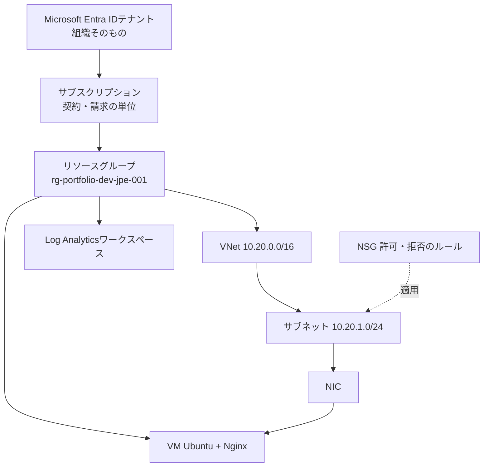

# 11. Azure基礎用語集(初心者向け)

**この章のポイント**

- サーバー構築エンジニアを目指す初心者が、**Azureの基礎用語を理解し、そのまま覚えられる**ことを目的にした用語集です。分野別に13カテゴリ、用語解説269語と、混同しやすい用語の対比34組を収録しています。
- 各用語は「**一言でいうと**」→「**たとえると**」→「**もう少し詳しく**」→「**この案件では**」→「**覚え方**」→「**つまずきポイント**」の順に並べています。急いでいるときは最初と「覚え方」だけを読めば足ります。
- 用語を1語ずつ暗記させません。**通信の順番、管理階層の入れ子、命名規則、略語の分解、混同しやすい用語の対比**という5つの切り口から、思い出せる形で結びつけます。
- [用語と全体像](02-fundamentals.md)の11語を拡張した本編の教科書であり、[発展編の用語集](advanced/11-glossary.md)へ進むための土台です。設計書を読みながら引く**辞書**としても使えます。
- 最後に理解度チェック(17節)と五十音・アルファベット索引(18節)を用意しています。

> [!NOTE]
> 料金、SLAの数値、サービスの上限値、ポータルの画面構成は変更されます。本用語集は**仕組みと考え方**を覚えるためのものであり、金額や数値の根拠として使わないでください。実施直前に[Azure公式ドキュメント](https://learn.microsoft.com/azure/)とAzure Pricing Calculatorで確認してください。

## 目次

| 節 | 内容 |
|---|---|
| [1. この用語集の使い方](#1-この用語集の使い方) | 覚えるための3段階、読み方、7日プラン |
| [2. まず覚える基本20語](#2-まず覚える基本20語) | この20語で案件の8割が説明できる |
| [3. クラウドとAzureの基礎概念](glossary/03-cloud-basics.md) | IaaS/PaaS/SaaS、責任共有モデル、リージョン、SLA |
| [4. 契約と管理階層・ガバナンス](glossary/04-governance.md) | サブスクリプション、リソースグループ、命名規則、タグ |
| [5. ネットワークの基礎(Azure以前に必要な知識)](glossary/05-network-basics.md) | IPアドレス、CIDR、ポート番号、DNS、TCP/UDP |
| [6. Azureのネットワークサービス](glossary/06-azure-network.md) | VNet、サブネット、NSG、NIC、Bastion、負荷分散 |
| [7. コンピューティング(仮想マシン)](glossary/07-compute.md) | VM、VMサイズ、割り当て解除、拡張機能、cloud-init |
| [8. ストレージとディスク](glossary/08-storage.md) | マネージドディスク、Blob、冗長構成、マウント |
| [9. ID・アクセス管理とセキュリティ](glossary/09-identity-security.md) | 認証と認可、RBAC、Key Vault、SSH鍵、ゼロトラスト |
| [10. 監視と運用](glossary/10-monitoring.md) | Azure Monitor、メトリック、ログ、KQL、アラート |
| [11. バックアップ・可用性・障害対応](glossary/11-backup-dr.md) | RPO/RTO、Azure Backup、冗長化、切り分け手順 |
| [12. コスト管理](glossary/12-cost.md) | 従量課金、予算アラート、止め忘れ対策、割引 |
| [13. IaCと開発ツール](glossary/13-iac.md) | Bicep、What-If、べき等性、Git、CI |
| [14. 現場でよく使う仕事の言葉](glossary/14-workplace.md) | 要件定義、証跡、切り分け、SLO、変更管理 |
| [15. 混同しやすい用語の対比](glossary/15-confusions.md) | 似ている用語を「違い」で覚える34組 |
| [16. 覚え方の技術](#16-覚え方の技術) | 略語分解、命名の逆引き、数字、復習間隔 |
| [17. 理解度チェック](glossary/17-quiz.md) | 説明できるかを自分で判定する |
| [18. 索引](glossary/18-index.md) | 五十音・アルファベットから引く |

---

## 1. この用語集の使い方

### 1.1 なぜ「詳しい用語集」を別に用意したのか

[用語と全体像](02-fundamentals.md)には、この案件を読み進めるための最小限の11語だけを載せています。設計書を読む速度を落とさないための一覧であり、意図的に短くしてあります。

しかし、実際にサーバー構築の現場に立つと、設計書に出てこない用語が会話の中で飛び交います。「そのサブネット、UDR切ってる?」「Bastionは費用的にどう?」「そのVM、割り当て解除しといて」。ここでつまずくのは知識不足ではなく、**言葉と実物が結びついていない**だけです。

本用語集は、その結びつきを作るために用意しました。**Azureの基礎用語を、初心者が理解でき、しかも覚えていられる形で**、分野別に収録しています。発展編の[用語集](advanced/11-glossary.md)が「発展編の設計書を読むための索引」であるのに対し、こちらは**発展編を読む前に土台を作るための教科書**です。

### 1.2 覚えるための3段階

用語は、眺めるだけでは定着しません。次の3段階を意識してください。

| 段階 | やること | できたと判断する基準 |
|---|---|---|
| 第1段階: 見て思い出す | 早見表の「用語」を隠し、「一言でいうと」から用語名を当てる | 8割の用語で名前が出てくる |
| 第2段階: 自分の言葉で説明する | 用語を1つ選び、家族に説明するつもりで30秒話す | たとえ話を交えて説明できる |
| 第3段階: 手を動かして確認する | Azure Portalや`az`コマンドで実物を見る、Bicepの該当行を指させる | 「この用語はこの画面のここ」と指し示せる |

第3段階まで到達した用語だけが、面接や現場で使えます。第1段階で止まった用語は、次の日には8割忘れます。

### 1.3 用語エントリの読み方

各用語は、次の項目で構成されています。用語によって省略される項目があります。全部を読む必要はありません。**急いでいるときは「一言でいうと」と「覚え方」だけ**で構いません。

| 項目 | 何が書いてあるか | どんなときに読むか |
|---|---|---|
| **一言でいうと** | 専門用語を使わない1文の要約 | とりあえず意味を知りたいとき |
| **たとえると** | 日常の物事に置き換えたイメージ | 意味がピンとこないとき |
| **もう少し詳しく** | 仕組み、実務での使いどころ、なぜ必要か | 面接で深掘りされる前に |
| **この案件では** | 本教材(Sample Works社の案件)での具体的な値や使われ方。本案件に関係する用語にのみ付きます | 教材と用語を結びつけたいとき |
| **覚え方** | 語源分解、対比、語呂、動作イメージ | 覚えられないとき、思い出せないとき |
| **つまずきポイント** | 初心者がよく誤解する点 | 「分かったつもり」を潰したいとき |
| **関連** | 一緒に覚えると効率がよい用語 | 芋づる式に広げたいとき |

### 1.4 収録カテゴリ

| 節 | カテゴリ | 解説項目数 | 一言でいうと |
|---|---|---:|---|
| 3 | [クラウドとAzureの基礎概念](glossary/03-cloud-basics.md) | 26 | クラウドで何を借りているのかが分かる |
| 4 | [契約と管理階層・ガバナンス](glossary/04-governance.md) | 22 | リソースが「どこに」作られるのかが分かる |
| 5 | [ネットワークの基礎(Azure以前に必要な知識)](glossary/05-network-basics.md) | 23 | Azure以前に必要なTCP/IPの言葉 |
| 6 | [Azureのネットワークサービス](glossary/06-azure-network.md) | 27 | 通信を作る・守る部品の名前 |
| 7 | [コンピューティング(仮想マシン)](glossary/07-compute.md) | 22 | サーバー本体を決めるときの言葉 |
| 8 | [ストレージとディスク](glossary/08-storage.md) | 17 | データの置き場所に関する言葉 |
| 9 | [ID・アクセス管理とセキュリティ](glossary/09-identity-security.md) | 26 | 誰が何をできるかを決める言葉 |
| 10 | [監視と運用](glossary/10-monitoring.md) | 21 | 動いていることを確かめる言葉 |
| 11 | [バックアップ・可用性・障害対応](glossary/11-backup-dr.md) | 22 | 壊れたときに戻すための言葉 |
| 12 | [コスト管理](glossary/12-cost.md) | 18 | 課金で驚かないための言葉 |
| 13 | [IaCと開発ツール](glossary/13-iac.md) | 19 | 構成をコードで扱うための言葉 |
| 14 | [現場でよく使う仕事の言葉](glossary/14-workplace.md) | 26 | Azure用語ではないが必ず出てくる言葉 |
| 15 | [混同しやすい用語の対比](glossary/15-confusions.md) | 34組 | 似た用語を「違い」で覚える |
| 16 | 覚え方の技術 | - | 暗記そのものを効率化する |
| 17 | [理解度チェック](glossary/17-quiz.md) | - | 説明できるかを自分で判定する |
| 18 | [索引](glossary/18-index.md) | - | 五十音・アルファベットから引く |

### 1.5 どの順番で読むか

**通読は必須ではありません。** 目的によって入口を変えてください。

| 目的 | おすすめの読み方 |
|---|---|
| とにかく最短で全体像をつかみたい | 2節(基本20語)→ 15節(対比)→ 17節(理解度チェック) |
| 設計書を読んでいて詰まった | 18節(索引)から該当語だけ引く |
| 面接が近い | 2節 → 15節 → 14節(現場の言葉)→ 17節 |
| じっくり土台を作りたい | 3節から順に通読(1.6の7日プラン) |
| 発展編へ進む前に | 3節・4節・6節・9節を重点的に、そのあと[発展編の用語集](advanced/11-glossary.md) |

[学習ルート](../README.md)との対応でいえば、本用語集は**2番目の教材([用語と全体像](02-fundamentals.md))の拡張版**であり、3番目以降の設計書を読みながら随時参照する**辞書**でもあります。

### 1.6 7日で一周するモデルプラン

1日30〜60分を想定しています。「覚えられたか」ではなく「**その日のうちに1語だけ声に出して説明できたか**」を合格条件にしてください。

| 日 | 読む節 | その日の宿題(声に出して説明する) |
|---|---|---|
| 1日目 | 1〜3節 | 「クラウドとオンプレミスの違い」を1分で |
| 2日目 | 4節 | 「サブスクリプションとリソースグループの違い」を1分で |
| 3日目 | 5節 | 「`10.20.1.0/24`とは何か」を1分で |
| 4日目 | 6節 | 「NSGがやっていること」を1分で |
| 5日目 | 7〜8節 | 「停止と割り当て解除の違い」を1分で |
| 6日目 | 9〜11節 | 「RPOとRTOの違い」を1分で |
| 7日目 | 12〜16節 | 「What-Ifを先に見る理由」を1分で |

一周したら17節の理解度チェックを解き、間違えた分野だけを読み直します。2周目は早見表だけを眺め、詰まった用語の本文へ戻る読み方が効率的です。

---

## 2. まず覚える基本20語

### 2.1 この20語で案件の8割は説明できる

Azureの用語は数千あります。しかし、**小規模なサーバーを1台構築して運用する**という本案件の範囲でいえば、次の20語を押さえれば設計書のほぼ全体を読み解けます。まずここだけを完璧にしてください。

| # | 用語 | 一言でいうと | この案件での役割 | 詳しく |
|---:|---|---|---|---|
| 1 | サブスクリプション | Azureを使う契約と請求の単位 | 間違えると別の請求先にサーバーが建つ | [4節](glossary/04-governance.md) |
| 2 | リソースグループ | 関連するリソースをまとめる箱 | `rg-portfolio-dev-jpe-001`。学習後はこの箱ごと削除する | [4節](glossary/04-governance.md) |
| 3 | リージョン | リソースを置く地域(データセンター群) | `japaneast`(東日本)を既定にする | [3節](glossary/03-cloud-basics.md) |
| 4 | リソース | Azure上に作る個々の部品 | VM、NSG、Public IPなど1つ1つがリソース | [4節](glossary/04-governance.md) |
| 5 | タグ | リソースに貼る付箋(誰の・何の・どの環境) | 統一して貼り、追跡と費用集計に使う | [4節](glossary/04-governance.md) |
| 6 | VNet(仮想ネットワーク) | Azure内に作る自分専用のネットワーク | `10.20.0.0/16` | [6節](glossary/06-azure-network.md) |
| 7 | サブネット | VNetを用途別に区切った区画 | サーバー用に`10.20.1.0/24` | [6節](glossary/06-azure-network.md) |
| 8 | CIDR | IPアドレスの範囲を`/数字`で表す書き方 | `/16`は広い範囲、`/32`は1個だけ | [5節](glossary/05-network-basics.md) |
| 9 | NSG | 通信を許可・拒否するルール表 | `adminCidr`からのSSHだけ許可し、HTTPは既定で閉じる | [6節](glossary/06-azure-network.md) |
| 10 | NIC | VMのネットワーク接続口(仮想LANカード) | VMとIPアドレスをつなぐ | [6節](glossary/06-azure-network.md) |
| 11 | パブリックIP | インターネット側から見える住所 | 管理接続と学習確認のために付与 | [6節](glossary/06-azure-network.md) |
| 12 | プライベートIP | VNetの内側だけで通用する住所 | サブネット`10.20.1.0/24`の中から割り当て | [5節](glossary/05-network-basics.md) |
| 13 | VM(仮想マシン) | クラウド上の仮想サーバー | UbuntuとNginxを稼働させる本体 | [7節](glossary/07-compute.md) |
| 14 | VMサイズ(SKU) | VMのCPU・メモリの大きさとグレード | 学習費用を抑えるため小さいサイズを選ぶ | [7節](glossary/07-compute.md) |
| 15 | マネージドディスク | Azureが面倒を見てくれるVM用ディスク | OSと`/var`配下のデータが載る | [8節](glossary/08-storage.md) |
| 16 | SSH公開鍵認証 | 鍵ペアでログインする方式(パスワードを使わない) | パスワード認証は無効化する | [9節](glossary/09-identity-security.md) |
| 17 | RBAC | 誰にどの範囲で何を許すかを決める権限の仕組み | 最小権限で運用する土台 | [9節](glossary/09-identity-security.md) |
| 18 | メトリックアラート | 数値が条件を超えたら知らせる仕組み | CPU使用率のアラートを定義済み(通知先は発展課題) | [10節](glossary/10-monitoring.md) |
| 19 | Log Analyticsワークスペース | ログを集めて検索する置き場 | 受け皿だけ作成済み。OSログ収集は発展課題 | [10節](glossary/10-monitoring.md) |
| 20 | Bicep / What-If | 構成をコードで書き、作る前に差分を予測する | `deploy.ps1`は既定でWhat-Ifだけを実行する | [13節](glossary/13-iac.md) |

### 2.2 「5つの決」に沿って並べ替える

READMEの合言葉「**5つの決**」に20語を割り当てると、用語が工程と結びつきます。工程で思い出せる用語は、忘れにくくなります。

| 工程 | 決めること | ここで登場する用語 |
|---|---|---|
| 1. 要件を決める | 何を守り、いつまで動かすか | サブスクリプション、リージョン |
| 2. 構成を決める | どのサービスを組み合わせるか | リソースグループ、VNet、サブネット、VM、パブリックIP |
| 3. 設定を決める | IP、名前、サイズ、通信ルール | CIDR、プライベートIP、NSG、NIC、VMサイズ、マネージドディスク、タグ |
| 4. 確認を決める | 正常・異常をどう試験するか | What-If、SSH公開鍵認証、メトリックアラート |
| 5. 運用を決める | 監視、変更、障害、削除をどう行うか | Log Analyticsワークスペース、RBAC、Bicep、リソース(グループ単位の削除) |

### 2.3 「通信の順番」に沿って並べ替える

もう1つの覚え方は、パケットが流れる順番に用語を並べる方法です。障害の切り分けはこの順番を**逆にたどる**ため、順番ごと覚えてしまうのが得です。

```text
管理者PC
  → パブリックIP        (11. インターネット側の住所)
  → NSGの判定           ( 9. 許可・拒否のルール表)
  → NIC                 (10. VMの接続口)
  → VM                  (13. サーバー本体)
  → Nginx               (VM内のWebサーバーソフト)
```

つながらないときは`Nginx → VM → NIC → NSG → 経路`の順に調べます。用語を覚えることが、そのまま切り分け手順を覚えることになります。

### 2.4 20語の自己チェック

用語名を見て「一言でいうと」が言えたら`○`、詰まったら`×`を付けます。`×`が3個以下になるまで、この節と該当節を往復してください。

```text
[ ] サブスクリプション    [ ] リソースグループ  [ ] リージョン        [ ] リソース
[ ] タグ                  [ ] VNet              [ ] サブネット        [ ] CIDR
[ ] NSG                   [ ] NIC               [ ] パブリックIP      [ ] プライベートIP
[ ] VM                    [ ] VMサイズ(SKU)     [ ] マネージドディスク[ ] SSH公開鍵認証
[ ] RBAC                  [ ] メトリックアラート[ ] Log Analytics     [ ] Bicep / What-If
```

---

## 16. 覚え方の技術

用語が覚えられないのは記憶力の問題ではなく、**覚え方を決めていない**ことが原因です。この節では、Azureの用語に特に効く7つの技術を紹介します。自分に合うものを2〜3個選び、それだけを徹底してください。

### 16.1 略語は必ず分解する

Azureの用語の大半は英語の頭文字です。**分解すれば意味が書いてある**ため、丸暗記する必要はほとんどありません。

| 略語 | 分解 | 分解から分かること |
|---|---|---|
| VM | **V**irtual **M**achine | 仮想の機械。つまり仮想サーバー |
| VNet | **V**irtual **Net**work | 仮想のネットワーク |
| NIC | **N**etwork **I**nterface **C**ard | ネットワークとの接点。LANカード相当 |
| NSG | **N**etwork **S**ecurity **G**roup | ネットワークの安全規則をまとめた群 |
| ASG | **A**pplication **S**ecurity **G**roup | アプリ(サーバーの役割)単位でまとめた群 |
| RBAC | **R**ole **B**ased **A**ccess **C**ontrol | 役割にもとづく権限制御 |
| ARM | **A**zure **R**esource **M**anager | Azureのリソースを管理する人(窓口) |
| CIDR | **C**lassless **I**nter-**D**omain **R**outing | クラス分けに縛られない経路指定の書き方 |
| DNS | **D**omain **N**ame **S**ystem | 名前を扱う仕組み |
| SKU | **S**tock **K**eeping **U**nit | 在庫管理単位。要するに型番・グレード |
| IaaS / PaaS / SaaS | **I**nfrastructure / **P**latform / **S**oftware as a Service | 借りる範囲がインフラ / 土台 / 完成品 |
| IaC | **I**nfrastructure **a**s **C**ode | インフラをコードとして扱う |
| SLA | **S**ervice **L**evel **A**greement | サービス水準の合意(約束) |
| RPO / RTO | Recovery **P**oint / **T**ime **O**bjective | 復旧の地**点**目標 / 復旧の時**間**目標 |
| AMA | **A**zure **M**onitor **A**gent | 監視の代理人(VMの中に住む) |
| DCR | **D**ata **C**ollection **R**ule | 何をどこへ集めるかの規則 |
| WAF | **W**eb **A**pplication **F**irewall | Webアプリ用の防火壁 |
| CAF | **C**loud **A**doption **F**ramework | クラウド導入の枠組み(命名規則の出典) |
| VMSS | **VM** **S**cale **S**et | VMを増減させる集合 |
| ASR | **A**zure **S**ite **R**ecovery | 拠点(サイト)ごと復旧する仕組み |
| KQL | **K**usto **Q**uery **L**anguage | ログ検索の言語 |
| TLS | **T**ransport **L**ayer **S**ecurity | 転送層の安全化。SSLの後継 |
| JIT | **J**ust **I**n **T**ime | 必要な時だけ |
| SPOF | **S**ingle **P**oint **O**f **F**ailure | 単一の故障点 |

**練習方法**: 知らない略語に出会ったら、意味を調べる前に「Aは何のA?」と自問します。当たらなくても、この一手間で記憶に残ります。

### 16.2 リソース名の接頭辞から逆引きする

本教材は[CAFの命名規則](https://learn.microsoft.com/azure/cloud-adoption-framework/ready/azure-best-practices/resource-naming)に沿った名前を使っています。**名前を読めることは、構成を読めること**と同じです。

```text
rg-portfolio-dev-jpe-001
│  │         │   │   └── 連番(001)
│  │         │   └────── リージョンの略(jpe = Japan East)
│  │         └────────── 環境(dev / stg / prod)
│  └──────────────────── 案件・システム名(portfolio)
└─────────────────────── 種別の略号(rg = Resource Group)
```

| 接頭辞 | リソース種別 | 覚え方 |
|---|---|---|
| `rg-` | リソースグループ | **R**esource **G**roup |
| `vnet-` | 仮想ネットワーク | そのまま |
| `snet-` | サブネット | **s**ub**net** |
| `nsg-` | ネットワークセキュリティグループ | そのまま |
| `pip-` | パブリックIP | **P**ublic **IP** |
| `nic-` | ネットワークインターフェイス | そのまま |
| `vm-` | 仮想マシン | そのまま |
| `disk-` | マネージドディスク | そのまま |
| `log-` | Log Analyticsワークスペース | **Log** Analytics。CAFの略号は`log`で、`LAW`は口頭で使う略称 |
| `kv-` | Key Vault | **K**ey **V**ault |
| `st` | ストレージアカウント | 記号やハイフンを使えないため`st`+英数字のみ |

**逆引きの練習**: `nsg-portfolio-dev-jpe-001`という名前を見たら、「dev環境・東日本にある、この案件用のNSGが1つ目」と即座に言えるようにします。設計書の表を隠して名前だけを見る練習が有効です。

### 16.3 数字で覚える

用語より先に**数字**を覚えてしまうと、周辺の用語が引きずられて出てきます。

| 数字 | 意味 | セットで思い出す用語 |
|---|---|---|
| 22 | SSHの既定ポート | SSH公開鍵認証、NSGの受信規則 |
| 80 / 443 | HTTP / HTTPSの既定ポート | Nginx、`openHttp=false`、TLS |
| 3389 | RDPの既定ポート | Windows Server、Azure Bastion |
| 53 | DNSの既定ポート | 名前解決、Azure DNS |
| 5 | サブネットごとにAzureが予約するIP数 | サブネット、CIDR、使用可能アドレス数 |
| 100〜4096 | NSGで自分が作れるルールの優先度の範囲 | 優先度は小さい数字が先に評価される |
| 256 / 65,536 | `/24` / `/16`に含まれるIPアドレス数 | CIDR、プレフィックス長 |
| 32 | IPv4アドレスのビット数 | `/32`は1個のIPだけ |
| 0〜4 | アラートの重大度(Sev 0が最も重大) | アクショングループ、エスカレーション |

### 16.4 図で覚える

言葉の羅列より、**入れ子**と**流れ**の2枚の図で覚えるほうが速いです。この2枚を白紙に書けるようになることが、3節から6節の到達目標です。

入れ子(どこに作られるか):



流れ(通信がどう届くか):

```text
管理者PC → パブリックIP → NSGの判定 → NIC → VM → Nginx
                              ↑
                    ここで止まる障害が最も多い
```

### 16.5 手を動かして覚える

用語と実物が結びつくと、忘れなくなります。Azureにサインインできる状態なら、次のコマンドで**用語の実物**を確認してください。いずれも参照だけを行うコマンドで、リソースを作成・変更しません。

```bash
# 契約(サブスクリプション)を確認する
az account show --output table

# リソースグループの一覧 = 箱の一覧
az group list --output table

# 箱の中身 = リソースの一覧
az resource list --resource-group rg-portfolio-dev-jpe-001 --output table

# VNetとアドレス空間
az network vnet list --output table

# NSGのルールを1件ずつ読む(優先度・方向・ポート)
az network nsg rule list \
  --resource-group rg-portfolio-dev-jpe-001 \
  --nsg-name <NSG名> --output table

# VMサイズの一覧(vCPU数とメモリを見る)
az vm list-sizes --location japaneast --output table
```

コマンドの意味が分からなくなったら`--help`を付けます(例: `az network nsg rule list --help`)。**用語はヘルプの説明文にそのまま出てくる**ため、ヘルプを読むこと自体が用語学習になります。

Azureの契約がまだない段階でも、[Bicep](../infra/main.bicep)を開いて用語を探す練習はできます。「`10.20.0.0/16`はどの行にあるか」「NSGのルールはどこか」を指させれば十分です。

### 16.6 復習の間隔を決める

人は覚えた翌日に大半を忘れます。**忘れる前提で復習日を決めてしまう**のが最も確実です。

| 復習 | タイミング | やること(5〜10分) |
|---|---|---|
| 1回目 | 学習した当日の夜 | 早見表の「一言でいうと」だけを読む |
| 2回目 | 翌日 | 用語名を隠して当てる |
| 3回目 | 3日後 | 15節の対比表を読む |
| 4回目 | 1週間後 | 17節の理解度チェックを解く |
| 5回目 | 1か月後 | 白紙に16.4の2枚の図を書く |

### 16.7 自作フラッシュカードを作る

最後は自分の言葉に置き換える作業です。**他人の説明文は忘れますが、自分が書いた1行は残ります**。

次の3列だけのメモを作り、1日1語ずつ足していきます。表計算ソフトでもテキストファイルでも構いません。

```text
用語, 自分の言葉での一言, 覚え方
NSG, 通信の入口に立っている警備員の許可リスト, Network Security Group。方向と優先度で判定
割り当て解除, VMを片付けて場所を返すこと。ディスク代だけ残る, 電源を切るだけでは席代を払い続ける
```

[学習ロードマップ](09-gap-analysis-and-roadmap.md)のStage 1にも「不明な用語を自分の言葉で用語集へ追記した」という達成条件があります。このメモがその成果物になります。

### 16.8 面接で使える説明の型

覚えた用語を面接で説明するときは、次の4段で話すと伝わります。用語ごとにこの順で1度だけ練習しておけば、本番で詰まりません。

| 順番 | 話すこと | 例(NSG) |
|---|---|---|
| 1. 一言 | 専門用語を使わずに定義する | 「通信を許可するか拒否するかを決めるルール表です」 |
| 2. たとえ | 相手の知っている物に置き換える | 「建物の入口に立つ警備員の許可リストのようなものです」 |
| 3. 具体値 | 自分が実際に設定した値を出す | 「今回は`adminCidr`で指定した接続元からのSSHだけを許可しました」 |
| 4. 判断理由 | なぜそうしたかを述べる | 「SSHを全世界へ公開すると総当たり攻撃を受けるためです」 |

この型で語れる用語が10個あれば、未経験者としては十分な説明力です。**20語すべてを浅く覚えるより、10語を4段で語れるほうが評価されます。**
