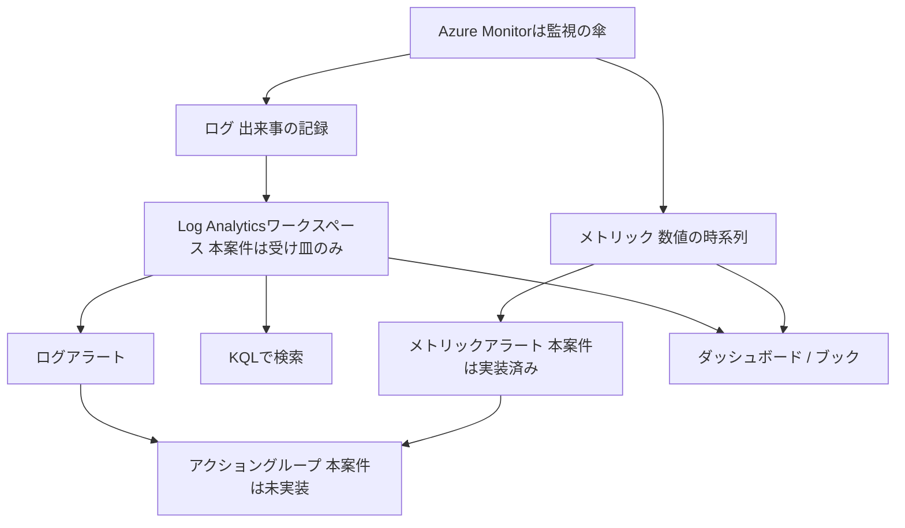

# 10. 監視と運用

[用語集トップ](../11-azure-glossary.md) ・ 前: [9. ID・アクセス管理とセキュリティ](09-identity-security.md) ・ 次: [11. バックアップ・可用性・障害対応](11-backup-dr.md)

構築が終わっても、動き続けているかを見張り、壊れたときに気づける仕組みがなければ運用は成り立ちません。この分野の入口は2つで、**数値の時系列が「メトリック」、出来事の記録が「ログ」**、この2種類を集めて見せて知らせる傘が`Azure Monitor`です。本案件ではCPU使用率のメトリックアラートとLog Analyticsワークスペースの受け皿だけを用意し、通知とOSログ収集は未実装の発展課題として残しています。ここを覚えると[運用・障害対応Runbook](../07-operations-runbook.md)がそのまま読めるようになります。

## 10.1 早見表

| 用語 | 読み方 | 一言でいうと | 覚え方のヒント |
|---|---|---|---|
| Azure Monitor | アジュール モニター | Azureの監視機能をまとめた傘となるサービス | 傘の下にログもアラートも全部ある |
| メトリック | メトリック | 一定間隔で自動的にたまる数値の時系列データ | メーターの針。数値だけ |
| ログ | ログ | いつ何が起きたかを文章で残した記録 | 航海日誌。出来事を文で残す |
| プラットフォームメトリックとゲストOSメトリック | プラットフォーム / ゲストオーエス メトリック | Azure側から自動で見える数値と、VMの中に入らないと見えない数値(OSログやファイルシステムの空き容量) | 外から見える箱の重さと、開けないと分からない中身 |
| Log Analyticsワークスペース | ログ アナリティクス ワークスペース | ログを集めて検索・分析するための保存場所 | ログの受け皿。まず皿を置く |
| KQL | ケーキューエル | Log Analyticsのログを検索する専用の問い合わせ言語 | Kusto Query Languageの頭文字 |
| アラートルール | アラートルール | 異常の条件を書いておき、合致したら知らせる設定 | 数値で見張るか、文章で見張るかの2種類 |
| シグナル・しきい値・集約粒度・評価頻度 | シグナル / シキイチ / シュウヤクリュウド / ヒョウカヒンド | アラートの「何を・いくらで・どの幅で・どの間隔で」の4点セット | 何を / いくらで / どの幅で / どの間隔で |
| アラートの重大度 | ジュウダイド | 0から4の数字で表すアラートの深刻さ | 0が最も重い。順位と同じで小さいほど上位 |
| アクショングループ | アクション グループ | アラート発生時の通知先と実行動作をまとめた連絡網 | 発火したあとの「誰に何を」 |
| アクティビティログ | アクティビティ ログ | 誰がAzureの構成をいつ変更したかの操作履歴 | 中身ではなく操作の履歴 |
| 診断設定 | シンダンセッテイ | リソースのログとメトリックの送り先を指定する配管 | 蛇口をどのバケツにつなぐか |
| AMA(Azure Monitor Agent) | エーエムエー | VMの中に入り、OSのログや数値を集めて送る常駐ソフト | AMA。中から運び出す配達員 |
| DCR(データ収集ルール) | ディーシーアール | AMAに「何を集めてどこへ送るか」を指示する設計書 | DCR。配達員に渡す指示書 |
| Application Insights | アプリケーション インサイツ | アプリの中の処理速度やエラーを可視化する監視機能 | Insightは「中を見通す」 |
| Service HealthとResource Health | サービス ヘルス / リソース ヘルス | Azure側の障害情報と、自分のリソース個別の健康状態 | 路線全体の運休か、自分の車両の故障か |
| Azure Update Manager | アジュール アップデート マネージャー | OS更新の適用状況を一覧化し、計画的に当てる仕組み | 更新の名簿と時間割 |
| 自動シャットダウン | ジドウ シャットダウン | 指定時刻にVMを自動で停止するスケジュール設定 | 消し忘れ防止のタイマー |
| ダッシュボードとブック | ダッシュボード / ブック | 常時見る計器盤と、調査用に読ませるレポート | 毎日見る盤と、読ませる資料 |
| ランブック | ランブック | 誰がやっても同じ結果になる運用手順書 | runとbook。走らせる本 |
| 一次切り分けとエスカレーション | イチジキリワケ / エスカレーション | 自分で切り分けられる範囲を調べ、超えたら引き継ぐこと | 止・見・守・戻・残 |

## 10.2 用語解説

### 10.2.1 Azure Monitor(アジュールモニター)

- **一言でいうと**: Azure上の数値と記録を集め、見える化し、異常を知らせるまでを担う監視の総合サービスです。
- **たとえると**: 鉄道の運行管理センターです。センサー値も作業記録も1か所へ集まり、異常があれば連絡が飛びます。
- **もう少し詳しく**: Azure Monitorは単一の画面ではなく、複数の機能をまとめた傘の名前です。傘の下にメトリック、ログ、Log Analyticsワークスペース、アラートルールが並びます。
- **この案件では**: CPUアラートとLog Analyticsワークスペースが、この傘の下に置かれた2つの部品です。
- **覚え方**: 「モニター=画面」ではなく「見張る役」と読み替えます。測る、記録する、知らせるの3動作が傘の下にあると位置づけます。
- **つまずきポイント**: 「Azure Monitorを有効化する」単一のスイッチがあると思いがちですが、実際は機能ごとに個別の設定が必要です。
- **関連**: メトリック / ログ / Log Analyticsワークスペース

### 10.2.2 メトリック(メトリクス、Metrics)

- **一言でいうと**: CPU使用率のように、一定間隔で自動的にたまっていく数値の時系列データです。
- **たとえると**: 車のスピードメーターです。今何キロかは分かりますが、なぜ加速したのかは書かれていません。
- **もう少し詳しく**: 「時刻と数値」の組が並んだ軽いデータで、平均や最大の集計に向きます。原因の特定には向かないため、メトリックで気づいてログで調べる2段構えが基本です。
- **この案件では**: VMのCPU使用率メトリック`Percentage CPU`が、CPUアラートの判断材料です。
- **覚え方**: メトリックはmeter(計器)と同じ語源です。計器は数字しか出さないと押さえれば、ログとの役割分担が一度で入ります。
- **つまずきポイント**: グラフに何も出ないと監視が壊れたと思いがちですが、実際は集計期間や集計方法の指定が合っていないだけの場合が多くあります。
- **関連**: ログ / プラットフォームメトリックとゲストOSメトリック / シグナル・しきい値・集約粒度・評価頻度

### 10.2.3 ログ(Logs、ログデータ)

- **一言でいうと**: いつ何が起きたかを1件ずつ文章として残した記録で、原因を追うための材料です。
- **たとえると**: 航海日誌です。速度計の数値とは別に、何時にどの港へ寄ったかが文で残ります。
- **もう少し詳しく**: 1件ごとに時刻とメッセージと属性を持つため、メトリックより重い代わりに検索に向きます。Azureのログは、Azure側の操作履歴、リソースの診断ログ、VM内部のOSやアプリのログに分かれます。
- **この案件では**: ワークスペースは作成済みですが、OSログを流し込む設定は未実装で、今はSSHで`journalctl`を見ます。
- **覚え方**: メトリックとログを「数字か文章か」で二分します。数字で気づき、文章で納得する。
- **つまずきポイント**: VMを作ればOSのログが自動でAzureへ集まると思いがちですが、実際は収集の設定がなければVMの中に留まります。
- **関連**: メトリック / Log Analyticsワークスペース / Azure Monitor Agent

### 10.2.4 プラットフォームメトリックとゲストOSメトリック

- **一言でいうと**: Azureの土台側から自動で見える数値と、VMの中でしか分からない数値の区別です。
- **たとえると**: 宅配便です。箱の重さは外から量れますが、中身は分かりません。
- **もう少し詳しく**: 基盤側から観測できる数値がプラットフォームメトリックで、エージェントは不要です。メモリの空き量`Available Memory Bytes`もホスト側から見えるためこちらです。VM内にしかない情報を集めるのがゲストOSメトリックです。
- **この案件では**: CPUアラートはプラットフォームメトリックだけで成立し、エージェントなしで動きます。
- **覚え方**: CPU、ネットワーク、ディスクI/O、メモリの空き量は外から測れる。ファイルシステムの空き容量とOSログは中に入らないと測れない。
- **つまずきポイント**: ファイルシステムの空き容量もCPUと同じに見えると思いがちですが、実際は収集設定が必要です。
- **関連**: メトリック / Azure Monitor Agent / データ収集ルール

### 10.2.5 Log Analyticsワークスペース(Log Analytics Workspace、略してLAW)

- **一言でいうと**: 各所から集めたログを保存し、検索と分析ができるようにしておく専用の置き場です。
- **たとえると**: 会社の書庫です。バラバラだった書類を1か所へ集めるから、後から横断して探せます。
- **もう少し詳しく**: ログは送り先がなければ保存されないため、監視の設計はまずワークスペースを作ることから始まります。保持期間と課金の単位でもあり、集めたログはテーブルに分かれて格納され、KQLで検索します。
- **この案件では**: `log-`で始まるワークスペースを1つ作成し、保持期間は`30`日です。OSログを流し込む配管は未実装です。
- **覚え方**: 「先に皿を置く、料理は後から盛る」と動作でイメージします。皿がないとログはこぼれて消えます。
- **つまずきポイント**: 作ればログが集まり始めると思いがちですが、実際は空の皿が置かれただけで、何を集めるかは別途決めます。
- **関連**: ログ / KQL / 診断設定 / データ収集ルール

### 10.2.6 KQL(Kusto Query Language、クエリ言語)

- **一言でいうと**: Log Analyticsに集めたログを絞り込み、集計するための専用の検索言語です。
- **たとえると**: 図書館の検索端末に打ち込む条件です。本があっても、条件を書けなければ出てきません。
- **もう少し詳しく**: テーブル名から始めて、パイプ`|`で処理を数珠つなぎにする素直な書き方をします。`Heartbeat | take 10`で形を確認し、`where`で絞り、`summarize`で集計する順に育てるのが定石です。
- **この案件では**: OSログの取り込みが未実装のため、練習対象のデータはまだ入っていません。
- **覚え方**: **K**usto **Q**uery **L**anguageの頭文字です。SQLに似た並びながら、テーブルから始める向きが逆です。
- **つまずきポイント**: SQLと同じ構文で書けると思いがちですが、実際は`SELECT`から始めず、テーブル名を先頭に書きます。
- **関連**: Log Analyticsワークスペース / ログ / アラートルール

### 10.2.7 アラートルール(Alert Rule、メトリックアラート / ログアラート)

- **一言でいうと**: 異常とみなす条件を先に書いておき、条件に合致したときに自動で知らせる監視の設定です。
- **たとえると**: 目覚まし時計です。鳴らす条件を前の晩に決めるから、当日は自分で時計を見張らずに済みます。
- **もう少し詳しく**: 数値のしきい値で判定する**メトリックアラート**は反応が速く設定も簡単です。ログの検索結果で判定する**ログアラート**はKQLが必要な代わりに、柔軟な条件を書けます。
- **この案件では**: CPU使用率が`80`パーセント超過で発報するメトリックアラートを1本定義し、解消すると自動で解決へ戻ります。
- **覚え方**: 「数値で見張るか、文章で見張るか」で二分します。メトリックアラートは数字の門番、ログアラートは文章の門番です。
- **つまずきポイント**: 作れば連絡が来ると思いがちですが、実際は通知先を別に登録しないと、記録が残るだけで誰にも届きません。
- **関連**: アクショングループ / シグナル・しきい値・集約粒度・評価頻度 / アラートの重大度

### 10.2.8 シグナル・しきい値・集約粒度・評価頻度

- **一言でいうと**: アラートを1本作るとき必ず決める、何を・いくらで・どの幅で・どの間隔で見張るかの4項目です。
- **たとえると**: 健康診断の血圧測定です。測る項目、異常とする値、1回に使う時間、測る間隔を決めて判定します。
- **もう少し詳しく**: シグナルは判定に使うデータ、しきい値は超えたら異常とみなす値です。集約粒度は1回の判定で平均する窓の幅、評価頻度はその判定を行う間隔で、窓が短いと誤検知が増え、長いと気づくのが遅れます。
- **この案件では**: シグナルはCPU使用率、しきい値は`80`パーセント超過、集約粒度は`5`分平均、評価頻度は`1`分おきです。
- **覚え方**: 「なに・いくら・どのはば・どのかんかく」と4拍で唱えます。順番どおり埋めればアラートは完成します。
- **つまずきポイント**: しきい値だけ決めれば良いと思いがちですが、実際は集約粒度で結果が変わり、5分平均なら瞬間的な跳ねでは超えません。
- **関連**: アラートルール / メトリック / アラートの重大度

### 10.2.9 アラートの重大度(Severity、Sev 0から4)

- **一言でいうと**: アラートの深刻さを`0`から`4`で表し、対応の優先順位を機械的に判断できるようにする区分です。
- **たとえると**: 病院のトリアージです。来院順ではなく重さの順に対応するため、札の色を決めます。
- **もう少し詳しく**: `Sev 0`が最も重く、数字が大きいほど軽くなります。目安は`0`が重大、`1`がエラー、`2`が警告、`3`が情報、`4`が詳細です。通知先と対応時間を重大度ごとに決めて初めて機能します。
- **この案件では**: CPUアラートの重大度は`Sev 2`(警告)です。CPU高騰は即時のサービス断ではないためです。
- **覚え方**: 順位で覚えます。1位、2位、3位と同じで、`0`は最上位、つまり最も重い。数字が小さいほど先に扱うという向きは、NSGルールの優先度とまったく同じです。
- **つまずきポイント**: `4`が最重要だと思いがちですが、実際は逆で`0`が最重要です。
- **関連**: アラートルール / アクショングループ / 一次切り分けとエスカレーション

### 10.2.10 アクショングループ(Action Group)

- **一言でいうと**: アラート発生時に誰へ知らせ何を動かすかを、あらかじめ束ねて登録しておく通知先の定義です。
- **たとえると**: 会社の緊急連絡網です。名前と連絡手段を一覧にし、複数のアラートから同じ連絡網を呼び出します。
- **もう少し詳しく**: メールやSMSの通知に加え、Webhookなどの呼び出しも登録できます。要点はアラートルールと分離している設計で、通知先が変わっても1つ直せば参照する全アラートに反映されます。
- **この案件では**: アクショングループは**未実装の発展課題**です。CPUアラートは動作しますが通知先が空で、発報はアラート一覧で確認します。
- **覚え方**: アラートを火災報知器、アクショングループを消防への回線と分けます。報知器だけでは誰も来ません。
- **つまずきポイント**: 作った時点で通知まで完了したと思いがちですが、実際は通知先の登録は別作業です。
- **関連**: アラートルール / アラートの重大度 / ランブック

### 10.2.11 アクティビティログ(Activity Log)

- **一言でいうと**: サブスクリプション上で誰がいつ何のリソースを作成・変更・削除したかを記録した操作の履歴です。
- **たとえると**: マンションの入退館記録です。部屋の中で何が起きたかではなく、誰が建物に何をしたかが残ります。
- **もう少し詳しく**: 記録されるのは操作の面で、VM内部のOSの動きは含まれません。障害調査では「直前に構成変更がなかったか」の確認に最初に効きます。
- **この案件では**: [運用・障害対応Runbook](../07-operations-runbook.md)のエスカレーション情報に、関連するアラートとActivity Logを添えます。
- **覚え方**: **リソースへ何をしたかがアクティビティログ、中で何が起きたかが診断ログ**。外側と内側の履歴と対比します。
- **つまずきポイント**: VMのCPUやNginxのエラーも出ると思いがちですが、実際は出ず、操作の記録専用です。
- **関連**: 診断設定 / ログ / Log Analyticsワークスペース

### 10.2.12 診断設定(Diagnostic Settings、診断ログ設定)

- **一言でいうと**: リソースが出すログとメトリックを、どこへ送って残すかを指定する配管の設定です。
- **たとえると**: 蛇口とバケツをつなぐホースです。水が出ていても、つながなければどこにも溜まりません。
- **もう少し詳しく**: 送り先は、検索したいならLog Analyticsワークスペース、安く長期保管したいならストレージ、と選べます。リソースごとに設定するため、リソースを増やしたら診断設定も足す運用が必要です。
- **この案件では**: Log Analyticsワークスペースという送り先は用意済みですが、そこへ流し込む診断設定は未実装です。
- **覚え方**: 「**出す側で決める**」と覚えます。集める側ではなく、送り出すリソース側に設定があります。
- **つまずきポイント**: ワークスペースを作れば全リソースのログが自動で入ると思いがちですが、実際は診断設定を有効にした分だけが流れ込みます。
- **関連**: Log Analyticsワークスペース / アクティビティログ / データ収集ルール

### 10.2.13 AMA(Azure Monitor Agent、Azure Monitorエージェント)

- **一言でいうと**: VMの中に常駐し、OSのログや性能値を集めてAzure Monitorへ送る小さなソフトです。
- **たとえると**: 建物に常駐する集配担当者です。外の運送会社は中の荷物を運べないので、中の人が渡します。
- **もう少し詳しく**: プラットフォームメトリックはホスト側から見えますが、OSの中のsyslogやファイルシステムの空き容量は見えません。その隙間を埋めるのがAMAで、集める内容はデータ収集ルールから受け取ります。
- **この案件では**: AMAは**未実装の発展課題**で、OSログとファイルシステム空き容量の監視はまだできません。
- **覚え方**: AMAはAzure Monitor Agentの頭文字です。Azureが中へ入れない代わりに立てる代理人と読み替えます。
- **つまずきポイント**: 入れればログが集まり始めると思いがちですが、実際は収集ルールを紐づけるまで何も送りません。
- **関連**: データ収集ルール / プラットフォームメトリックとゲストOSメトリック / ログ

### 10.2.14 DCR(Data Collection Rule、データ収集ルール)

- **一言でいうと**: エージェントに、どのデータを集めてどのワークスペースへ送るかを指示する設定リソースです。
- **たとえると**: 集配担当者へ渡す配達指示書です。担当者がいても、集める物と届け先の紙がなければ動けません。
- **もう少し詳しく**: 収集元の種類、対象、送信先を定義した独立したリソースで、VMへ関連付けて使います。1つのDCRを複数VMへ適用できるため、台数が増えても設定を1か所で管理できます。
- **この案件では**: DCRも**未実装の発展課題**です。AMAとDCRの追加が、ワークスペースを受け皿から使える調査基盤へ変える残作業です。
- **覚え方**: **AMAは運ぶ人、DCRは指示書**。人と紙の2語で区別すると、どちらが何をするか取り違えません。
- **つまずきポイント**: 作れば自動で全VMに効くと思いがちですが、実際は対象VMへの関連付けが必要です。
- **関連**: Azure Monitor Agent / Log Analyticsワークスペース / ログ

### 10.2.15 Application Insights(アプリケーションインサイツ)

- **一言でいうと**: アプリの内部の応答時間、エラー、依存先の呼び出しを可視化するAzure Monitorの機能です。
- **たとえると**: 健康診断の精密検査です。体重や血圧が正常でも不調なとき、体の中の流れを調べます。
- **もう少し詳しく**: CPUやメモリが正常なのにWebが遅い原因はアプリ内部にあります。アプリ側へ組み込むと、要求ごとの処理時間や失敗率、外部への問い合わせ時間を収集できます。
- **この案件では**: Nginxが静的な応答を返す学習用構成のため導入していませんが、アプリを載せる案件では監視設計に含めます。
- **覚え方**: application+insight(中を見通す)。**外側を見るのがメトリック、内側を見るのがApplication Insights**と層で分けます。
- **つまずきポイント**: VMを監視すればアプリの遅さも分かると思いがちですが、実際はインフラが正常でもアプリは遅くなります。
- **関連**: Azure Monitor / メトリック / ログ

### 10.2.16 Service HealthとResource Health

- **一言でいうと**: Azure側の障害や計画メンテナンスの情報と、自分のリソースごとの健康状態を示す2つの機能です。
- **たとえると**: 鉄道です。前者は路線全体の運休のお知らせ、後者は自分の車両の故障表示です。
- **もう少し詳しく**: **Service Health**はAzure側の事象を伝え、自分が原因でない障害を切り分ける1手目です。**Resource Health**は個別リソースの状態を利用可能や劣化などの区分で示します。
- **この案件では**: [運用・障害対応Runbook](../07-operations-runbook.md)の毎日の確認の1番目がこの確認です。
- **覚え方**: Serviceの主語はAzure、Resourceの主語は自分の部品。向こうかこちらかを分けます。
- **つまずきポイント**: まず自分の設定ミスを疑うべきと思いがちですが、実際はAzure側の事象のこともあります。
- **関連**: アクティビティログ / 一次切り分けとエスカレーション / アラートルール

### 10.2.17 Azure Update Manager(アジュールアップデートマネージャー)

- **一言でいうと**: VMのOS更新の適用状況を一覧で確認し、決めた時間帯にまとめて適用できる組み込み機能です。
- **たとえると**: 学校の時間割と出席簿です。誰が受けていないかが分かり、次に受ける日も決まっています。
- **もう少し詳しく**: 未適用の更新を評価して見える化し、適用の時間帯や再起動の扱いを決めて実行できます。台数が増えると放置期間を記憶で管理できず、放置は脆弱性として残ります。
- **この案件では**: Bicepには含まれませんが、[運用・障害対応Runbook](../07-operations-runbook.md)の毎月の確認に「OS更新」が挙げられています。
- **覚え方**: **評価して、時間を決めて、当てる**。この3拍がこの機能の全部です。
- **つまずきポイント**: 自動適用にすれば安心と思いがちですが、実際は再起動のタイミングが業務影響を生みます。
- **関連**: ランブック / Service HealthとResource Health / 一次切り分けとエスカレーション

### 10.2.18 自動シャットダウン(Auto-shutdown)

- **一言でいうと**: 指定した時刻にVMを自動で停止させ、消し忘れによる無駄な稼働を防ぐスケジュール機能です。
- **たとえると**: 部屋の電気の消灯タイマーです。人が忘れても時間が来れば消えます。
- **もう少し詳しく**: VMの設定として停止時刻を指定できます。停止しても、ディスクなどのリソースは残ります。料金の考え方はAzure Pricing CalculatorとCost Managementで確認します。
- **この案件では**: Bicepに自動シャットダウンは含まれません。コスト管理は、What-Ifを先に見る運用と`scripts/remove.ps1`での削除で行います。
- **覚え方**: 「止めても消えない」と1行で覚えます。停止は消灯、削除は撤去です。
- **つまずきポイント**: 自動シャットダウンしておけば費用の心配がないと思いがちですが、実際は停止中も残る要素があります。
- **関連**: ランブック / Azure Update Manager / Azure Monitor

### 10.2.19 ダッシュボードとブック(Workbooks)

- **一言でいうと**: 毎日見るための集約画面がダッシュボード、調査や報告のために組み立てる資料がブックです。
- **たとえると**: 車の計器盤と整備報告書です。走行中に見るのは計器盤、後で説明するのは報告書です。
- **もう少し詳しく**: ダッシュボードはグラフやタイルを並べた常設の画面で、朝の確認に向きます。ブックは文章、グラフ、KQLの結果を1つの読み物として保存でき、対象や期間をパラメーターで切り替えられます。
- **この案件では**: どちらも作成していませんが、毎日の確認項目を1画面へ集約する作りが次の一歩になります。
- **覚え方**: **ダッシュボードは見るためのもの、ブックは読ませるためのもの**。毎朝見るか、他人へ渡すかで選びます。
- **つまずきポイント**: 数値を並べれば監視が完成すると思いがちですが、実際は誰も見ない画面は機能しません。
- **関連**: Azure Monitor / KQL / メトリック

### 10.2.20 ランブック(Runbook、運用手順書)

- **一言でいうと**: 誰が実施しても同じ結果になるように、運用作業の手順と判断基準を書き残した文書です。
- **たとえると**: 料理のレシピです。分量と順番と火加減が書かれているから、誰でも同じ味になります。
- **もう少し詳しく**: 良いランブックには、前提、手順、期待される結果、失敗時の戻し方、記録の残し方が含まれます。属人化した運用は担当者不在の日に止まるため、設計書と同格に扱います。
- **この案件では**: [運用・障害対応Runbook](../07-operations-runbook.md)がまさにこれで、毎日と毎月の確認、調査手順、変更手順があります。
- **覚え方**: run(走らせる)+book(本)。読む本ではなく、走らせれば動く本と取ります。
- **つまずきポイント**: ランブックはAzure Automationの自動化スクリプトを指す場合もあるため、文脈で読み分けます。
- **関連**: 一次切り分けとエスカレーション / Azure Update Manager / アクショングループ

### 10.2.21 一次切り分けとエスカレーション

- **一言でいうと**: 自分の担当範囲で原因の在りかを絞り込み、超えたら情報をそろえて次の担当へ引き継ぐことです。
- **たとえると**: 病院の受付と専門外来です。受付が症状と時刻を聞いて行き先を決めます。
- **もう少し詳しく**: 一次切り分けの要点は、通信の順番`管理者PC → Public IP → NSGの判定 → NIC → VM → Nginx`を逆にたどることです。エスカレーションでは、発生時刻、影響範囲、直前の変更、確認結果を渡します。
- **この案件では**: [運用・障害対応Runbook](../07-operations-runbook.md)に初動の型が定義されています。
- **覚え方**: **止・見・守・戻・残**。止めて、見て、守って、戻して、残す。慌てて再起動して証跡を消す最悪手を避けます。
- **つまずきポイント**: まず再起動すれば直ると思いがちですが、実際は原因の手がかりが消えます。
- **関連**: ランブック / Service HealthとResource Health / アラートの重大度

## 10.3 このセクションの覚え方まとめ

まず**数字はメトリック、文章はログ**の二分を固定し、その両方が`Azure Monitor`という傘の下にあると覚えます。傘の下の関係はこの形です。

集める配管は2組の2点セットで覚えます。**リソースの外側は診断設定、VMの内側はAMAとDCR**。どちらも「受け皿を作る」だけでは1件も流れません。

アラートを1本作る手順は4拍です。**なに(シグナル)・いくら(しきい値)・どのはば(集約粒度)・どのかんかく(評価頻度)**、そして最後に**誰へ(アクショングループ)**。この5つ目が抜けているのが本案件の現在地で、通知が最優先の残課題です。

障害が起きたら**止・見・守・戻・残**。見るときは先にService HealthとResource Healthで「向こうかこちらか」を分け、次に通信の順番を逆にたどります。

---

[用語集トップ](../11-azure-glossary.md) ・ 前: [9. ID・アクセス管理とセキュリティ](09-identity-security.md) ・ 次: [11. バックアップ・可用性・障害対応](11-backup-dr.md)
