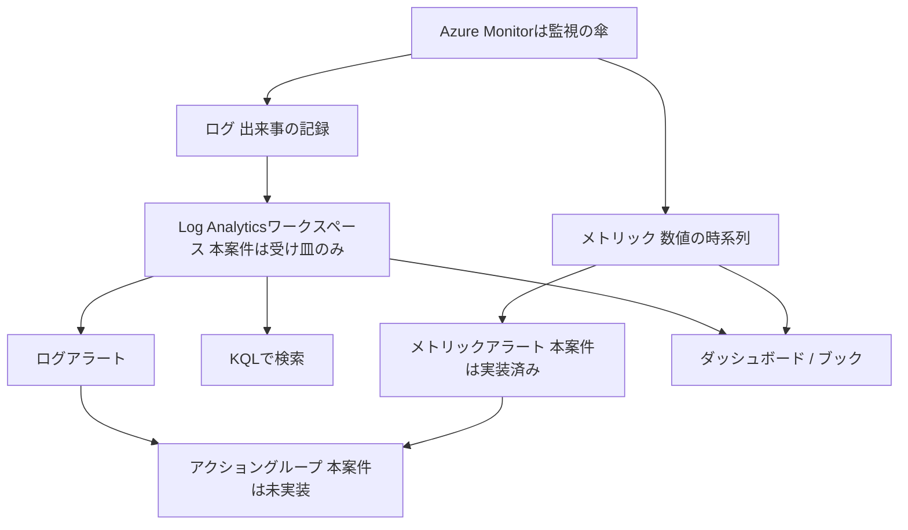

# 10. 監視と運用

[用語集トップ](../11-azure-glossary.md) ・ 前: [9. ID・アクセス管理とセキュリティ](09-identity-security.md) ・ 次: [11. バックアップ・可用性・障害対応](11-backup-dr.md)

構築が終わっても、動き続けているかを見張り、壊れたときに気づける仕組みがなければ運用は成り立ちません。この分野の入口は1つだけです。**数値の時系列が「メトリック」、出来事の記録が「ログ」**、この2種類のデータを集めて見せて知らせる傘が`Azure Monitor`です。本案件ではCPU使用率のメトリックアラートとLog Analyticsワークスペースの受け皿だけを用意し、通知とOSログ収集は未実装の発展課題として残しています。ここを覚えると[運用・障害対応Runbook](../07-operations-runbook.md)がそのまま読めるようになります。

## 10.1 早見表

| 用語 | 読み方 | 一言でいうと | 覚え方のヒント |
|---|---|---|---|
| Azure Monitor | アジュール モニター | Azureの監視機能をまとめた傘となるサービス | 傘の下にログもアラートも全部ある |
| メトリック | メトリック | 一定間隔で自動的にたまる数値の時系列データ | メーターの針。数値だけ |
| ログ | ログ | いつ何が起きたかを文章で残した記録 | 航海日誌。出来事を文で残す |
| プラットフォームメトリックとゲストOSメトリック | プラットフォーム / ゲストオーエス メトリック | Azure側から自動で見える数値と、VMの中に入らないと見えない数値 | 外から見える箱の重さと、開けないと分からない中身 |
| Log Analyticsワークスペース | ログ アナリティクス ワークスペース | ログを集めて検索・分析するための保存場所 | ログの受け皿。まず皿を置く |
| KQL | ケーキューエル | Log Analyticsのログを検索する専用の問い合わせ言語 | Kusto Query Languageの頭文字 |
| アラートルール | アラートルール | 異常の条件を書いておき、合致したら知らせる設定 | 数値で見張るか、文章で見張るかの2種類 |
| シグナル・しきい値・集約粒度・評価頻度 | シグナル / シキイチ / シュウヤクリュウド / ヒョウカヒンド | アラートの「何を・いくらで・どの幅で・どの間隔で」の4点セット | 何を / いくらで / どの幅で / どの間隔で |
| アラートの重大度 | ジュウダイド | 0から4の数字で表すアラートの深刻さ | 0が最も重い。地下ほど深い |
| アクショングループ | アクション グループ | アラート発生時の通知先と実行動作をまとめた連絡網 | 発火したあとの「誰に何を」 |
| アクティビティログ | アクティビティ ログ | 誰がAzureの構成をいつ変更したかの操作履歴 | 中身ではなく操作の履歴 |
| 診断設定 | シンダンセッテイ | リソースのログとメトリックの送り先を指定する配管 | 蛇口をどのバケツにつなぐか |
| Azure Monitor Agent | アジュール モニター エージェント | VMの中に入り、OSのログや数値を集めて送る常駐ソフト | AMA。中から運び出す配達員 |
| データ収集ルール | データ シュウシュウ ルール | AMAに「何を集めてどこへ送るか」を指示する設計書 | DCR。配達員に渡す指示書 |
| Application Insights | アプリケーション インサイツ | アプリの中の処理速度やエラーを可視化する監視機能 | Insightは「中を見通す」 |
| Service HealthとResource Health | サービス ヘルス / リソース ヘルス | Azure側の障害情報と、自分のリソース個別の健康状態 | 路線全体の運休か、自分の車両の故障か |
| Azure Update Manager | アジュール アップデート マネージャー | OS更新の適用状況を一覧化し、計画的に当てる仕組み | 更新の名簿と時間割 |
| 自動シャットダウン | ジドウ シャットダウン | 指定時刻にVMを自動で停止するスケジュール設定 | 消し忘れ防止のタイマー |
| ダッシュボードとブック | ダッシュボード / ブック | 常時見る計器盤と、調査用に読ませるレポート | 毎日見る盤と、読ませる資料 |
| ランブック | ランブック | 誰がやっても同じ結果になる運用手順書 | runとbook。走らせる本 |
| 一次切り分けとエスカレーション | イチジキリワケ / エスカレーション | 自分で切り分けられる範囲を調べ、超えたら引き継ぐこと | 止・見・守・戻・残 |

## 10.2 用語解説

### 10.2.1 Azure Monitor(アジュールモニター)

- **一言でいうと**: Azure上の数値と記録を集め、見える化し、異常を知らせるところまでを担う監視の総合サービスです。
- **たとえると**: 鉄道の運行管理センターです。各駅のセンサー値も、係員の作業記録も、いったん1か所へ集まり、異常があれば関係者へ連絡が飛びます。
- **もう少し詳しく**: Azure Monitorは単一の画面ではなく、複数の機能をまとめた傘の名前です。傘の下にメトリック、ログ、Log Analyticsワークスペース、アラートルール、アクショングループ、ブックなどが並びます。個別の機能名を覚える前に、「これは全部Azure Monitorの一部だ」と位置づけを固定すると混乱しません。
- **この案件では**: CPU使用率のメトリックアラートとLog Analyticsワークスペースが、このAzure Monitorという傘の下に置かれた2つの部品です。
- **覚え方**: 「モニター=画面」ではなく「モニター=見張る役」と読み替えます。見張るには、測る(メトリック)、記録する(ログ)、知らせる(アラート)の3動作が必要で、その3つを束ねたものがAzure Monitorです。
- **つまずきポイント**: 「Azure Monitorを有効化する」という単一のスイッチがあると思いがちですが、実際は機能ごとに個別の設定が必要です。メトリックは既定で集まる一方、OSの中のログは設定しないと集まりません。
- **関連**: メトリック / ログ / Log Analyticsワークスペース

### 10.2.2 メトリック(メトリクス、Metrics)

- **一言でいうと**: CPU使用率のように、一定間隔で自動的にたまっていく数値の時系列データです。
- **たとえると**: 車のスピードメーターです。今何キロかは分かりますが、なぜ加速したのかという理由は書かれていません。
- **もう少し詳しく**: メトリックは「時刻と数値」の組が延々と並んだ軽いデータで、平均や最大といった集計に向きます。グラフにして傾向を見る、しきい値を決めてアラートを出す、という用途が中心です。原因の特定には向かないため、メトリックで気づいてログで調べる、という2段構えが基本です。
- **この案件では**: VMのCPU使用率メトリック`Percentage CPU`が、CPUアラートの判断材料になっています。
- **覚え方**: メトリックはmeter(計器)と同じ語源です。計器は数字しか出さない、と押さえれば、後述のログとの役割分担が一度で入ります。
- **つまずきポイント**: メトリックのグラフに何も出ないとき「監視が壊れた」と思いがちですが、実際は集計期間や集計方法の指定が合っていないだけの場合が多くあります。まず表示期間を広げて確認します。
- **関連**: ログ / プラットフォームメトリックとゲストOSメトリック / シグナル・しきい値・集約粒度・評価頻度

### 10.2.3 ログ(Logs、ログデータ)

- **一言でいうと**: いつ何が起きたかを1件ずつ文章として残した記録で、原因を追うための材料です。
- **たとえると**: 航海日誌です。速度計の数値とは別に、「何時にどの港へ寄った」「何時に嵐に遭った」という出来事が文で残ります。
- **もう少し詳しく**: ログは1件ごとに時刻とメッセージと属性を持つため、メトリックより重い代わりに情報量が多く、検索と絞り込みに向きます。Azureではログの種類が階層的で、Azure側の操作履歴、リソースが出す診断ログ、VM内部のOSやアプリのログに分かれます。ログの保存先がLog Analyticsワークスペースです。
- **この案件では**: Log Analyticsワークスペースは作成済みですが、VM内部のOSログを流し込む設定は未実装です。現時点でVMのログを見るには、SSH接続して`journalctl`などで直接確認します。
- **覚え方**: メトリックとログを「数字か文章か」で二分します。数字で気づく、文章で納得する。この対比を先に固定しておくと、以降の用語がどちらの系統かで整理できます。
- **つまずきポイント**: VMを作れば自動的にOSのログがAzureへ集まると思いがちですが、実際はエージェントと収集ルールを設定しない限り、OS内部のログはVMの中に留まったままです。
- **関連**: メトリック / Log Analyticsワークスペース / Azure Monitor Agent

### 10.2.4 プラットフォームメトリックとゲストOSメトリック

- **一言でいうと**: Azureの土台側から自動で見える数値と、VMの中に入らないと分からない数値の区別です。
- **たとえると**: 宅配便の荷物です。箱の重さや配達状況は運送会社が外から把握できますが、箱の中身の在庫数は、受け取った人が開けて数えないと分かりません。
- **もう少し詳しく**: CPU使用率やディスクのI/O、ネットワーク送受信量は、Azureの仮想化基盤側で観測できるためエージェントなしで取得できます。これがプラットフォームメトリックです。一方、メモリの空き容量やファイルシステムの空き容量は、OSの中の情報なので基盤側からは見えません。取得するにはVM内にエージェントを入れる必要があり、これがゲストOSメトリックです。
- **この案件では**: CPUアラートはプラットフォームメトリックだけで成立するため、エージェント未導入でも動作します。逆にメモリやディスク空き容量のアラートは、エージェント導入が前提となるため未実装です。
- **覚え方**: 「外から測れるか、中に入らないと測れないか」の一線を引きます。CPUは外から、メモリとディスク空き容量は中から。この3語だけ覚えれば実務で迷いません。
- **つまずきポイント**: メモリ使用率もCPUと同じように既定で見られると思いがちですが、実際はゲストOS側の情報であり、追加の収集設定が必要です。
- **関連**: メトリック / Azure Monitor Agent / データ収集ルール

### 10.2.5 Log Analyticsワークスペース(Log Analytics Workspace、LAW)

- **一言でいうと**: 各所から集めたログを保存し、検索と分析ができるようにしておく専用の置き場です。
- **たとえると**: 会社の書庫です。部署ごとにバラバラだった書類を1か所へ集めておくから、後から横断して探せます。
- **もう少し詳しく**: ログは送り先がなければ保存されないため、監視の設計はまず「ワークスペースを作る」から始まります。ワークスペースは保持期間と課金の単位でもあり、集めたログはテーブルに分かれて格納され、KQLで検索します。1つのワークスペースへ複数のリソースのログを集約すると、横断調査ができるようになります。
- **この案件では**: `log-`で始まるワークスペースを1つ作成し、保持期間は`30`日に設定しています。ただし現時点では「受け皿だけを置いた状態」で、VMのOSログを流し込む配管は未実装の発展課題です。
- **覚え方**: 「先に皿を置く、料理は後から盛る」と動作でイメージします。皿(ワークスペース)がないとログはこぼれて消える、と考えると作成順序が自然に入ります。
- **つまずきポイント**: ワークスペースを作ればログが集まり始めると思いがちですが、実際は空の皿が置かれただけです。何を集めるかは診断設定やデータ収集ルールで別途決めます。
- **関連**: ログ / KQL / 診断設定 / データ収集ルール

### 10.2.6 KQL(Kusto Query Language、クエリ言語)

- **一言でいうと**: Log Analyticsに集めたログを絞り込み、集計するための専用の検索言語です。
- **たとえると**: 図書館の検索端末に打ち込む条件です。書庫に本があっても、条件を書けなければ目的の1冊は出てきません。
- **もう少し詳しく**: KQLは「テーブル名から始めて、パイプ`|`で処理を数珠つなぎにする」という素直な書き方をします。まず`Heartbeat | take 10`のように少量を取り出して形を確認し、次に`where`で時刻や条件を絞り、`summarize`で集計する、という順に育てるのが定石です。障害調査の速さはKQLをどれだけ書けるかで大きく変わります。
- **この案件では**: ワークスペースへOSログを取り込む設定が未実装のため、KQLの練習対象となるデータはまだ入っていません。エージェント導入を発展課題として実施した後の学習項目です。
- **覚え方**: 頭文字で覚えます。**K**usto **Q**uery **L**anguage。Kustoは開発時の呼び名で、SQLに似た並びながら「テーブルから始まり、パイプで流す」向きが逆と押さえます。
- **つまずきポイント**: SQLと同じ構文で書けると思いがちですが、実際は`SELECT`から始めず、テーブル名を先頭に書きます。書き出しが違うだけで、考え方は絞り込みと集計という同じ流れです。
- **関連**: Log Analyticsワークスペース / ログ / アラートルール

### 10.2.7 アラートルール(Alert Rule、メトリックアラート / ログアラート)

- **一言でいうと**: 異常とみなす条件を先に書いておき、条件に合致したときに自動で知らせる設定です。
- **たとえると**: 目覚まし時計です。鳴らす条件を前の晩に決めておくから、当日は自分で時計を見張らずに済みます。
- **もう少し詳しく**: 大きく2種類あります。数値のしきい値で判定する**メトリックアラート**は、反応が速く設定も簡単です。ログの検索結果の件数などで判定する**ログアラート**は、KQLを書く必要がある代わりに「特定のエラー文字列が出たら」といった柔軟な条件が書けます。まずメトリックアラートで最低限の見張りを作り、必要に応じてログアラートを足す順序が実務的です。
- **この案件では**: VMのCPU使用率が`80`パーセントを超えた状態が続いたら発報するメトリックアラートを1本定義しています。条件が解消すると自動で解決状態へ戻る設定です。
- **覚え方**: 「数値で見張るか、文章で見張るか」で二分します。メトリックアラート=数字の門番、ログアラート=文章の門番。10.2.2と10.2.3の対比がそのまま効きます。
- **つまずきポイント**: アラートルールを作れば連絡が来ると思いがちですが、実際は通知先を別に登録しないと、記録が残るだけで誰にも届きません。
- **関連**: アクショングループ / シグナル・しきい値・集約粒度・評価頻度 / アラートの重大度

### 10.2.8 シグナル・しきい値・集約粒度・評価頻度

- **一言でいうと**: アラートを1本作るとき必ず決める、何を・いくらで・どの幅で・どの間隔で見張るかの4項目です。
- **たとえると**: 健康診断の血圧測定です。測る項目(シグナル)、異常とする値(しきい値)、1回の測定に使う時間(集約粒度)、何日おきに測るか(評価頻度)を決めなければ判定できません。
- **もう少し詳しく**: **シグナル**は判定に使うデータ、**しきい値**は超えたら異常とみなす値です。**集約粒度**は1回の判定で何分ぶんのデータを平均するかの窓の幅で、**評価頻度**はその判定を何分おきに行うかです。集約粒度を短くすると瞬間的な跳ねで誤検知が増え、長くすると気づくのが遅れます。この2つのバランス調整が監視設計の腕の見せどころです。
- **この案件では**: シグナルはCPU使用率、しきい値は`80`パーセント超過、集約粒度は`5`分間の平均、評価頻度は`1`分おきという組み合わせです。1分ごとに直近5分の平均を見る、と読みます。
- **覚え方**: 「なに・いくら・どのはば・どのかんかく」と4拍のリズムで唱えます。順番どおりに埋めればアラートは必ず完成します。
- **つまずきポイント**: しきい値だけ決めれば良いと思いがちですが、実際は集約粒度の指定で結果が変わります。5分平均で80パーセントは、瞬間的に100パーセントへ跳ねただけでは超えません。
- **関連**: アラートルール / メトリック / アラートの重大度

### 10.2.9 アラートの重大度(Severity、Sev 0から4)

- **一言でいうと**: アラートの深刻さを`0`から`4`の数字で表し、対応の優先順位を機械的に判断できるようにする区分です。
- **たとえると**: 病院のトリアージです。来院順ではなく重さの順に対応するために、あらかじめ札の色を決めておきます。
- **もう少し詳しく**: `Sev 0`が最も重く、数字が大きくなるほど軽くなります。目安として`0`は重大、`1`はエラー、`2`は警告、`3`は情報、`4`は詳細という位置づけです。重大度そのものは通知の速さを自動で変えるものではなく、通知先や対応時間の取り決めを重大度ごとに設計して初めて意味を持ちます。全部を`0`にすると優先順位が消えるため、配分を決めることが重要です。
- **この案件では**: CPUアラートの重大度は`Sev 2`(警告)としています。単一VMの学習用構成であり、CPU高騰は即時のサービス断ではないという判断です。
- **覚え方**: 数字で覚えます。**地下は数字が小さいほど深い**、つまり`0`が一番深刻。エレベーターのB1よりB2のほうが下、という感覚の逆向きに、`0`を底と置きます。
- **つまずきポイント**: `4`が最重要だと思いがちですが、実際は逆で`0`が最重要です。優先度と同じく「小さい数字が先」というAzureの共通感覚で、NSGルールの優先度と同じ向きです。
- **関連**: アラートルール / アクショングループ / 一次切り分けとエスカレーション

### 10.2.10 アクショングループ(Action Group)

- **一言でいうと**: アラートが発生したときに誰へ知らせ何を動かすかを、あらかじめ束ねて登録しておく通知先の定義です。
- **たとえると**: 会社の緊急連絡網です。人の名前と連絡手段を一覧にしておき、複数のアラートから同じ連絡網を呼び出します。
- **もう少し詳しく**: メールやSMSなどの通知に加えて、Webhookや自動処理の呼び出しといった動作も登録できます。要点は、アラートルールとアクショングループが分離している設計です。通知先が変わってもアクショングループを1つ直すだけで、それを参照する全アラートに反映されます。逆にアクショングループを紐づけていないアラートは、Azure上に記録が残るだけで誰にも届きません。
- **この案件では**: アクショングループは**未実装の発展課題**です。CPUアラートは定義済みで動作しますが、通知先が空のため、発報を知るにはポータルでアラート一覧を確認する必要があります。まず通知を足すことが、この案件の運用面で最優先の残課題です。
- **覚え方**: アラートを「火災報知器」、アクショングループを「消防への回線」と分けて動作を追います。報知器だけ付けても電話がつながっていなければ誰も来ない、という絵が残ります。
- **つまずきポイント**: アラートを作った時点で通知まで完了したと思いがちですが、実際は通知先の登録は別作業です。作成後に必ずテスト発報で「届くか」を確認します。
- **関連**: アラートルール / アラートの重大度 / ランブック

### 10.2.11 アクティビティログ(Activity Log)

- **一言でいうと**: サブスクリプション上で誰がいつ何のリソースを作成・変更・削除したかを記録した操作の履歴です。
- **たとえると**: マンションの入退館記録です。各部屋の中で何が起きたかではなく、誰がいつ建物に何をしたかが残ります。
- **もう少し詳しく**: 記録されるのは操作の面であり、VM内部のOSの動きは含まれません。障害調査で最初に効く使い方は「直前に構成変更がなかったか」の確認です。設定を戻した記憶がない障害でも、アクティビティログを見ると誰かの変更が写っていることがあります。長期に残したい場合は診断設定でLog Analyticsワークスペースなどへ送ります。
- **この案件では**: [運用・障害対応Runbook](../07-operations-runbook.md)のエスカレーション情報に、関連するアラートとActivity Logを添えることが手順として書かれています。変更手順の証跡と突き合わせる材料になります。
- **覚え方**: 対比で覚えます。**リソースへ何をしたかがアクティビティログ、リソースの中で何が起きたかが診断ログ**。「外側の履歴」と「内側の履歴」です。
- **つまずきポイント**: アクティビティログにVMのCPUやNginxのエラーも出ると思いがちですが、実際は出ません。操作の記録専用です。また既定の保持期間は無期限ではないため、長期保存には別途の送信設定が必要です。
- **関連**: 診断設定 / ログ / Log Analyticsワークスペース

### 10.2.12 診断設定(Diagnostic Settings、診断ログ設定)

- **一言でいうと**: リソースが出すログとメトリックを、どこへ送って残すかを指定する配管の設定です。
- **たとえると**: 蛇口とバケツをつなぐホースです。水(ログ)は出ていても、ホースをつながなければどこにも溜まりません。
- **もう少し詳しく**: 送り先として、検索したいならLog Analyticsワークスペース、安く長期保管したいならストレージ、他システムへ流したいならイベント配信の基盤、といった選択ができます。リソースごとに設定するため、リソースを増やしたら診断設定も足す運用が必要です。「ログが見つからない」という相談の多くは、この設定が入っていないことが原因です。
- **この案件では**: Log Analyticsワークスペースという送り先は用意済みですが、そこへ流し込む診断設定は未実装です。受け皿とホースは別物、という関係がそのまま教材になっています。
- **覚え方**: 動作で覚えます。「**出す側で決める**」のが診断設定です。集める側(ワークスペース)ではなく、送り出すリソース側に設定がある、と押さえると探す場所を間違えません。
- **つまずきポイント**: ワークスペースを作ればすべてのリソースのログが自動で入ると思いがちですが、実際はリソースごとに診断設定を有効にした分だけが流れ込みます。
- **関連**: Log Analyticsワークスペース / アクティビティログ / データ収集ルール

### 10.2.13 Azure Monitor Agent(AMA、Azure Monitorエージェント)

- **一言でいうと**: VMの中に常駐し、OSのログや性能値を集めてAzure Monitorへ送り出す小さなソフトです。
- **たとえると**: 建物の中に常駐する集配担当者です。外の運送会社は建物の中の荷物を運べないため、中の人が集めて渡す必要があります。
- **もう少し詳しく**: プラットフォームメトリックはAzure側から見えますが、OSの中のsyslogやメモリ使用率は見えません。その隙間を埋めるのがAMAです。VMの拡張機能として導入し、何を集めるかは自身では決めず、後述のデータ収集ルールから指示を受け取って動きます。旧世代のLog Analyticsエージェントは提供が終了しており、新規構成ではAMAを使います。
- **この案件では**: AMAは**未実装の発展課題**です。導入していないため、OSログとメモリやディスク空き容量の監視はまだできません。
- **覚え方**: 頭文字を分解します。**A**zure **M**onitor **A**gent。agentは「代理人」で、Azureが中へ入れない代わりに立てる代理人、と読み替えます。
- **つまずきポイント**: AMAを入れればログが集まり始めると思いがちですが、実際は収集ルールを紐づけるまで何も送りません。エージェントと指示書は必ず2点セットです。
- **関連**: データ収集ルール / プラットフォームメトリックとゲストOSメトリック / Log Analyticsワークスペース

### 10.2.14 データ収集ルール(DCR、Data Collection Rule)

- **一言でいうと**: エージェントに対して、どのデータを集めてどのワークスペースへ送るかを指示する設定リソースです。
- **たとえると**: 集配担当者へ渡す配達指示書です。担当者(AMA)がいても、集める物と届け先が書かれた紙がなければ動けません。
- **もう少し詳しく**: DCRは収集元の種類、対象、送信先を定義した独立したリソースで、VMへ関連付けて使います。1つのDCRを複数VMへ適用できるため、台数が増えても設定を1か所で管理できます。「エージェントを入れる」「DCRを作る」「VMへ関連付ける」の3手順がそろって初めてログが流れ始めます。
- **この案件では**: DCRも**未実装の発展課題**です。AMAとDCRの2つを追加することが、Log Analyticsワークスペースを「受け皿」から「実際に使える調査基盤」へ変えるための残作業です。
- **覚え方**: 頭文字と役割の対比で覚えます。**AMAは運ぶ人、DCRは指示書**。人と紙、と2語で区別すると、どちらが何をするか取り違えません。
- **つまずきポイント**: DCRを作れば自動で全VMに効くと思いがちですが、実際は対象VMへの関連付けが必要です。作っただけの状態は指示書を机に置いたままの状態です。
- **関連**: Azure Monitor Agent / Log Analyticsワークスペース / ログ

### 10.2.15 Application Insights(アプリケーションインサイツ)

- **一言でいうと**: アプリケーションの内部の応答時間、エラー、依存先の呼び出しを可視化するAzure Monitorの機能です。
- **たとえると**: 人間の健康診断における精密検査です。体重や血圧(サーバーのメトリック)が正常でも不調なとき、体の中の流れを詳しく調べます。
- **もう少し詳しく**: サーバーのCPUやメモリが正常なのにWebが遅い、という状況の原因はアプリ内部にあります。Application Insightsはアプリ側へ組み込むことで、要求ごとの処理時間や失敗率、外部への問い合わせにかかった時間などを収集します。インフラ担当が扱う範囲の外に見えますが、「サーバーは正常です」を証明するためにアプリ側の数値が必要になる場面が実務では多くあります。
- **この案件では**: Nginxが静的な応答を返す学習用構成のため導入していませんが、アプリを載せる案件では監視設計に含める前提の機能です。
- **覚え方**: 語を分解します。application(アプリ)+insight(中を見通す洞察)。**サーバーの外側を見るのがメトリック、アプリの内側を見るのがApplication Insights**、と層で分けます。
- **つまずきポイント**: VMを監視すればアプリの遅さも分かると思いがちですが、実際はインフラの数値が正常でもアプリは遅くなります。層が違えば必要な監視も違います。
- **関連**: Azure Monitor / メトリック / ログ

### 10.2.16 Service HealthとResource Health

- **一言でいうと**: Azure側で起きている障害や計画メンテナンスの情報と、自分のリソース1台ごとの健康状態を示す2つの機能です。
- **たとえると**: 鉄道です。Service Healthは路線全体の運休や工事のお知らせ、Resource Healthは自分が乗る車両の故障表示にあたります。
- **もう少し詳しく**: **Service Health**はサブスクリプションに関係するAzure側の事象を伝えます。自分の設定が原因ではない障害を切り分けるための最初の1手です。**Resource Health**は個別リソースの状態を、利用可能、利用不可、劣化などの区分で示します。障害対応の初動では、自分の変更を疑う前にこの2つを見て「そもそもAzure側か」を判断すると、無駄な調査を減らせます。
- **この案件では**: [運用・障害対応Runbook](../07-operations-runbook.md)の毎日の確認の1番目が「Azure Service Healthに影響がないか」です。毎朝の最初の動作として手順化されています。
- **覚え方**: 主語の対比で覚えます。**Serviceの主語はAzure、Resourceの主語は自分の部品**。「向こうが悪いのか、こちらが悪いのか」を分ける2枚のカードです。
- **つまずきポイント**: 障害はまず自分の設定ミスを疑うべきと思いがちですが、実際にAzure側の事象であることもあります。順番として、先にこの2つを見るほうが速く済みます。
- **関連**: アクティビティログ / 一次切り分けとエスカレーション / アラートルール

### 10.2.17 Azure Update Manager(アジュールアップデートマネージャー)

- **一言でいうと**: VMのOS更新の適用状況を一覧で確認し、決めた時間帯にまとめて適用できるAzureの組み込み機能です。
- **たとえると**: 学校の時間割と出席簿です。誰が受けていないかが一覧で分かり、次はいつ受けるかも決まっています。
- **もう少し詳しく**: 未適用の更新を評価して見える化し、適用の時間帯や再起動の扱いを決めて実行できます。単一VMなら手作業でも回りますが、台数が増えると「どのサーバーがいつまで放置されているか」を人の記憶で管理できなくなります。放置された更新は脆弱性として残るため、更新の運用は監視と同じ重みで設計します。
- **この案件では**: Bicepには含まれていませんが、[運用・障害対応Runbook](../07-operations-runbook.md)の毎月の確認に「OS更新」が項目として挙げられています。手順としては存在し、自動化は発展課題という位置づけです。
- **覚え方**: 動作でイメージします。**評価して、時間を決めて、当てる**。この3拍がこの機能の全部です。手順が3つだけと分かれば構えずに読めます。
- **つまずきポイント**: 更新を自動適用にすれば安心と思いがちですが、実際は再起動のタイミングが業務影響を生みます。適用時間帯と再起動の可否を先に決めるほうが重要です。
- **関連**: ランブック / Service HealthとResource Health / 一次切り分けとエスカレーション

### 10.2.18 自動シャットダウン(Auto-shutdown)

- **一言でいうと**: 指定した時刻にVMを自動で停止させ、消し忘れによる無駄な稼働を防ぐスケジュール機能です。
- **たとえると**: 部屋の電気の消灯タイマーです。人が忘れても時間が来れば消えます。
- **もう少し詳しく**: VMの設定として停止時刻を指定できます。学習用や検証用のVMは「触った日の夜だけ動けばよい」ことが多く、自動停止を入れておくと想定外の稼働を避けられます。停止するとコンピューティングの稼働は止まりますが、ディスクなどのリソースは残ったままである点に注意します。料金はリージョン、契約、時期で変わるため、実施前にAzure Pricing CalculatorとCost Managementで確認します。
- **この案件では**: Bicepに自動シャットダウンは含まれていません。学習コストの管理は、What-Ifを先に見る運用と、`scripts/remove.ps1`でリソースグループ名を二重指定して削除する手順で行う方針です。
- **覚え方**: 「止めても消えない」と1行で覚えます。停止は消灯、削除は撤去。学習用サブスクリプションで最初に体感すべき違いです。
- **つまずきポイント**: 自動シャットダウンしておけば費用の心配がないと思いがちですが、実際は停止中も残り続ける要素があります。学習が終わったら停止ではなく削除まで行います。
- **関連**: ランブック / Azure Update Manager / Azure Monitor

### 10.2.19 ダッシュボードとブック(Workbooks)

- **一言でいうと**: 毎日見るための集約画面がダッシュボード、調査や報告のために組み立てる資料がブックです。
- **たとえると**: 車の計器盤と整備報告書です。走行中に見るのは計器盤、後で説明するのは報告書です。
- **もう少し詳しく**: ダッシュボードはグラフやタイルを並べた常設の画面で、朝の確認で「いつもと違うか」を素早く見るのに向きます。ブックは文章、グラフ、KQLのクエリ結果を組み合わせて1つの読み物として保存でき、パラメーターで対象や期間を切り替えられます。障害報告や月次報告を毎回手作業で作らずに済むのがブックの利点です。
- **この案件では**: どちらも作成していませんが、CPUアラートとLog Analyticsワークスペースがそろえば、毎日の確認項目を1画面へ集約する作りが次の一歩になります。
- **覚え方**: 用途の対比です。**ダッシュボードは見るためのもの、ブックは読ませるためのもの**。「自分が毎朝見る」か「他人へ渡す」かで選ぶと迷いません。
- **つまずきポイント**: 数値を並べれば監視が完成すると思いがちですが、実際は誰も見ない画面は機能しません。人が見なくても知らせが届くアラートと、人が見るための画面は、役割が別です。
- **関連**: Azure Monitor / KQL / メトリック

### 10.2.20 ランブック(Runbook、運用手順書)

- **一言でいうと**: 誰が実施しても同じ結果になるように、運用作業の手順と判断基準を書き残した文書です。
- **たとえると**: 料理のレシピです。分量と順番と火加減が書かれているから、書いた本人でなくても同じ味になります。
- **もう少し詳しく**: 良いランブックには、実施の前提、手順、期待される結果、失敗したときの戻し方、記録の残し方が含まれます。障害対応の場面で人が冷静さを失っても、手順が文書化されていれば判断のばらつきを抑えられます。属人化した運用は担当者が不在の日に止まるため、手順書は成果物として設計書と同格に扱います。
- **この案件では**: [運用・障害対応Runbook](../07-operations-runbook.md)がまさにこれで、毎日と毎月の確認、Webに接続できないとき、SSHできないとき、CPU高騰時の調査コマンド、変更手順が具体的に書かれています。
- **覚え方**: 語を分解します。run(走らせる)+book(本)=「そのとおり走らせれば動く本」。読む本ではなく走らせる本、と意味を取ると位置づけが明確になります。
- **つまずきポイント**: Azureの用語としてランブックというとAzure Automationの自動化スクリプトを指す場合があるため、文脈で読み分けます。ここでの意味は人が読む運用手順書です。
- **関連**: 一次切り分けとエスカレーション / Azure Update Manager / アクショングループ

### 10.2.21 一次切り分けとエスカレーション

- **一言でいうと**: 自分の担当範囲で原因の在りかを絞り込み、範囲を超えたら情報をそろえて次の担当へ引き継ぐことです。
- **たとえると**: 病院の受付と専門外来です。受付は症状と時刻を聞いて行き先を決め、専門医は整理された情報を受けて診察に入ります。
- **もう少し詳しく**: 一次切り分けの要点は、通信の順番を逆にたどることです。本案件なら`管理者PC → Public IP → NSGの判定 → NIC → VM → Nginx`を逆順に、Nginxが動いているか、OSは起動しているか、NICとIPは正しいか、NSGが接続元を許可しているか、と確認します。エスカレーションでは、発生時刻、影響範囲、正常だった最終時刻、直前の変更、実施した確認と結果、現在の暫定対応をまとめて渡します。秘密鍵や機密値は渡す情報に含めません。
- **この案件では**: [運用・障害対応Runbook](../07-operations-runbook.md)に初動の型として「止・見・守・戻・残」が定義され、エスカレーション時に添える情報も一覧化されています。
- **覚え方**: 語呂で覚えます。**止・見・守・戻・残**。止めて、見て、守って、戻して、残す。この5文字が思い出せれば、慌てて再起動して証跡を消すという最悪手を避けられます。
- **つまずきポイント**: まず再起動すれば直ると思いがちですが、実際は原因の手がかりが消えて再発時に何も分からなくなります。復旧と原因除去は別作業です。
- **関連**: ランブック / Service HealthとResource Health / アラートの重大度

## 10.3 このセクションの覚え方まとめ

まず**数字はメトリック、文章はログ**の二分を固定し、その両方が`Azure Monitor`という傘の下にあると覚えます。傘の下の関係はこの形です。

集める配管は2組の2点セットで覚えます。**リソースの外側は診断設定、VMの内側はAMAとDCR**。どちらも「受け皿を作る」だけでは1件も流れません。

アラートを1本作る手順は4拍です。**なに(シグナル)・いくら(しきい値)・どのはば(集約粒度)・どのかんかく(評価頻度)**、そして最後に**誰へ(アクショングループ)**。この5つ目が抜けているのが本案件の現在地で、通知が最優先の残課題です。

障害が起きたら**止・見・守・戻・残**。見るときは先にService HealthとResource Healthで「向こうかこちらか」を分け、次に通信の順番を逆にたどります。

---

[用語集トップ](../11-azure-glossary.md) ・ 前: [9. ID・アクセス管理とセキュリティ](09-identity-security.md) ・ 次: [11. バックアップ・可用性・障害対応](11-backup-dr.md)
